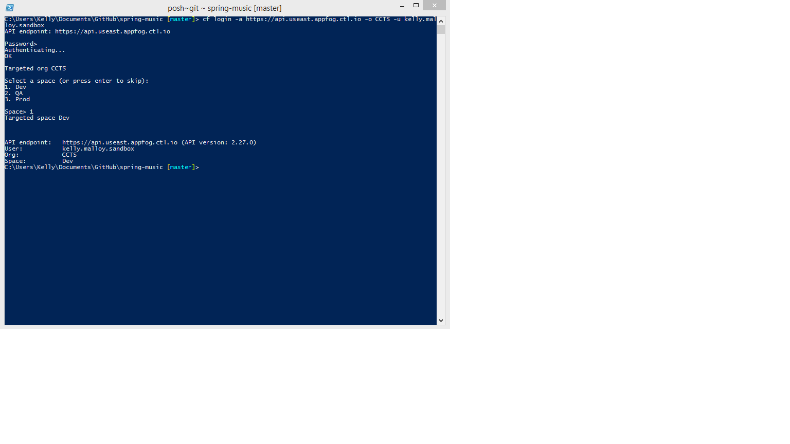
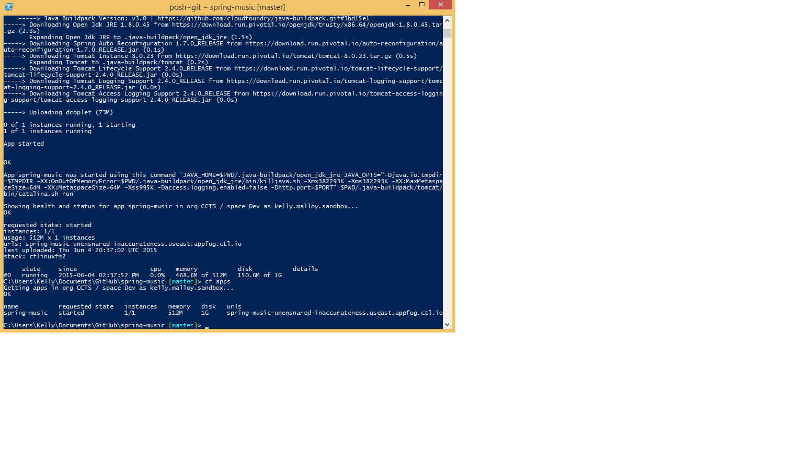

{{{
  "title": "Deploying Your First Application with AppFog, A Step by Step Guide",
  "date": "06-9-2015",
  "author": "Kelly Malloy",
  "attachments": [],
  "related-products" : [],
  "contentIsHTML": false
}}}

### Overview

AppFog is CenturyLink’s scalable, robust, high performing multi-tenant Platform-as-a-Service (Paas) platform.  This product has been updated with several powerful new features including automatic cross datacenter provisioning and replication.  This important new features creates a high level of application availability that can allow applications to stay online during a datacenter failure event.

### Prerequisites

We have found that use of the word PaaS creates significant confusion with many customers. For this reason throughout this guide we have used the term “Cloud Native Application Platform”.  The guide assumes that the reader has no experience with Cloud Foundry and does not understand what it means to push an application to a Cloud Native Application Platform.  This guide requires the AppFog functionality to be enabled on your CenturyLink Cloud Platform account.  Later in this guide more detail will be provided on determining this setting.  This guide will use an application created and published by a third party named “spring-music” in order to demonstrate the functionality of Cloud Foundry.  The application is published on GiHhub and instructions for obtaining this application will be provided when required.

### Steps

#### 1. Install Java JDK

Download and install the appropriate Java SE Development Kit, also known as Java JDK.  The download location is http://www.oracle.com/technetwork/java/javase/downloads/jdk7-downloads-1880260.html.  This guide will use the Windows x64 version.

Follow the standard installation steps, accepting all defaults.  This will install the Java application to C:\Program Files\Java\jre7.  After installation completes you will need to create two System variables.  These can be set by opening Control Panel – System – Advanced System Settings – Environment Variables.  You will add a new System Variable named “java_home” with the path “C:\Program Files\Java\jre7”.  Next you will modify the existing PATH variable to add the additional path, “C:\Program Files\Java\jre7” if it does not already exist.  Once complete you can open a new Command Prompt to ensure the command “Echo %java_home%” and “Echo %path% both return C:\Program Files\Java\jre7 in the response.

#### 2.	Install Cloud Foundry CLI

Download and install the appropriate Cloud Foundry CLI version.  The download location is https://github.com/cloudfoundry/cli.  This guide will use the Windows 64 bit Stable Installers bundle.  Install the bundle using all default settings.

#### 3. Install GitHub

Download and install GitHub for Windows.  The download location is https://windows.github.com/. Install the application using all default settings.  

#### 4.	Login to GitHub & Clone the sample application “Spring-Music”

After the install for GitHub completes the GitHub client will prompt for your username and password.  If you have an existing GitHub account, sign in.  If you need an account you can create an account at www.github.com

After successful login to the GitHub client, launch the Git Shell application from your start menu found under GitHub, Inc.  The easiest method to clone the sample application is by running the following command in your Git Shell application:

git clone https://github.com/cloudfoundry-samples/spring-music

At this point in the process, the application is ready to be pushed to the CenturyLink Cloud AppFog platform.  In your Git Shell application that is already open change the working directory to the newly created spring-music directory.  Assemble the application locally on your PC by typing in the command : “./gradlew assemble”

#### 5. Determine AppFog Login information

Login to https://control.ctl.io.   On the far left hand navigation pane there will be a small cloud icon named AppFog once you hover over the icon.  Select the appropriate origination that you would like to push this application to.  In this example we are choosing CCTS, US East Region.  In the Overview tab, you will see your login information that will be used in the Git Shell application.

#### 6. Check/Add Member

Once a region has been selected the account you are using to login to the AppFog API Endpoint must have the appropriate permissions.  In this example we are using Dev.  We have created a member that matches our Control Panel Login and granted the appropriate roles.

#### 7. Login to AppFog API Endpoint

Using the information you discovered above login to the AppFog API Endpoint with Git Shell Application.  After you enter the login command you will be prompted for a password.  This is the same password you use to login to https://control.ctl.io.  Once authenticated, choose the appropriate deployment space.  In this example we are choosing Dev.

#### 8. Push Application

We are now connected and authenticated to the API Endpoint.  To push your new application issue the command:
“cf push”
Once the application has been pushed to the API Endpoint you can issue the command “cf apps” to verify the status of your running application.  Also you will see the URL for your new application.  You can access the application immediately at that URL or you can create a CNAME record to match to a URL you desire.  You can read more about CNAME records at this URL if you desire further understanding.  http://en.wikipedia.org/wiki/CNAME_record

That completes the process for publishing your first application to CenturyLink Cloud, Cloud Native Application Platform!  This powerful platform allows for quick deployments that are easily scalable and provide the application availability that many organizations require.
