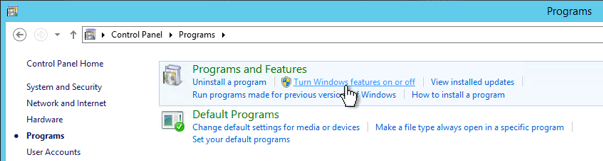

{{{
  "title": "Bare Metal FAQ",
  "date": "2-28-2018",
  "author": "Lumen",
  "attachments": [],
  "contentIsHTML": false,
  "sticky": false
}}}

### Description

Lumen Bare Metal servers introduce the ability to provision and manage physical machines from the Lumen Cloud platform in a self-service, on-demand, and highly automated fashion.

This FAQ addresses commonly asked questions about the service. For further information on this service and how it compares to virtual servers, see [Server Comparison Matrix](../Servers/server-comparison-matrix.md).


**What are the available configurations & locations for Bare Metal servers?**
Server configurations are available depending on data center locations.  Please see matrix below for availability of configurations by data centers.

Location|Available Configurations<sup>1</sup>
--------|------------------------
US East (Sterling)-VA1|4 cores E3/16 GB RAM/2x1TB 7200 RAID 1 (0.91TB usable)<br>12 cores E5/64 GB RAM/4x2TB 7200 RAID 5 (5.46TB usable)<br>20 cores E5/128 GB RAM/6x2TB 7200 RAID 5 (9.09TB usable)
Great Britain (Slough)-GB3|4 cores E3/16 GB RAM/2x1TB 7200 RAID 1 (0.91TB usable)<br>12 cores E5/64 GB RAM/4x2TB 7200 RAID 5 (5.46TB usable)<br>20 cores E5/128 GB RAM/6x2TB 7200 RAID 5 (9.09TB usable)
US East (New York)-NY1|24 cores E5/128 GB RAM/1x960GB SSD<br>24 cores E5/128 GB RAM/1x3.84TB SSD<br>24 cores E5/512 GB RAM/1x3.84TB SSD <br>20 cores E5/256 GB RAM/2x800GB SSD/12x2TB 7200 SATA<sup>2</sup><br>16 cores E5/256 GB RAM/2x800GB SSD/4x4TB 7200 SATA<sup>2</sup>
Canada (Vancouver)-CA1|24 cores E5/128 GB RAM/1x960GB SSD<br>24 cores E5/128 GB RAM/1x3.84TB SSD<br>24 cores E5/512 GB RAM/1x3.84TB SSD <br>20 cores E5/256 GB RAM/2x800GB SSD/12x2TB 7200 SATA<sup>2</sup><br>16 cores E5/256 GB RAM/2x800GB SSD/4x4TB 7200 SATA<sup>2</sup>
Australia (Sydney)-AU1|24 cores E5/128 GB RAM/1x960GB SSD<br>24 cores E5/128 GB RAM/1x3.84TB SSD<br>24 cores E5/512 GB RAM/1x3.84TB SSD <br>20 cores E5/256 GB RAM/2x800GB SSD/12x2TB 7200 SATA<sup>2</sup><br>16 cores E5/256 GB RAM/2x800GB SSD/4x4TB 7200 SATA<sup>2</sup>
Germany (Frankfurt)-DE3|24 cores E5/128 GB RAM/1x960GB SSD<br>24 cores E5/128 GB RAM/1x3.84TB SSD<br>24 cores E5/512 GB RAM/1x3.84TB SSD <br>20 cores E5/256 GB RAM/2x800GB SSD/12x4TB 7200 SATA<sup>2</sup><br>20 cores E5/256 GB RAM/2x800GB SSD/4x4TB 7200 SATA<sup>2</sup>
Great Britain (Reading)-GB1|24 cores E5/128 GB RAM/1x960GB SSD<br>24 cores E5/128 GB RAM/1x3.84TB SSD<br>24 cores E5/512 GB RAM/1x3.84TB SSD <br>20 cores E5/256 GB RAM/2x800GB SSD/12x4TB 7200 SATA<sup>2</sup><br>20 cores E5/256 GB RAM/2x800GB SSD/4x4TB 7200 SATA<sup>2</sup>

<sup>1: All Physical servers include 10Gbps Network Interfaces</sup><br>
<sup>2: SATA Disks are attached to Dell PERC H730 RAID Controllers and can operate in HBA/JBOD or RAID mode<sup>

**Why don't I see the option to provision a Bare Metal?**

There are a couple reasons you might not see the option for Bare Metal servers.  First, check your data center and the current [availability for Bare Metal servers](https://www.ctl.io/data-centers/#/filters/Bare%20Metal).  Bare Metal servers are not available in all data centers.  If you are in a data center where Bare Metal servers should be available, contact Customer Care to have them check to see if Bare Metal servers need to be enabled for your account.

**Why doesn't all server types options appear as an option to provision?**

Not all data centers will carry all server types as shown above in the configuration and location matrix. As we expand our Bare Metal product offering, we are trying to match customer demand with server types by locations. If you would like to see certain server types in specific data centers, we would love to hear from you. Please drop us a note by submitting a [Feature Request](https://www.ctl.io/knowledge-base/support/how-do-i-submit-a-feature-request/) including a brief explanation of your use case and the need for the particular configuration of resources and location.

**Why am I seeing an error saying "limit exceeded" for CPU, memory, or storage when I try to provision a Bare Metal server?**

All accounts start with a pre-defined resource (CPU/memory/storage) limit per data center. Bare Metal server resources are included as part of these limits. If you've reached the limits for your account, you may contact Customer Care to [request an increase on your resource limits](../Control Portal/how-to-increase-resources-on-account.md).

**Can I increase or decrease CPU, memory or storage resources on Bare Metal servers?**

No, the CPU, memory and storage are static resources on each individual Bare Metal server and can not be changed once a particular configuration has been provisioned. The best available path for adjusting the resource configuration is to provision a new server with the desired configuration and plan to migrate any data as necessary.

**What are the self-service actions available to me through the Control portal for Bare Metal servers?**

Through the Control Portal you are able to power the Bare Metal server on or off, perform a server reset and add a single public IP.

**What options are available for adding public IP addresses to my servers?**

Through the Control Portal customers can add **a single public ip address** to a bare metal server. Customers who require multiple public IP addresses should consider using a Virtual Machine delivery model or [submit a feature request.](../Support/how-do-i-submit-a-feature-request.md)

**Can Blueprint jobs from the available options in the Blueprint Library be run against Bare Metal servers?**

No, Blueprint functionality is not supported.

**What are the best suited workloads for this new server class?**

Any applications not well-suited to virtualization whether it be performance or licensing restrictions related, database and application workloads where consistent performance is critical, grid or HPC (High Performance Computing), data analytics, caching and indexing.

**How do I connect my Bare Metal servers over the network to my Lumen Cloud virtual servers?**

Bare Metal servers share the same network as Lumen Cloud virtual servers so it's as easy as creating and connecting networks amongst all your server types.  For more information on Network features of Lumen Cloud platform, reference the [Network Section](https://www.ctl.io/knowledge-base/network/centurylink-cloud/) of our Knowledge Base.

**Since these servers use local storage, how do I avoid application failure if underlying hardware fails?**

**Important** It is the responsibility of the customer to maintain any data recovery or restoration process that may be necessary in the case of a critical hardware failure. **This is not automatically configured by default.**  Lumen Simple Backup Service is integrated to all Bare Metal server configurations to protect against data loss in the event of a hardware failure. For more information on Lumen Simple Back Service, reference the [Simple Backup Service](https://www.ctl.io/simple-backup-service/)    

**How is hardware support and replacement handled for Bare Metal servers?**

Lumen is responsible for all hardware replacement for Bare Metal servers.  Physical hardware support for servers is only available during core business hours (M-F 9AM - 5PM) in the time zone of the datacenter.

For servers located in VA1 or GB3 only the following SLA will apply:
* In the case where a server becomes completely unavailable the process to replace the server will begin immediately with consent from the customer. For additional service level details please reference the Bare Metal servers SLA on the [SLA page](https://www.ctl.io/legal/sla/).

For server located in all other data centers, other than VA1 or GB3, then the following SLA will apply:
* In the case where a server becomes completely unavailable the customer will be required to create a new server and migrate all data to the new server.

For additional service level details please reference the Bare Metal servers SLA on the [SLA page](https://www.ctl.io/legal/sla/).

**What are the security features available for Bare Metal servers?**

Bare Metal servers can be incorporated in the same firewall policies currently available with other Lumen Cloud server types. Some Bare Metal servers are pre-configured with fully encrypted local storage while others are left to the users to configure. Please see additional FAQ on “storage customizations” and "configuring RAID controller" below for details on encryption and server options.

**What should I do if I do not see the configuration of CPU/Memory/Storage I want?**

We've initially launched with a limited number of Bare Metal server configuration types and have added new Bare Metal server configurations.  We fully expect to continue expanding upon the number of types and quantity available of each based on customer feedback.  The server configuration screen will provide an up to date indication of our available server types.  If you do not see a configuration type there that suits your needs, please submit a [Feature Request](../Support/how-do-i-submit-a-feature-request.md) including a brief explanation of your use case and the need for a particular configuration of resources.

**What features do Bare Metal servers share with Lumen Cloud virtual servers?**

While there are multiple in common between the two, there are several features available on virtual servers within Lumen Cloud that do not apply to Bare Metal servers.  Please see the [Server Comparison Matrix](../Servers/server-comparison-matrix.md) for more detail.

**Is there a term commit option available for Bare Metal servers?**

Yes, customers may work with their respective Sales representative to make use of the existing Cloud Term Commit process for Bare Metal servers in the same way they would for Lumen Cloud virtual servers.

**May I have console or iLO access to my Bare Metal server?**

No, there are a select number of management capabilities available through the Control portal including power operations and the ability to reset the server. No additional iLO or console access is included with the service.

**Can I change the administrator/root password of my server through Control or the API?**

Yes, the password is set at the time of server creation and can be changed after the fact. The password should only be [changed through the Control portal](../Servers/how-to-change-a-server-administrator-password.md) or API.  Changing the password through the OS will cause the “show credentials” link in the Control portal to no longer display accurate credentials.

**What are the configuration ID's for building bare metal servers using the API?**

Customers can retrieve the available configuration ID's, pricing and SKU details using the [Get Data Center Bare Metal Capabilities API.](//www.ctl.io/api-docs/v2/#data-centers-get-data-center-bare-metal-capabilities)

Separately, we have listed the configuration ID's in the table below:

Location|Configuration|ConfigurationID
--------|-------------|----------------
VA1<br>GB3|4 core, 16 GB RAM, 2x 1TB HDD|529e2592a3e640a7c2617b5e8bc8feaed94eac22
VA1<br>GB3|12 core, 64 GB RAM, 4x 2TB HDD|f24b18ba2ce23657657444601649c7b8b7f9b60c
VA1<br>GB3|20 core, 128 GB RAM, 6x 2TB HDD|8057e3629403e92d6693352ad17a807dc8970aef
AU1<br>CA1<br>NY1|24 core, 128 GB RAM, 1x 960GB SSD|331afd25f49e10187c9095a33bd16209e013a56f
AU1<br>CA1<br>NY1|24 core, 128 GB RAM, 1x 3.84TB SSD|44ed64b3174dc99f6f549b3707eefcc58fd701de
AU1<br>CA1<br>NY1|24 core, 512 GB RAM, 1x 3.84TB SSD|7f6a073eb8e13626ee01c1ab5e698cf1c25ca073
AU1<br>CA1<br>NY1|20 core, 256 GB RAM, 2x800GB SSD + 12x2TB HDD|43e0a50bf7ab9e80c493b1c8bf5da75dfba3f7e1
AU1<br>CA1<br>NY1|16 core, 256 GB RAM, 2x800GB SSD + 4x4TB HDD|2516e341b960652f01563933d72523d9c222a437
DE3<br>GB1|24 core, 128 GB RAM, 1x 960GB SSD|6f16f5f852ab701fd85779bfdbcb0d4f97b6932e
DE3<br>GB1|24 core, 128 GB RAM, 1x 3.84TB SSD|4c3f0369c42c74f7ce34096ee9a6a79efaf72e0b
DE3<br>GB1|24 core, 512 GB RAM, 1x 3.84TB SSD|715fc7b2d4affd6b87ff405684eb04a004951283
DE3<br>GB1|20 core, 256 GB RAM, 2x800GB SSD + 12x4TB HDD|88a98572bad1bf5c03156475523ee6075a39be3a
DE3<br>GB1|20 core, 256 GB RAM, 2x800GB SSD + 4x4TB HDD|e6e8aa03dbeb61e25af77c6134f307d4d9f9a0d6

**Where are Bare Metal servers available geographically?**

Bare Metal servers availability can be viewed on the [Lumen Cloud data centers page](https://www.ctl.io/data-centers/#/filters/Bare%20Metal).

**What should I do if my Bare Metal server becomes unresponsive?**

Contact our Customer Care group by submitting a support request using the link at the top right side of this site.  If a ticket has not already been automatically generated, they will respond to your request and begin investigation.

**How is data destruction handled in the cases of hard drive failure/replacement and/or server relinquishment for Bare Metal servers?**

The mechanism which we use to render all stored data unrecoverable depends upon the server configuration you are using.
* SSDs use Instant Secure Erase (ISE) to render all data unrecoverable as part of our routine rediscovery and provisioning process for servers being decommissioned.
* Any server configuration pre-configured for RAID 1 or RAID 5 are fully encrypted. As such, destruction is not necessary to protect sensitive data.  New encryption keys are automatically generated for each newly provisioned server. Encryption is controlled exclusively by the disk array controller and not within the OS or elsewhere. We control the encryption keys and each key is tied directly to the logical volume on the array controller. When the logical volume is deleted there is no recovery path as the associated key is destroyed at the same time by the array controller. Thus, the data is rendered unrecoverable as part of our routine rediscovery and provisioning process for servers being decommissioned.
* Any server configuration where customized storage is available, full encryption will be left for the customer to define.

**Do I still get billed for a Bare Metal server that is turned off?**

Yes, Bare Metal servers are dedicated to you once they have been provisioned and will continue to bill the normal hourly rate regardless of the state of the server.  Under certain circumstances, if a server has become unavailable to the point where it has exceeded the SLA for availability, credits may be applicable for the lost server time.

**Can I customize my storage configuration on a Bare Metal server?**

Yes and No.

Storage is pre-defined and not customizable for the following server configurations.
* 4 cores (3.6GHz E3), 16 GB RAM, 10Gb NIC
  * Storage is 2x1TB 7200 RAID 1 (0.91TB usable)
* 12 cores (2.4GHz 2x6 E5), 64 GB RAM, dual 10Gb NIC
  * Storage is 4x2TB 7200 RAID 5 (5.46TB usable)
* 20 cores (2.3GHz 2x10 E5), 128 GB RAM, dual 10Gb NIC
  * Storage is 6x2TB 7200 RAID 5 (9.09TB usable)

Storage is customizable for the following server configurations. The user will be able to select from available options upon provisioning of a server.  Please see additional FAQ on Enabling encryption  on RAID controller below.
* 20 cores, 256 GB RAM, dual 10Gb NIC
  * Storage is 2x800GB SSD (1.6TB usable)
  * Storage is 12x2TB or 12x4TB 7200 RAID/JBOD Configurable
* 16 or 20 cores, 256 GB RAM, dual 10Gb NIC
  * Storage is 2x800GB SSD (1.6TB usable)
  * Storage is 4x4TB 7200 RAID/JBOD Configurable

**Can I configure encryption on the RAID controller?**

Yes, encryption can be enabled on servers with the configurable RAID controllers.  That being said, **DO NOT set a "PASS PHRASE" on the RAID controller.**  If a pass phrase is set, data may become unrecoverable because servers will prompt for the phrase upon each reboot and console access is not available for you to use.

For complete customization to configure the RAID controller and disks as desired, you may wish to download and install the following tools provided by Dell:

* [OpenManage Server Administrator (OMSA)](http://www.dell.com/support/contents/us/en/04/article/Product-Support/Self-support-Knowledgebase/enterprise-resource-center/SystemsManagement/OMSA)
  * [OMSA User Guide](http://www.dell.com/support/manuals/us/en/19/dell-openmanage-server-administrator-v8.3/OMSA_UG/Introduction?guid=GUID-D8D65820-62E7-4AA9-A074-FB9F79BCD7CF&lang=en-us)

For command line scripting:
* [PERCCLI Utility provided by Dell](http://www.dell.com/support/home/us/en/04/Drivers/DriversDetails?driverId=3XDPP)
  * [PERCCLI Reference Guide](http://topics-cdn.dell.com/pdf/poweredge-rc-h730_Reference%20Guide_en-us.pdf)

In addition, Runner jobs will soon be made available to help automate certain common configurations making RAID configurations easier.

**Can I customize my network interface configuration on a Bare Metal server?**

Yes, Bare Metal servers do support multiple vNIC configurations. Additional vNICs can be [added through the API](//www.ctl.io/api-docs/v2/#servers-add-secondary-network). It is not advised to make any other manual network configuration changes as they may be detrimental to associated support and automated provisioning services.

**Can I bring my own OS image?**

No, the available Operating Systems on bare metal are:
* Windows 2012 R2 Standard Edition
* Windows 2012 R2 Datacenter Edition
* Red Hat Enterprise Linux 6
* Red Hat Enterprise Linux 7
* CentOS 6
* CentOS 7
* Ubuntu 14 LTS
* Ubuntu 16 LTS

If there is a particular OS image you would like to see incorporated please [submit a feature request](https://www.ctl.io/knowledge-base/support/how-do-i-submit-a-feature-request/).

As an alternative to a custom image, Bare Metal servers do support the [execute package](https://www.ctl.io/knowledge-base/servers/using-group-tasks-to-install-software-and-run-scripts-on-groups/) action from the Control Portal as well as through the [API](https://www.ctl.io/api-docs/v2/#server-actions-execute-package), allowing you to install the same software or run the same scripts on many servers at once.

**When running "execute package" a Bare Metal server, why does the Blueprint fail?**

Your server may be using an older version of the OS image from before package execution was supported on Bare Metal. Follow the instructions below for the specific OS that your server is running to ensure packages can be executed successfully.

_On Windows_

  - Enable "File and Printer Sharing" on the server. The following PowerShell command will enable it, or you may turn it on through the Management Console in Windows.

        netsh advfirewall firewall set rule group="File and Printer Sharing" new enable=Yes

_On Linux_

  - The `Ciphers` line in `etc/ssh/sshd_config` must support the **`aes256-cbc`** cipher:

        Ciphers aes128-ctr,aes192-ctr,aes256-ctr,aes256-cbc

  - Ensure that the `unzip` command package is installed on the server.


If you still have problems with failing Blueprints, contact Customer Care by submitting a support request using the link at the top right side of this site.

**Can I use my own licensing for the OS?**

No, the licensing is factored into the cost of the Bare Metal server where applicable and cannot be separated from the service.  If you would be interested in using your own OS licensing with Bare Metal servers, please let us know in a [feature request](https://www.ctl.io/knowledge-base/support/how-do-i-submit-a-feature-request/).

**What's the difference between Windows 2012 Standard and Windows 2012 Datacenter Edition on Bare Metal servers?**

Both are capable of leveraging the Hyper-V role to provision VMs on the Bare Metal server, but the Datacenter Edition license allows for unlimited VMs to be provisioned on a physical host while the Standard Edition is limited to two VMs running concurrently on the physical server host.

**How do I enable Hyper-V support on my Windows 2012 Bare Metal server?**

If you would like to enable Hyper-V functionality for use on your Windows bare metal server, you will need to add the Hyper-V role via the Server Manager Dashboard. Start by logging into your bare metal server as Administrator, opening Control Panel and selecting `Programs > Turn Windows features on or off`.



From the Add Roles and Features Wizard, click `Next >` three times and then select the `Hyper-V` checkbox. Click the `Add Features` button when the prompt comes up.


Now click `Next >` three times until you reach the Create Virtual Switches screen. Make sure you _do not_ check any network adapters, and just click `Next >`. **DO NOT CREATE ANY VIRTUAL SWITCHES YET or you will lose connectivity to your server! You will add one or more virtual switches later and configure them with the proper VLAN tag to ensure you don't lose connectivity.**


Click `Next >` two more times until you reach the Confirmation screen. Finally, click `Install` to finish the installation process. Once complete, click `Close` and make sure to restart the server as stated.

Once the server comes back up, log in as Administrator again. To finish the configuration you'll need to go back and create at least one virtual switch, but be very careful to follow the steps below so you don't lose network connectivity.

First, open Network and Sharing Center from Control Panel and look for the connection labeled `team0 - VLAN <ID>` where `<ID>` is the VLAN tag. Click on the connection `team0 - VLAN <ID>`, then select Properties.


Note the `<ID>` number and adapapter as you will need them in the following steps, in this example "2332" and "Microsoft Network Adapter Multiplexor Driver #2".


Now, launch `Hyper-V Manager`, right click on the server name, and select `Virtual Switch Manager...`.


Click `Create Virtual Switch` (you probably want an External type). Give the switch a name. The most important part here is to enable the VLAN ID! Check the `Enable virtual LAN identification for management operating system` checkbox and enter the VLAN ID noted above into the text box.


Click `OK` and then `Yes` to apply the changes. You are now free to set up virtual machines connected to this virtual switch.

Once you have created a virtual machine, select the VM in Hyper-V Manager, right click and select Settings. From the Setting menu select Network Adapter, assign the virtual switch created above "Test-Switch" in our example, select the check box to "Enable virtual LAN identifiation", and enter the vlan `<ID>` noted earlier.


**How do I activate my Windows VMs provisioned on a Windows 2012 Datacenter Edition Bare Metal server?**

The answers will differ depending on which Windows OSes you are trying to activate.  Guest VMs running Windows 2012 R2 will automatically activate using [AVMA (Automatic Virtual Machine Activation)](https://technet.microsoft.com/en-us/library/dn303421.aspx) using the host's Hypervisor. Guest VMs running Windows 2008 R2 can activate either using Multi-Activation Keys (MAKs) obtained from Microsoft, or by using the volume license keys available on [Microsoft's site](https://technet.microsoft.com/en-us/library/jj612867.aspx?f=255&MSPPError=-2147217396) along with the Lumen KMS host. To use our KMS you will need to manually specify the KMS host on the guest VM.

1. You will need the VM to be on a Lumen Cloud customer VLAN to access our KMS host and the IP/port associated.
  ```
  172.17.1.21:1688
  ```

2. You can test TCP port by telnetting to the IP over the appropriate port.
  ```
  telnet 172.17.1.21 1688
  ```

3. To specify the KMS host, use the following command:
  ```
  slmgr /skms 172.17.1.21:1688
  ```

Windows VMs in a Hyper-V environment on Bare Metal servers should use IPs in the same VLAN as configured in the Control portal for the host Bare Metal server.  It is also recommended that IPs be higher in the range so VMs claiming from that same range will not encounter IP conflicts.  Additional IPs for guest VMs can be obtained by submitting a customer support request. For activation of older Windows OSes on guest VMs you will need to obtain your own MAKs and/or activation solution.

**Does Lumen provide OS media (ISO's) for guest VMs on Windows 2012 Datacenter Edition with Hyper-V?**

Customers are responsible for supplying their own guest VM OS media when using the Windows 2012 Datacenter Edition virtualization features.

**Can I use Runner to automate my deployment and provisioning of Bare Metal?**

Yes, Lumen Runner is integrated with Bare Metal to automate your deployments and provisioning of your servers. For more information on how to leverage Runner on Bare Metal, reference [Lumen Runner](https://www.ctl.io/runner/)   
