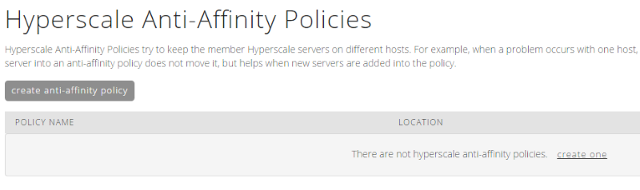
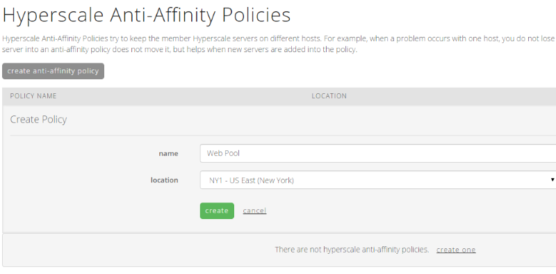
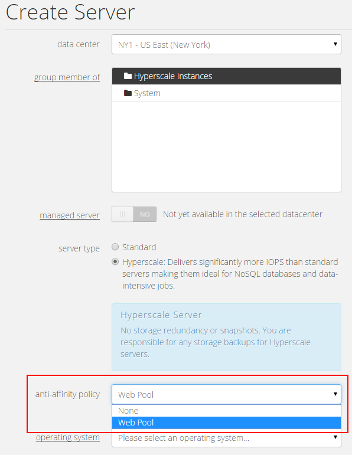
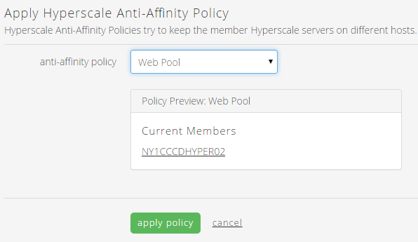

{{{
  "title": "CenturyLink Cloud Anti-Affinity Policies",
  "date": "6-1-2015",
  "author": "Chris Little",
  "attachments": [],
  "contentIsHTML": false
}}}

### Overview
CenturyLink Cloud offers customers [Hyperscale Servers](//www.ctl.io/hyperscale/) – an instance type that is designed for distributed workloads that require maximum performance. Hyperscale offers the same top-tier CPU and RAM performance found in our standard servers – and adds 100% flash storage. That means customers can typically expect at least 15,000 IOPS to turbo-charge applications.

Anti-affinity policies make it possible to spread workloads across physical hosts. When a new server is created and references an anti-affinity policy, the CenturyLink Cloud platform makes sure that all the virtual servers in that policy are distributed to unique physical hosts.
### Prerequisites to Leverage Anti-Affinity Policies
* A Hyperscale enabled Data Center. Refer to the [Centurylink Cloud Feature Availability Matrix](../General/centuryLink-cloud-feature-availability-matrix.md) for a list of Cloud locations that support Hyperscale
* A Hyperscale Virtual Machine. Customers can only apply Anti-Affinity Policies to Hyperscale Virtual Machines. Standard Virtual Machines are not supported at this time.

### Creating an Anti-Affinity Policy
1. Navigate to Policies, Hypsercale Anti-Affinity link in the Control Portal menu

    

2. Select Create Anti-Affinity Policy. Input a name for the Policy and choose a Hyperscale Enabled Data Center. Anti-Affinity Policies are Data Center specific. Once done select the create button.

    

### Creating a Virtual Machine with an Anti-Affinity Policy
[Create a new Hyperscale virtual server in CenturyLink Cloud.](../Servers/creating-a-new-enterprise-cloud-server.md) When doing so the ability to choose an Anti-Affinity policy will be available. Select the policy you wish to leverage.

  

### Adding an Existing Virtual Machine to an Anti-Affinity Policy
Navigate to the Hyperscale Virtual Machine in the Servers portion of control. In the *Server Info* portion of the page select *apply* and choose the Anti-Affinity Policy you wish this VM to leverage.

  
