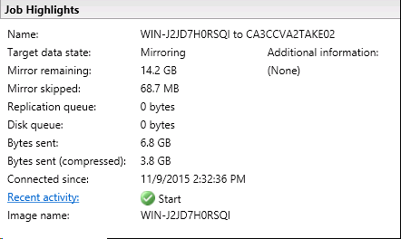

{{{
  "title": "CenturyLink Cloud Guide to Double-Take DR",
  "date": "11-16-2015",
  "author": "Gavin Lai",
  "attachments": [],
  "contentIsHTML": false,
  "sticky": false
}}}

### Table of contents

* [Overview](#overview)
* [Prerequisites](#prerequisites)
* [Use Case](#use-case)
* [Preparation Cloud](#preparation)
* [Scenario](#scenario)
* [Deployment](#deployment)
* [Repository Server](#repository-server)
* [Source Server](#source-server)
* [Setting up the DR mirroring and replication](#setting-up-the-dr-mirroring-and-replication)
* [Creating a Target Server](#creating-a-target-server)
* [Perform a Test fail over](#perform-a-test-fail-over)
* [Health Check](#health-check)
* [Support](#support)

### Overview
Double-Take DR allows customer to have a DR environment setup with a few easy steps. By utilizing the Vision Solutions created Blueprint in CenturyLink Cloud, this further simplifies the deployment process.

Before deploying any software, a DR plan needs to be in place. Depending on the business requirement, the server can be mirrored and replicated from on premise infrastructure to CenturyLink Cloud, CenturyLink Cloud to CenturyLink Cloud or CenturyLink Cloud to another location. In this walk through, a one to one scenario is used for the Double-Take DR for Windows, which can be expanded to many to many. For detail of the products, please see [Vision Solutions website](//www.visionsolutions.com/products/windows/double-take-dr/overview).

### Prerequisite

-   Access to the CenturyLink Cloud platform as an authorized user.
-   Identify a Network VLAN you want the Vision Solutions servers to reside on.
-   Possess a Double-Take license key
-   Target or Repository server should have enough disk space for
    replication
-   [Firewall
    rules](../Ecosystem Partners/Marketplace Guides/getting-started-with-double-take-blueprint.md)
    are in place for Double-Take Console and agent communication (Please
    see Knowledge Base article [**Getting Started with Double-Take -
    Blueprint**](../Ecosystem Partners/Marketplace Guides/getting-started-with-double-take-blueprint.md)
-   Review the [Self-Service VM Import / OVF Requirements](../Servers/self-service-vm-import-ovf-requirements.md) to ensure successfully DR


### Use Case

For ease of management, a Double-Take Management Console software is the user management interface for all Double-Take products.
Double-Take DR can mirror and replicate any server to any server, using it to create an easy to deploy DR environment either a one to one or many to many environment without costly infrastructure.  
In Double-Take DR product, there are minimum three servers, the source server, the repository server and the target server
 - The Source Server is the server requires DR
 - The Repository Server is used to store the data server images
 - The Target Servers are the servers built for disaster recovery (see below)


Starting with the Blueprint, apply the appropriate license to the server during the Blueprint setup. Please see the [Getting Started with Double-Take Blueprint](../Ecosystem Partners/Marketplace Guides/getting-started-with-double-take-blueprint.md) for details of licensing request.

### Preparation

In preparation, there are several factors need to be considered:

-   Verify the Windows version on the source server is supported by [Double-Take](//www.visionsolutions.com/docs/default-source/ha-dr-solution/double-take-dr-for-windows/double-take-dr-for-windows---technical-data-sheet.pdf?sfvrsn=4)
-   Currently Double-Take Blueprints are available on CentOS 5/6, RHEL 5/6 and Microsoft Windows 2008 R2 and 2012 R2
-   Bandwidth and connectivity between Source Servers and Repository Server
-   Double-Take Console (for management) is part of the Windows
    Blueprint installation

### Scenario

For this example, the source server is running Windows 2012 R2.

Multiple Windows servers require a central offsite disaster recovery to meet the business requirement. By using Double-Take Disaster Recovery product and CenturyLink Cloud Blueprints, this can be done in a few steps with an easy to understand costing model.  

### Deployment

If there an existing Double-Take Console installed and have network access to all Source, Repository and Target servers, then it can be used instead of creating new one.
For a new installation of Double-Take Management Console, please use the following steps:
1.   Deploy Double-Take Console on a VM in CenturyLink Cloud by running the [Double-Take Windows Blueprint from the blueprint    library](//www.ctl.io/knowledge-base/ecosystem-partners/marketplace-guides/getting-started-with-double-take-blueprint/#postrequisite),
    for this scenario, it could reside on the same sever as the Repository server

2.  Once installed, start the Console from the “Start’ Menu

    

3.   This will be the management interface to set up the DR environment

    

    Once in the Management Console, go to ‘Help’ and ‘Check for Updates’ and install any updates available

    

### Repository Server
Using the steps below to create the Repository Server in CenturyLink Cloud:

1.   Create the Repository server by running the Double-Take Blueprint on
    Windows 2012 R2 from the Blueprint library, enter the Double-Take DR
    for Windows Repository license in the Blueprint configuration screen

    

    

2.   Once Blueprint is completed, the new server can be managed from the Double-Take Console by clicking on
    ‘Get Started’ and ‘Add Servers’
    

3.   Enter the IP address or hostname, user name and password in the prompt:
    

4.   The ‘Manage Servers’ screen will show the status of the management connectivity

    

5.   The server details can be seen by double clicking the server
    

6.   The Double-Take Repository server has been created successfully, it will be use as the central storage for many Source Servers as DR target. The detail user guide for Double-Take DR is located [here](//download.doubletake.com/_download/7.1/7.1.0.0/Docs/DR/Windows/DRWindowsUsersGuide.pdf)

### Source Server

**Important Note**: make sure Remote Desktop Services and ping is
enabled on the Source Server as this is part of the requirement to
Import server to CenturyLink Cloud (please see [Self Service VM import OVF requirement knowledge article](../Servers/self-service-vm-import-ovf-requirements.md)).
There are two way of installing Double-Take software on the source server, either by downloading from Vision Solutions website or from the Double-Take Management Console.  

Install Double-Take DR on the Source Server using the Double-Take Management Console

1.   To manage the new server from the Double-Take Console by clicking on ‘Get Started’ and ‘Add Servers’

    

2.   Enter the IP address or hostname, user name and password in the prompt

    

3.   The source server will appear on the managed server list with
    ‘Cannot Connect to Double-Take’ activity

    

4.   Right click on the source server and click on ‘Install’

    

    The ‘Install’ screen will give the installation option, like
    temporary directory, installation path as well as schedule of the installation

    

    

5.   The ‘Manage Server’ screen will display the status of the
    installation, once completed, the source server will have ‘idle’     status and license status displayed
    

6.   The server details can be seen by double clicking the server

    

    Under ‘Edit Server Properties’, the network traffic can be encrypted for all Double-Take activities

    

### Setting up the DR mirroring and replication

1.   Click on ‘Get Started’ from the Double-Take Management Console and
    pick ‘Double-Take DR’

    

2.   Choose the ‘Protect files and folders or an entire Windows server’ from the next screen

    

3.   Pick the server that need to be protected

    

4.   Choose the data on this server that needed protection, this could be a data directory or a whole server

    

    

5.   Next is choose the target Repository server

    

6.   Set options for this replication

    -   Location of the Virtual Disk Path (ensure enough disk space for the images)

        

    -   Mirror Verify and file management options

        

    -   Snapshot schedules, Compression, Bandwidth (depends on the connectivity between Source and Repository) options and any customized scripts can be configured here

        

    -   Summary will report any issue with the checklist

        

7.   Jobs can be managed and monitored from the ‘Managed Jobs’ screen

    

8.   Double Click on the job to see the ‘Job Detail’

    

9.   The synchronization will continue until is completed

    

    

### Creating a Target Server

Similar to building the Repository server in the previous step, utilizing CenturyLink Cloud Blueprint to create the target server in the desired datacenter using [Getting Started with Double-Take Blueprint](../Ecosystem Partners/Marketplace Guides/getting-started-with-double-take-blueprint.md)


The Double-Take license required for this node is ‘Double-Take DR For Windows Recovery Target’

-   Once completed, the server can be managed from the Double-Take
    Management Console by ‘Add Servers’

    

    

#### Creating the Recovery Job

1.   Click on ‘Manage Jobs’ and select ‘Create a New Job’ or ‘Get
    Started’

    

2.   Choose Double-Take DR

    

3.   In order to recover data or entire server, select ‘Recover files and folders or an entire Windows server’

    

4.   Pick the Source Repository Server and the Image to Recover

    

5.   Choose Source Image to Recover, it can be done from a live image or a previously captured snapshot

    

6.   Choose to recover data or entire server

    

7.   Choose the newly created server as the target server

    

8.   Next is to customize the options for the recovery job, please do **NOT** change the network information in ‘Recovery Identity’ section on the target server as this will lead to lose access to the server in CenturyLink Cloud

    

    

    

9.   Make sure the job meets all the requirement from the checklist

    

10.   Click on ‘Finish’, the ‘Manage Jobs’ screen will show the job has been submitted

    

11.   Once completed, the status on the job will turn green and it can be used as a recovery server
    

### Perform a Test fail over

-   Create a snapshot of the target server from the Control Portal
    ([Creating and Managing Server Snapshots knowledge
    article](../Servers/creating-and-managing-server-snapshots.md)),
    [API](https://www.ctl.io/api-docs/v2/#server-actions-create-snapshot)
    or [CLI](//github.com/CenturyLinkCloud/CenturyLink Cloud-go-cli) for recovery or rebuild the test node with the procedure [Creating a Target Server](#creating-a-target-server)

    

-   From ‘Manage Jobs’ screen, right click on the replication job from the Repository Server to the Target Server and choose ‘Failover, Cutover or Recover’

    

-   Choose how to apply the target data

    

-   The Failover has started

    

-   Depending on size and bandwidth, the time required for this process can be varied. Once completed, the Target Server is rebooted and becomes a copy of the Source Server

### Health Check
-   Once the server is running, please ensure the password is identical to the one defined in the Control Portal to ensure the server operates correctly.
-   Please review the following list to complete the installation:
    1. Check if VMware tool is installed
    2. Windows can be activiated via a support ticket or the following commands

    	```
    	{
        slmgr /skms 172.17.1.21:1688
        slmgr /ato
    	}
      ```      
    3. Make sure the password on the server matches the one in the Control Portal

  This process can be used to create DR for multiple servers using the existing Repository Server.  The target server can be created at the time of disaster, this means there is not ongoing cost to maintain the running Target Servers as they can be created on demand for both testing and disaster recovery purposes.  
  This procedure can be repeated to set up multiple servers in a complex environment and managed from the Double-Take Management Console.  For multi-tiers application environment, either using built-in script function or a manual failover can control the start up sequence of the new environment.

### Support
  * For issues related to deploying the Double-Take on CenturyLink Cloud, Licensing or Accessing the deployed software, please visit the [Vision Solutions Website](//www.visionsolutions.com/services-support/support/contact-customercare)
  * For issues related to cloud infrastructure (VM's, network, etc), or is you experience a problem deploying any Blueprint or Script Package, please open a CenturyLink Cloud Support ticket by emailing [noc@ctl.io](mailto:noc@ctl.io) or [through the CenturyLink Cloud Support website](//t3n.zendesk.com/tickets/new).
