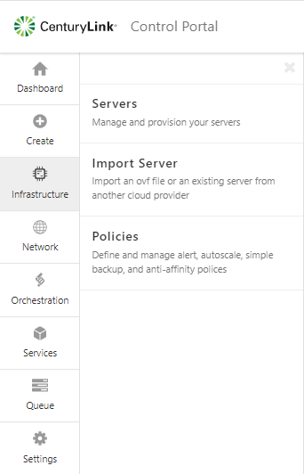
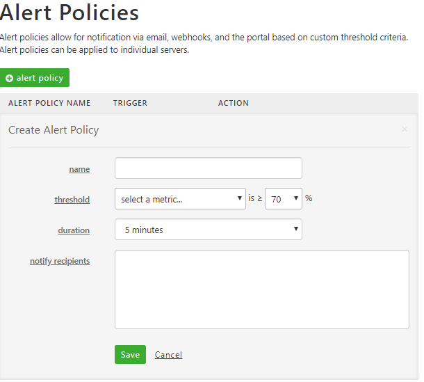
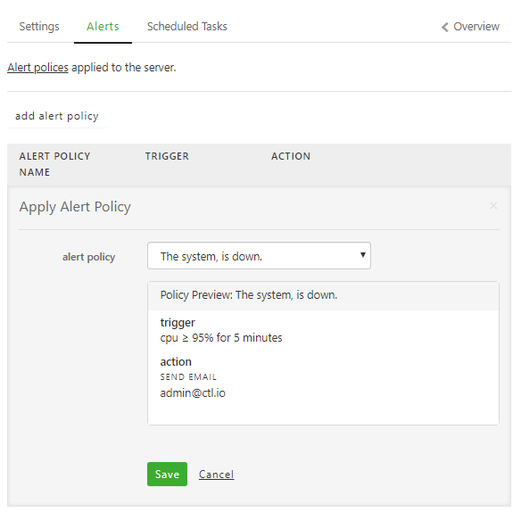

{{{
  "title": "Cloud Server Alerting FAQ",
  "date": "10-26-2021",
  "author": "Daniel Gainer",
  "attachments": [],
  "contentIsHTML": false
}}}

### Description

The Lumen Cloud has updated the Server Alerting capabilities that offer a new way to create and manage alert policies.

**Q: What's new in the server alerting service?**

**A:** The CLC team upgraded multiple aspects of the service. Previously, users configured monitors for each server and viewed a reports tab to track performance. Now, you create CPU/memory/storage alert policies, apply them to servers, and consume alerts in 3 key ways. Alerts can be sent via email, webhook, or through visual indicators in the updated Servers user interface.

**Q: Do my old single-server monitoring policies migrate to this new alerting service?**

**A:** No. We've rebuilt the monitoring system and cannot migrate old policies to the new alert system. Any custom monitors or IPMonitors remain in place. Note that now, your alert policies can be created once, and applied to multiple servers. This will make it significantly easier to update policies and impact a large number of servers immediately.

**Q: Does this only work with new servers, or can I apply these policies to existing ones?**

**A:** The new alert service applies to any server, regardless of when it was built or what operating system it is running.

**Q: How do I create alert policies in the Control Portal?**

**A:** Visit the **Infrastructure** page using the main navigation menu, then choose **Policies**. Provide a name for the policy and a specific utilization threshold for CPU/memory/storage that should trigger an alert.

Once in the **Alert Policies** submenu, click "+ alert policy" and provide a name for the policy and a specific utilization threshold for CPU/memory/storage that should trigger an alert.

**Q: Where do I add alert policies to a server?**

**A:** Alert policies are added to each server. Visit the server's settings and select the **Alerts** tab. Choose existing policies to add to the server. Changes take effect instantly.

**Q: What kind of emails do I receive when an alert occurs?**

**A:** The Lumen Cloud platform will send an email to the address(es) designated in the alert policy whenever the alert threshold is exceeded. This email message identifies the name of the alert, and what capacity of the server (e.g. 80% CPU utilization) trigger the alert. The platform will also send a follow up email when the alert is no longer occurring.

**Q: How can I see information in the Control Portal about active alerts?**

**A:** The Control Portal now provides a powerful way to detect alerts in progress. First, the user interface navigation highlights which servers are currently in an alert stage. The alerting status rolls up to the group containing the server, and the data center containing the group.

The server page itself also shows the alert details. You can see both the current amount of CPU/memory/storage consumption, and where the consumption exceeded the alert threshold.

**Q: How do alert webhooks work?**

**A:** Webhooks are a powerful way to build a more event-driven relationship with your cloud environment. Users of webhooks can integrate internal systems with the resources running in the cloud. Alerts are now available as webhooks! Whenever an alert fires, the Lumen Cloud platform sends out a JSON-encoded message to a web address specified by the user. These JSON messages include the name of alert, account name, server name, and threshold violation details. Users can choose to also receive webhook events for alerts raised in any sub accounts.
