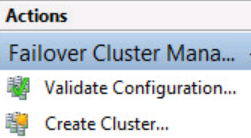
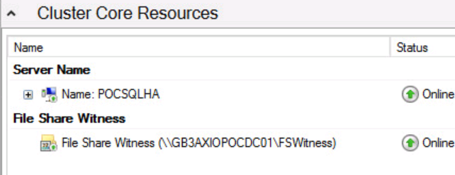
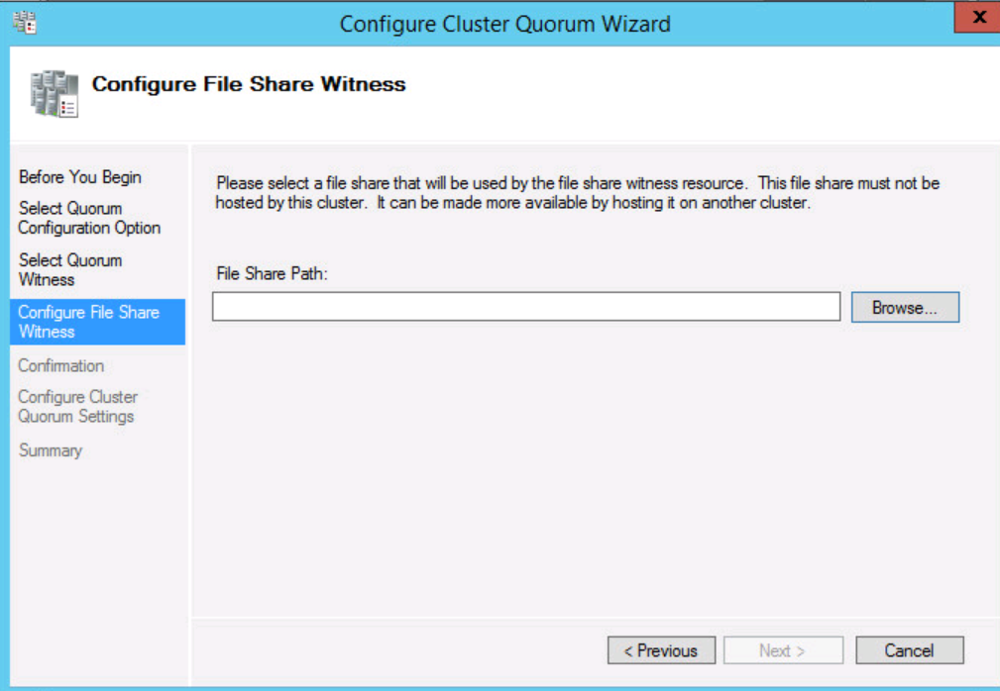
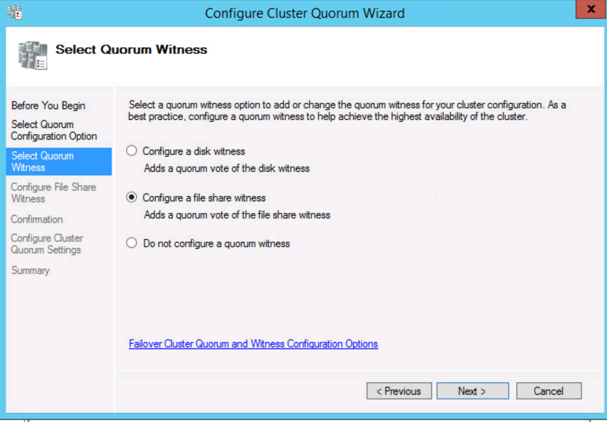
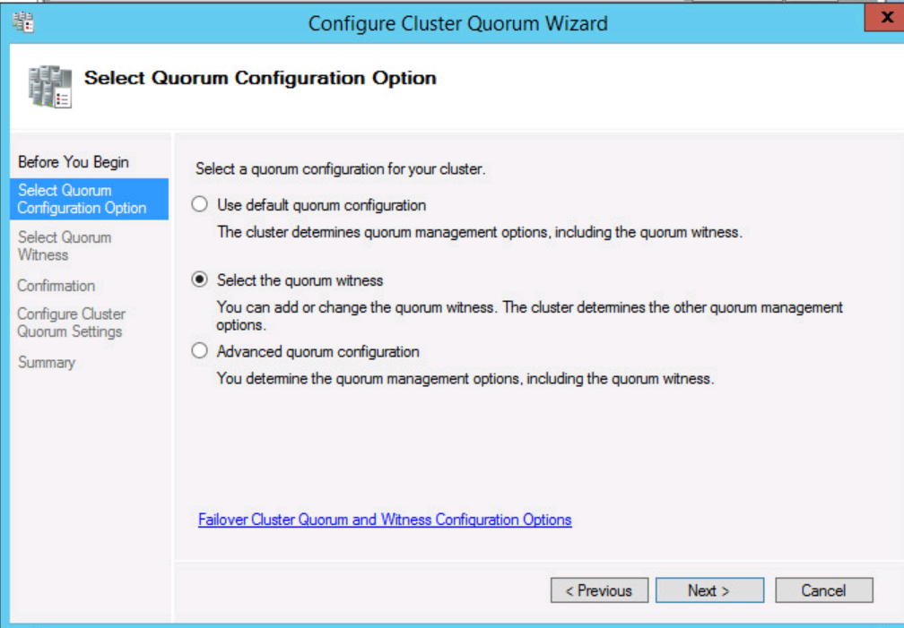
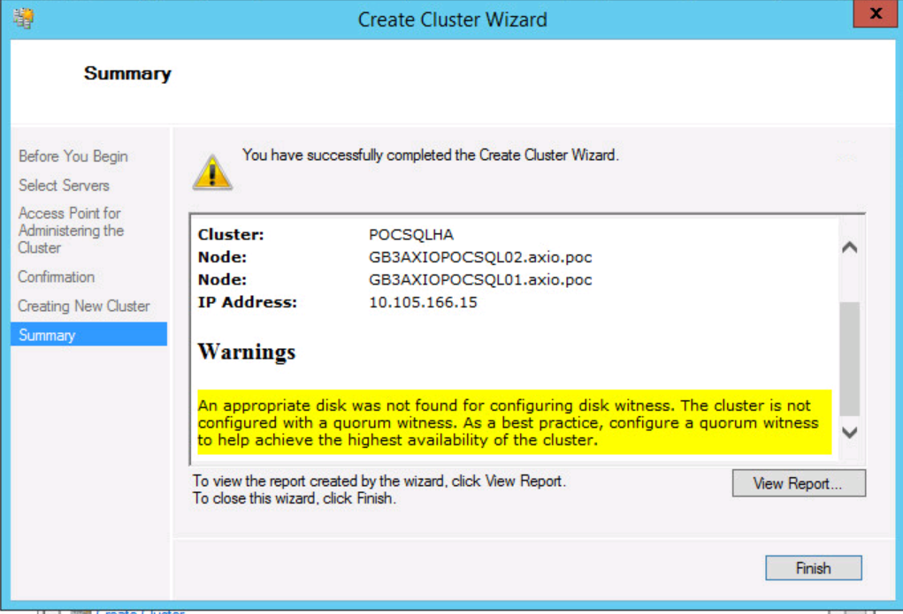
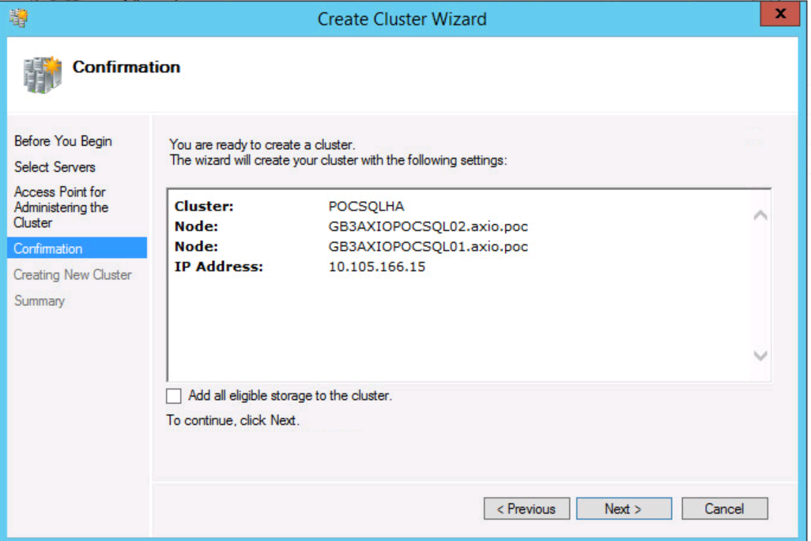
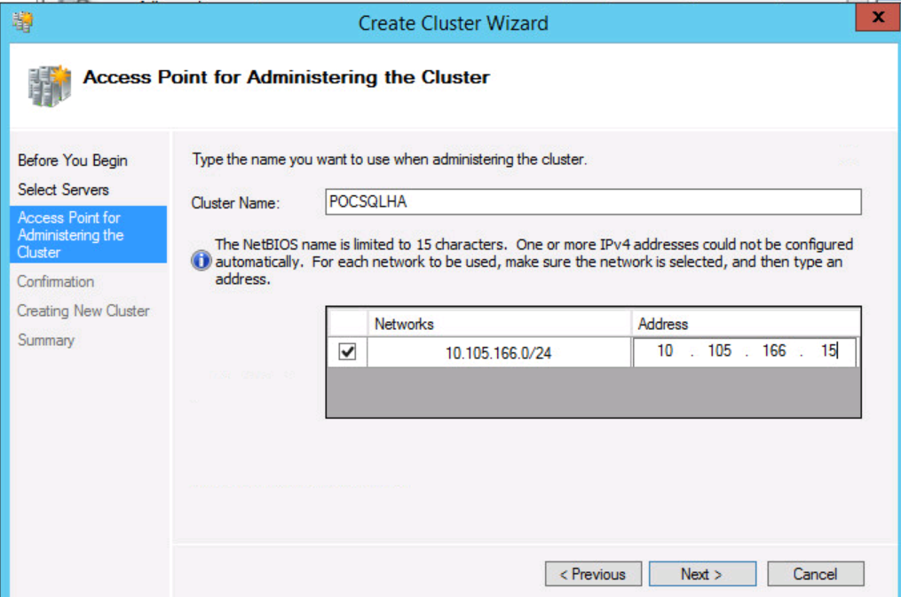
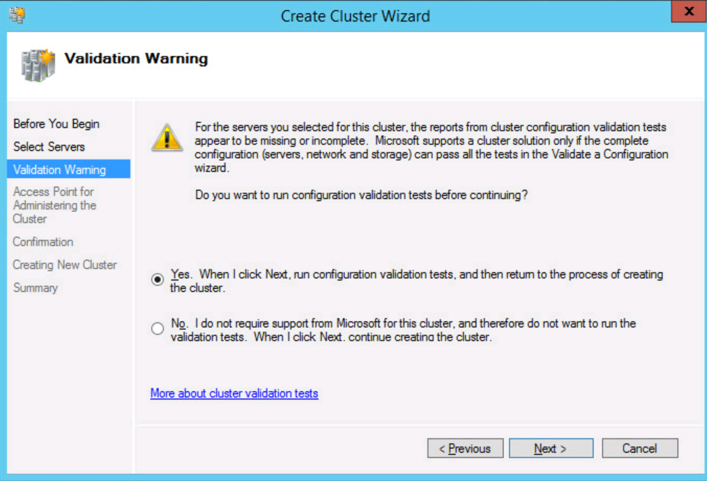

{{{
  "title": "Configuring Failover Clustering for a SQL AlwaysOn Availability Group",
  "date": "04-01-2015",
  "author": "Jake Malmad",
  "attachments": [],
  "contentIsHTML": false
}}}

###OVERVIEW
This article will walkthrough the creation of a Failover Cluster in preperation for a SQL AlwaysOn Availability Group. It assumes that at least one Active Directory Domain Controller exists and is reachable over the network that your SQL servers are to reside on. Best practices are to create separate VLANs for the Active Directory and the SQL networks, so ensure that the appropriate firewall rules are in place to allow communication. This article assumes we are using the default SQL instance and port (1433), please note that additional instances may have different ports assigned to them. The companion article with the SQL Configuration steps can be found [here](../Servers/configuring-failover-clustering-for-a-sql-alwayson-availability-group.md).

###DETAILED WALKTHROUGH

1. Create two identical servers using "Windows 2012 R2 Datacenter Edition". If additional paritions are to be added to the server (logs, DB storage, etc.) then the same drive letters and disk sizes must be identical across all machines participating in the cluster. In the "Create Server" wizard, ensure that your Active Directory Domain Controller(s) IP address is used for the DNS server(s).

2. Login to the first node, and click "Add Roles and Features". Click next twice until you get to the features selection, and check the "Failover Clustering" feature. When prompted "Click" add and finish the install wizard. Perform this process on all other nodes.

3. On the primary node, click the "Start" button and run "Failover Cluster Manager"

4. Under the "Actions" section, click "Create a new cluster"

    

5. Click "Next". Note that the account you are using should be an Admin account on all node, or preferrably a Domain Admin account.

6. Browse and add the desired nodes to the cluster. Click "Next"

7. You will be presented with a validation warning. Select "Yes" to run the validation tests.

    

8. The validation tests should pass with warnings. Some warnings are expected (such as a single NIC being a point of failure), but the report should be viewed to make certain there are no major errors.

9. Enter a name and IP address for the cluster. Email the NOC and ask them to reserve an IP address for the cluster. Also, please let us know which SQL server (you can pick one) you would like it reserved for. Click "Next"

    

10. On the confirmation page, uncheck the "Add all eligable storage to the cluster". Click "Next"

    

11. Click "Next" and wait for the cluster to be configured. It should be successful, but present a warning about a witness server.

    

12. Click "Finish".

13. Create a share on the server designated to be the "File Share Witness" server. Add the appropriate read/write permissions, especially including the cluster AD object (ClusterName$).

14. In "Failover Cluster Manager", right-click the cluster name, go to "More Actions" and select "Configure Cluster Quorum Settings"

15. Choose "Select the Quorum Witness" and click "Next"

    

16. Select "Configure a File Share Witness"

    

17. Browse to the previously created "File Share Witness" path.

    

18. Click "Next" through the confirmation and configuration. Click "Finish". Now, we viewing the cluster, we should see the health of all nodes (online) as well as the FSW:
    

19. Now that the cluster has been created, we can proceed to configuring SQL
