{{{
  "title": "Configuring High Availability (AlwaysOn) on Microsoft SQL Server Databases",
  "date": "06-29-2015",
  "author": "Kelly Malloy",
  "attachments": [],
  "related-products" : [],
  "contentIsHTML": false
}}}

### Overview

SQL 2012 Enterprise Edition introduced new features for configuring HA (high availability) on Microsoft SQL Server databases.  System outages are either anticipated (planned) or a result of failures (unplanned) which may lead to data loss and impact the end user application experience. In these situations, the primary objective of the system administrator is to bring back the system online as soon as possible with minimal data loss.

AlwaysOn is a feature in SQL Server 2012 and 2014 that provides flexible and cost-efficient high availability and disaster recovery. It provides automatic recovery from failures, increasing the availability of critical applications and potentially reducing the risk for data loss, while avoiding downtime.

### Description

AlwaysOn can be configured at both the database level and instance level.  This HA method also allows the use of locally attached storage.  There is no need for Fiber Channel or iSCSI based SAN disks.  SQL AlwaysOn is a perfect fit for multiple datacenter locations.  With the proper configuration, applications can survive a datacenter failure with little or no perceived application impact.  The purpose of this prescriptive architecture is to guide the setup of a SQL 2014 Enterprise Edition AlwaysOn availability group configuration in two distinct datacenter locations.

### Prerequisites

SQL 2014 AlwaysOn Database Availability Groups require a properly configured Active Directory environment and Enterprise or higher editions of Windows Server 2012 and Enterprise edition of SQL 2014.  This guide will not detail the required Active Directory setup, however listed below are some important ideas to consider prior.
* Ensure that the required Active Directory subnets are defined and joined to the correct Active Directory Sites.  This work is performed via the Active Directory Sites and Services tool.
* Ensure that at least one Active Directory Domain Controller is configured in each datacenter location that will support availability groups.  Leverage our [public blueprints](../Blueprints/centurylink-cloud-public-blueprint-packages.md) to automate this process.

This guide will use the CenturyLink Cloud Blueprints Library for server deployments as well as base application installation, assuming you have already deployed the desired servers in the desired datacenter that will be used for the Microsoft SQL Server.  It is also an assumption that there is a working Active Directory environment and the “Join Domain” and “Install SQL” tasks on the final page of the Create Server page.  

### Steps

1. Install SQL Server

  In this guide there are a total of 6 servers used in the deployment.  There is a Domain Controller in datacenter GB1 and GB3, as well as 2 SQL servers in datacenter GB1 and GB3.  Leverage our [public SQL server blueprints](../Blueprints/deploy-microsoft-sql-server-using-blueprint.md) to facilitate a rapid installation of SQL server.

  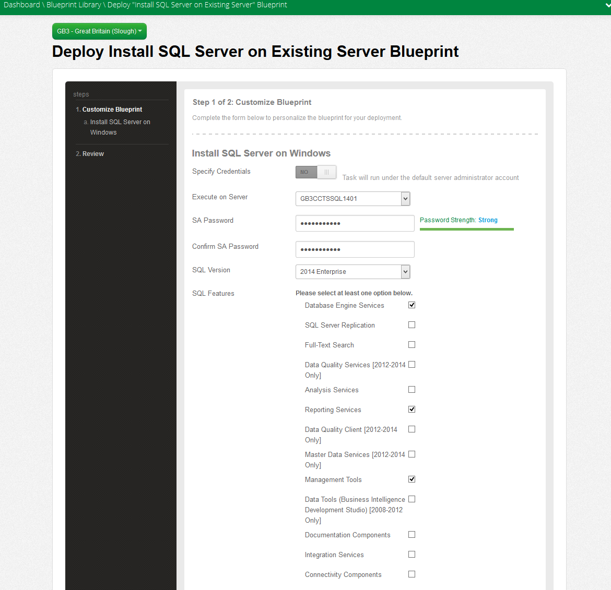

2. Create a Cross Data Center Firewall Policy

  After all servers are deployed and SQL Server 2014 is installed, a [cross data center firewall policy](../Network/creating-cross-data-center-firewall-policies.md) will need to be created between datacenter locations GB1 and GB3.  CenturyLink Cloud data centers are federated using our global network backbone.  To allow customer connectivity between datacenters, a cross data center firewall policy must be created.  Below, a policy has been created between 10.61.98.0/24 in GB1 and 10.105.40.0/24 in GB3, which are the subnets our guide servers are deployed to.  In this example, communication will be allowed between the entire /24 subnet range.  If security policies require restricting communication to specific hosts and ports, operating system firewalls can be configured as required.

  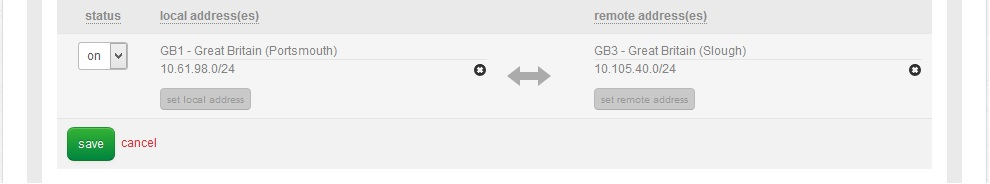

3. Add Failover Clustering Role

  Once all required network communication has been established, the Failover Clustering Role must be added to each of the four SQL servers. This is accomplished with the Add Roles option in the Server Manager.

  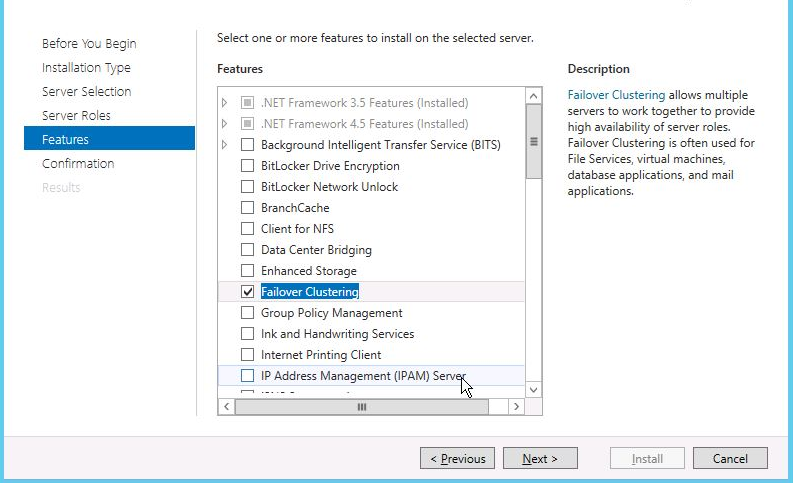

4. Add SQL Servers Into Failover Cluster

  After adding the role, open Failover Cluster Manager on one of your SQL servers.  This is accessed under the Administrative Tools.  Add all four of the SQL servers into this configuration.

  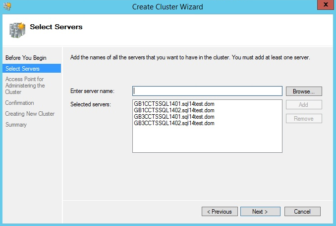

5. Run All Tests

  Choose the option to Run All Tests.  Examine the report and resolve any issues that might prevent the cluster from forming correctly.

  The access point will be a unique IP address on each of the respective subnets, in this example 10.105.40.250 and 10.61.98.250.  During creation of the cluster you will receive a warning about lack of File Share Witness and or Quorum Disks.  Continue past these warnings, they will be configured soon after cluster completion.

  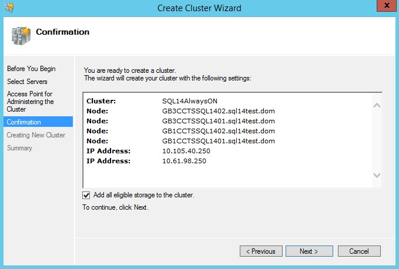

6. Create the Quorum

  After the cluster is created, each of the SQL Servers will now be listed under Nodes in the Failover Cluster Manager.  The next step in this process is the creation of the quorum.  The quorum works with the SQL servers to act like a tie-breaker when the cluster cannot determine the correct owner of resources.  This configuration guide will use a File Share Witness, which will be configured on an existing Domain Controller.  This File Share Witness role can be added to any machine that is part of the Active Directory domain as long as all SQL servers have network and share level access.

  Right click the new cluster name, SQL14AlwaysOn.sql14test.dom in this example, and choose Configure Cluster Quorum Settings.  Answer the appropriate configuration questions to complete configuration.

  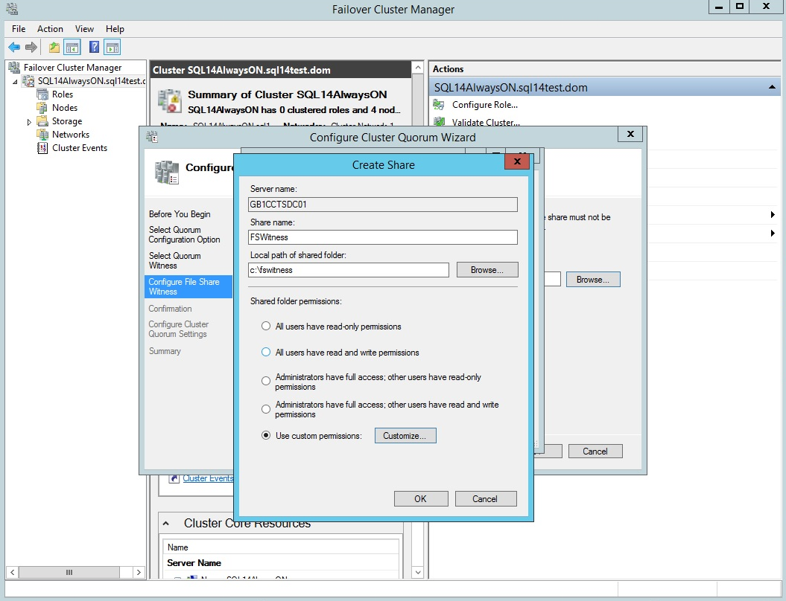

  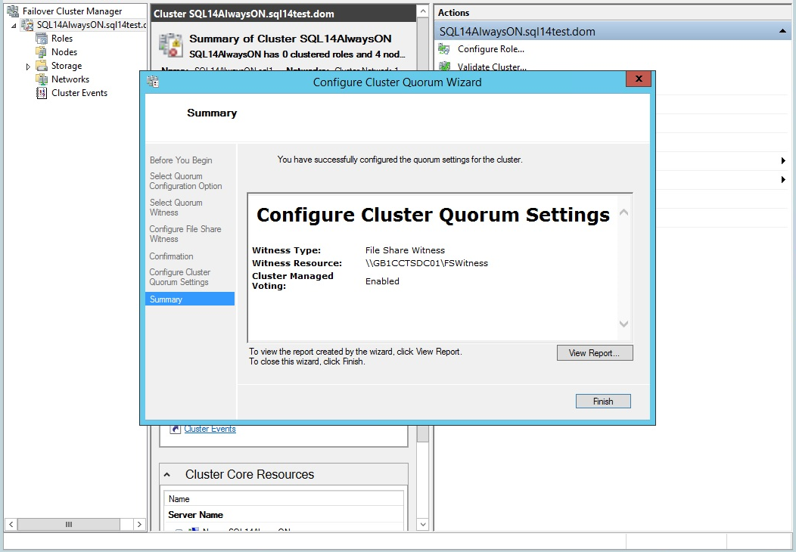

  At this point all prerequisites have been configured and the configuration of the SQL AlwaysOn Availability Group is ready to begin.

7. Enable AlwaysOn Availability Groups

  In Active Directory, Users and Computers create a domain service account for use by the SQL Cluster.  Be sure to set the password as never to expire.  On each SQL server, launch SQL Server Configuration Manager.  Choose the SQL Server (MSSQLSERVER instance) to run as the newly created Active Directory account.  Go to the AlwaysOn High Availability tab and mark the box Enable AlwaysOn Availability Groups.  This will prompt to restart services which can be completed at this point.

  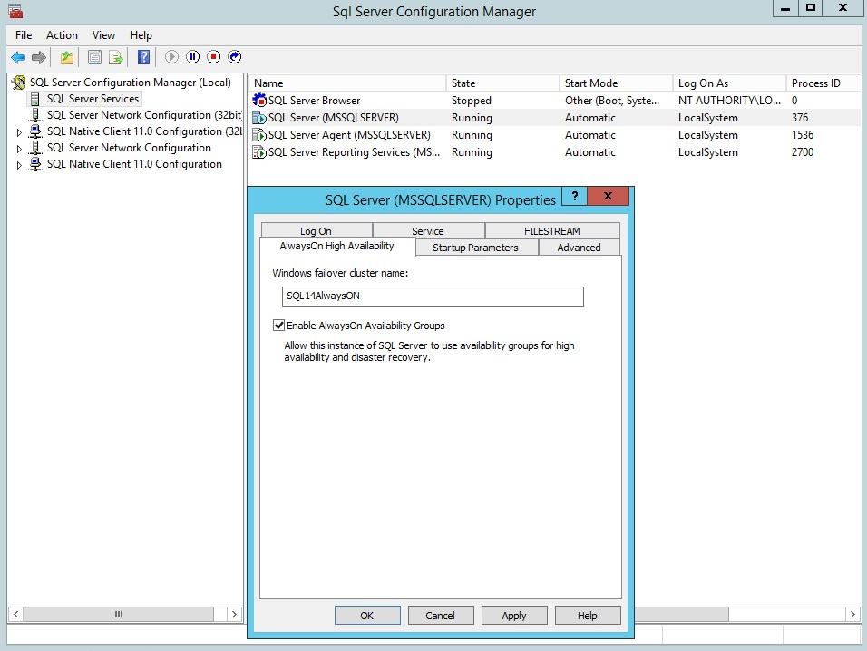

8. Create an Advanced Windows Firewall Policy

  On each SQL server, create an Advanced Windows Firewall policy that allows port 5022 and an arbitrary port number for the Availability Group Listener.  This should be enabled for inbound and outbound communication.

  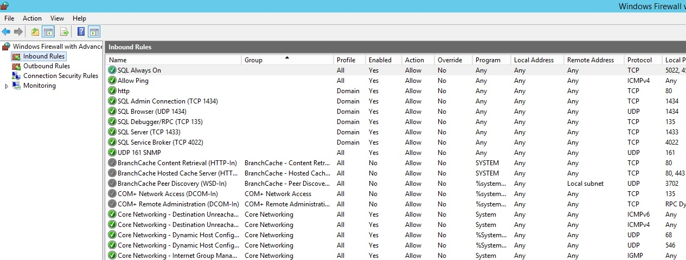

9. Select Databases for the Availability Group

  Open the SQL Server Management Studio and connect to the local SQL Server instance using Windows authentication.  In Object Explorer, expand the AlwaysOn High Availability folder.  Right click on this folder and select New Availability Group Wizard.  Enter the name for the new Availability Group in the appropriate field.  Next, you will be presented with a list of all local databases.  Also detailed is their eligibility for group membership.  One prerequisite is the database needs to be in a consistent state, in Full Recovery Mode.  Also, the database must have a recent full backup.  This is a great time to work with your SQL Server Administrator to ensure that the appropriate database maintenance plan has been created for your production databases.  The database maintenance plan should meet the business requirements for recoverability, data retention, etc.

  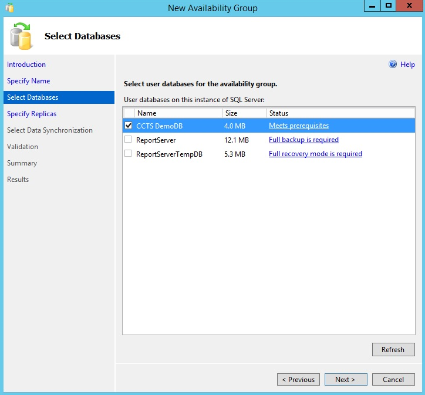

10. Specify Replicas

  After the desired databases have been selected for inclusion, proceed to the Specify Replicas page.  Use the Add Replica button to connect to your three other SQL server nodes in the previously created Windows Server Failover Cluster.  Local servers to a datacenter should be set to Synchronous Commit.  If you want to use automatic failover to a remote datacenter, select Automatic Failover for one of the remote SQL servers, with the Synchronous Commit button selected.  If desired, the 4th node can be set to Readable Secondary.  A Readable Secondary can be used for backups and other read-only operations.  It is important to note that failover, backups, etc should be tested and verified BEFORE you actually need to use them in a production environment.  The new tools with SQL 2014 are extremely powerful, but they will not function without the proper configuration, and subsequent testing.  An appropriate 4 server configuration is show below.

  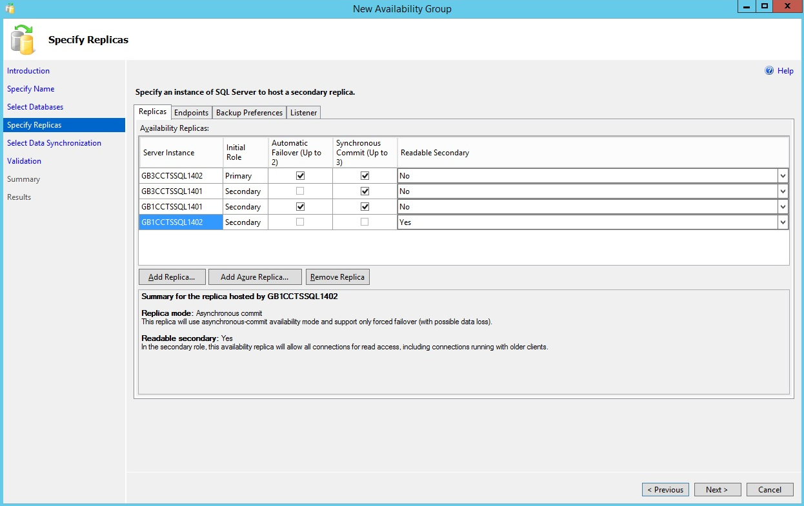

11. Create the Listener

  Select the Listener tab.  This tab will create the listener that your actual applications will connect to for SQL Operations.  Create a unique name in DNS and match your port number to the port number you used during the Advanced Windows Firewall rule creation.  In this example, port 4421 was used.  Choose the Network Mode as Static IP and create a unique IP address in each of your connected subnets.  In this example, 10.105.40.251 and 10.61.98.251.

  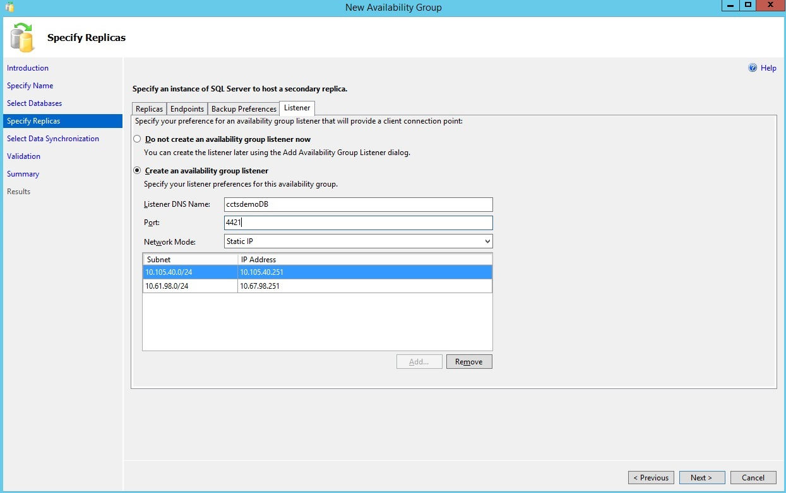

12. Specify a Share Accessible to All Cluster Nodes

  Next, move to the Select Data Synchronization tab.  Choose Full and specify a share accessible to all cluster nodes.  The Validation tab will ensure that all parameters and prerequisites are met.  After clicking Finish, the Wizard will create the required configuration among all servers.  With a bit of luck, you will be presented with a completion successful screen.

  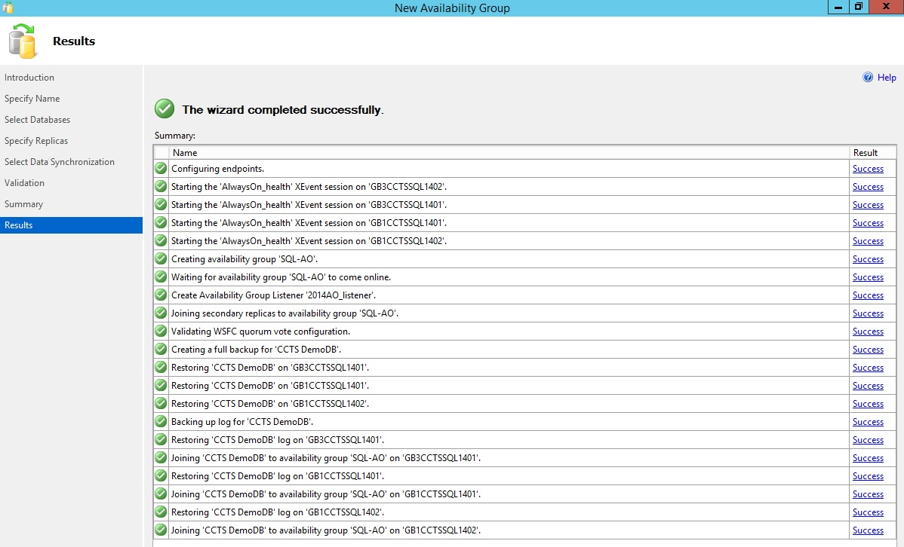

13. View Your New Availability Group

  After completion use SQL Server Management Studio – Object Explorer to view your new Availability Group.

  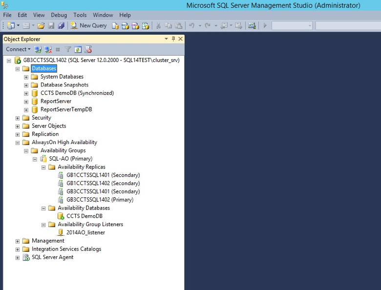

  That completes the setup for a 4 node SQL Server cluster.  Mentioned previously, if you desire for your solution to work in a worst case scenario, for example, a datacenter is offline and not coming back online for many hours this must be tested and verified prior.  All applications behave differently.  Your team will need to ensure that the applications you plan to use with this High Availability method behave in a manner you expect.  All system administrators know that during an outage is not the time to try and figure out something for the first time.  Create a strategy, execute a plan, and test for success!
