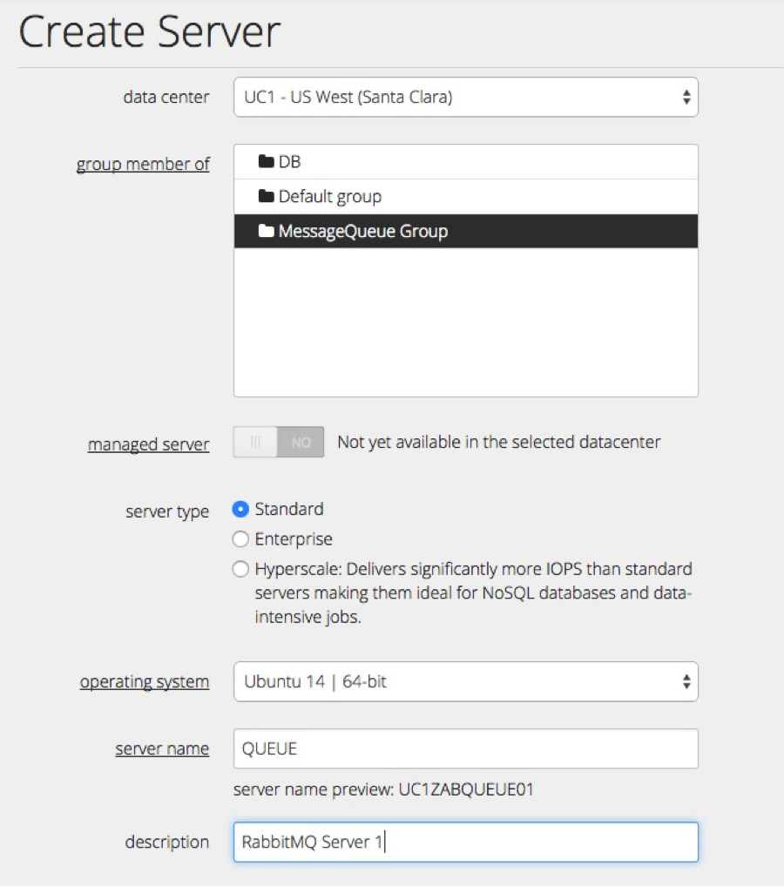
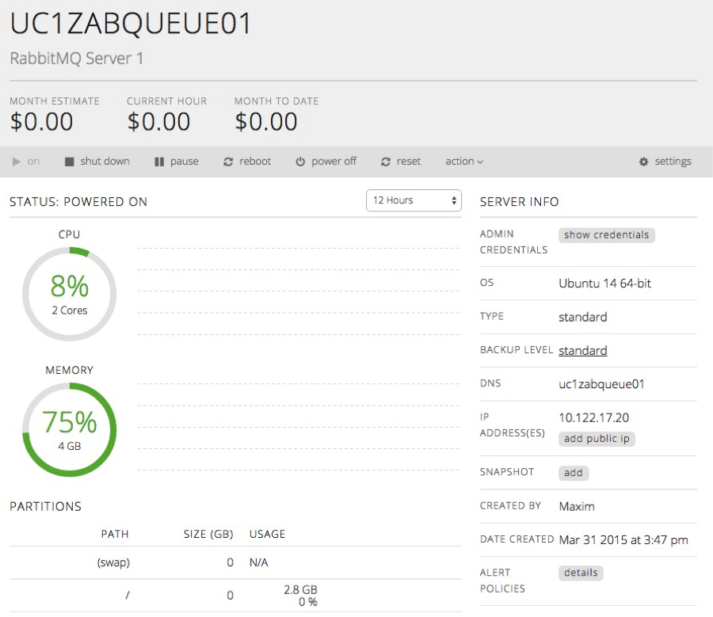
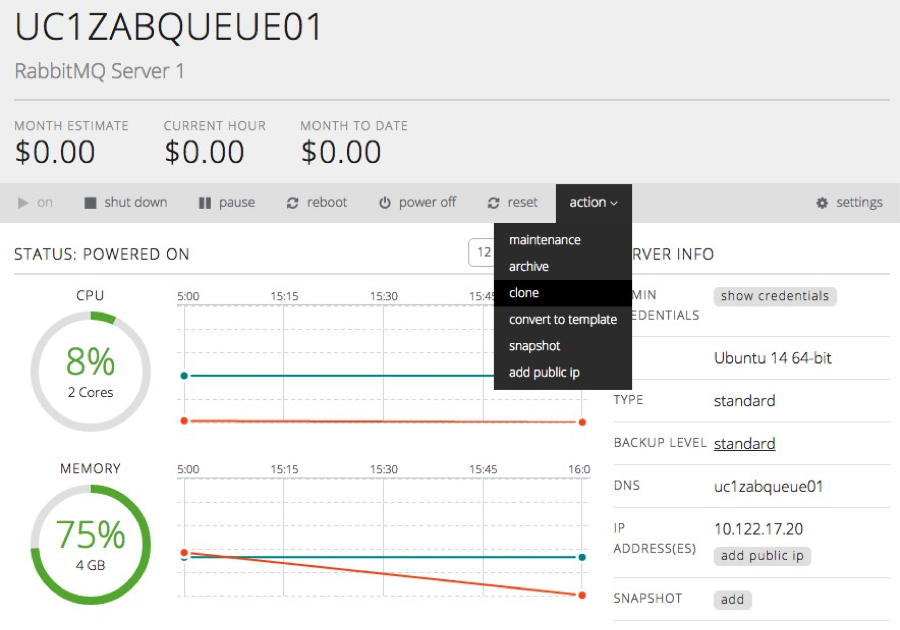
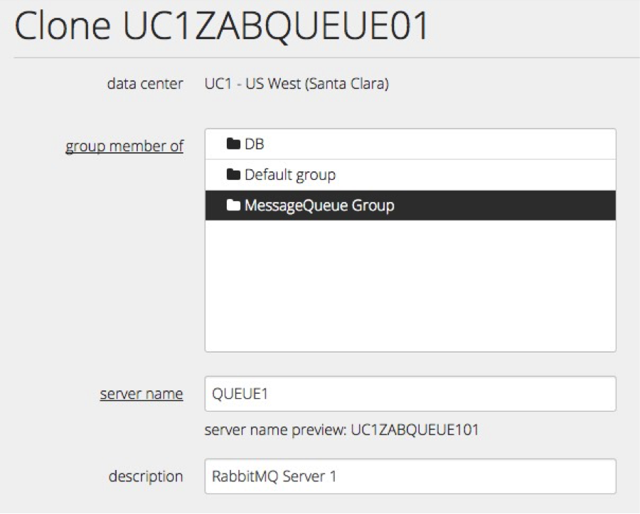
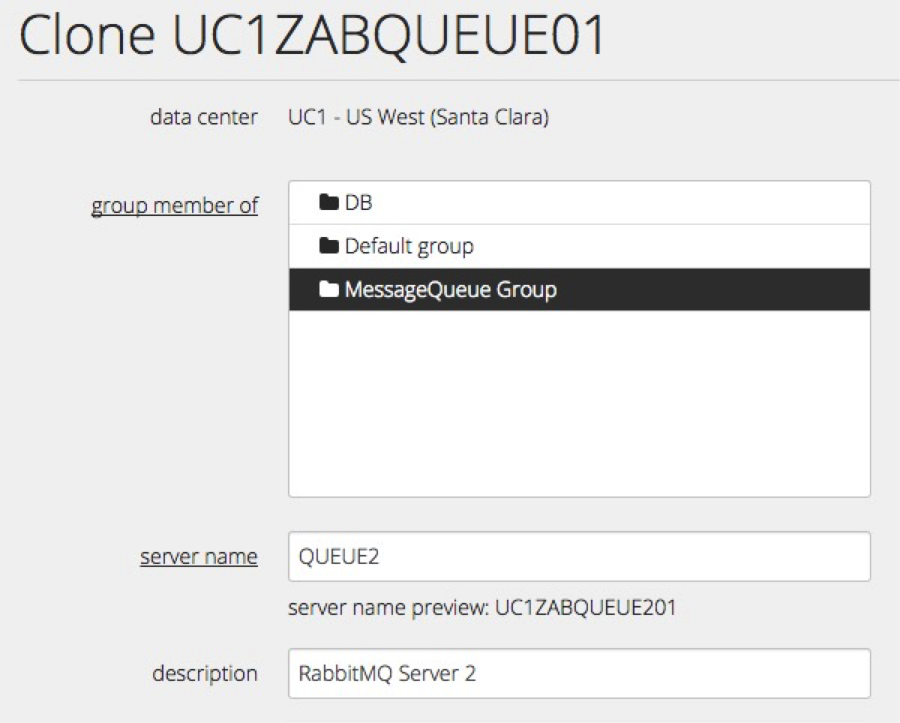

{{{
  "title": "Configuring RabbitMQ Cluster",
  "date": "04-01-2015",
  "author": "Maxim Volkov",
  "attachments": [],
  "contentIsHTML": true
}}}

<strong>Introduction</strong>

Message queuing services do play an increasingly important role allowing companies to create elastic, cross platform/cross application, asynchronous processing architectures. One of the popular choices for message queuing is RabbitMQ, it is an Advanced Message Queuing Protocol (AMPQ) compliant, well documented, with a broad user base.

The steps below are describing how to build operational highly available redundant RabbitMQ cluster, which will be composed from three servers. The assumption is that clustered servers are residing within a same Data Center. 
	RabbitMQ replication across WAN will function, however will conflict with the principles of the <a href="http://en.wikipedia.org/wiki/CAP_theorem">CAP Theorem</a>.

Upon RabbitMQ cluster installation a testing method will be presented as well.

<h3>Steps to Configure RabbitMQ Cluster on CenturyLink Cloud</h3>

	<ol>
		<li><strong>Create Server.</strong>

We will use the Ubuntu 14 64-bit template for this example, however with a few changes, these steps can be performed on other OS flavours as well.  

  

 
	 	<li><strong>Install RabbitMQ.</strong>

This will become a main queue server. We will use the following script to install the MySQL package using Ubuntu's package manager. You could also create a  [blueprint script](https://t3n.zendesk.com/entries/20348448-Blueprints-Script-and-Software-Package-Management) to do this, but since we are only installing on one server for now, we will logon to the server and run the commands manually.

<pre>
apt-get update
apt-get -y install rabbitmq-server
</pre>
		<li><strong>Clone server.</strong>
 
Now we will use clone method to create second and third messaging queue servers.

  

  

 

		<li><strong>Configuring RabbitMQ cluster.</strong>

To simplify instructions, we will rename hostnames to something less cryptic, and call servers: queue1, queue2 and queue3, by executing following command on respective host.

<pre>
FIRST_SERVER$ hostname queue1 
SECOND_SERVER$ hostname queue2 
THIRD_SERVER$ hostname queue3
</pre>

We'll need to change /etc/hosts file as well to reflect the change across all nodes:

<pre>
10.XX.XX.1 queue1 # master 
10.XX.XX.2 queue2 # First slave 
10.XX.XX.3 queue3 # Second slave
</pre>

To begin cluster configuration we will stop RabbitMQ on all three servers with:

<pre>
/etc/init.d/rabbitmq-server stop
</pre>

Ensure service is stopped properly by examining output from the command - no services should be listed:

<pre>
ps aux | grep '[r]abbitmq-server'
</pre>

Since we need the same cookie file to be present across all nodes, next we need to copy the cookie from the master to slaves. Running from the master:

<pre>
scp /var/lib/rabbitmq/.erlang.cookie queue1:/var/lib/rabbitmq/ scp /var/lib/rabbitmq/.erlang.cookie queue2:/var/lib/rabbitmq/
</pre>

Make sure you start nodes after copying the cookie from the master.

<pre>
/etc/init.d/rabbitmq-server start
</pre>

The following commands have to be run on all nodes, except the master (queue1).

<pre>
rabbitmqctl stop_app
rabbitmqctl reset 
rabbitmqctl join_cluster 
rabbit@queue1 rabbitmqctl start_app
</pre>

To confirm the change took place, we check cluster's status from any connected node:

<pre>
rabbitmqctl cluster_status

Cluster status of node rabbit@queue3 ...

[{nodes,[{disc,[rabbit@queue1,rabbit@queue2,rabbit@queue3]}]},

{running_nodes,[rabbit@queue1,rabbit@queue2,rabbit@queue3]},

{partitions,[]}]

...done.
</pre>

<li><strong>HA policy</strong>

Finaly, to synck all the queues accross all the nodes we need to run:

<pre>
rabbitmqctl set_policy ha-all "" '{"ha-mode":"all","ha-sync-mode":"automatic"}'
</pre>

</ol>
Our cluster has been successfully created.

<h3>Testing RabbitMQ cluster</h3>

The cluster is ready to be tested. We will create a simple testing scenario to make sure our cluster works as is expected. Using first Python script we are going to submit a message to the messaging queue and using second script we will collect that message. 
To prepare for testing, we will install Python module to work with RabbitMQ:

<pre>
apt-get install python-pika
</pre>

Now let's copy and paste the following script in your home directory, and call it "test_send.py"

<pre>
import pika

queue_server='queue1'

queue_name="My_First_Queue"

message="Hello CLC!"

connection = pika.BlockingConnection(pika.ConnectionParameters(host=queue_server))

channel = connection.channel()

channel.queue_declare(queue='%s' % queue_name)

channel.basic_publish(exchange='', routing_key='%s' % queue_name, body='%s' % message)

print " [---->] Sent a message : '%s'" % message

connection.close()
</pre>

The script connects to the "queue1" servers and sends a message, which consecutively replicates into the rest of the servers of our new queue cluster:

<pre>
python test_send.py
</pre>

To make sure message has been successfully received, we run:

<pre>
rabbitmqclt list_queues
</pre>

When we run this command on each of the three clustered servers, you should see:

<pre>
queue1:/home/rabbit/py$ rabbitmqctl list_queues

Listing queues ...

My_First_Queue 1

...done.

queue2:/home/rabbit/py$ rabbitmqctl list_queues

Listing queues ...

My_First_Queue 1

...done.

queue3:/home/rabbit/py$ rabbitmqctl list_queues

Listing queues ...

My_First_Queue 1

...done.
</pre>

Output from the command implies that message is waiting in a queue to be used. To test message retrieval, we'll use the following script test_receive.py

<pre>
import pika

queue_name="My_First_Queue"

queue_server="queue2"

connection = pika.BlockingConnection(pika.ConnectionParameters(queue_server))

channel = connection.channel()

channel.queue_declare(queue='%s' % queue_name)

def callback(ch, method, properties, body):

print " [---->] Received %r" % (body,)

channel.basic_consume(callback,

queue='%s' % queue_name,

no_ack=True)

print ' [---->] Waiting for the next messages. To exit press CTRL+C'

channel.start_consuming()
</pre>

The script connects to one of the cluster nodes and retrieves the message stored there.

<pre>
queue3:/home/rabbit/py$ python test_receive.py

[---->] Received 'Hello CLC!'

[---->] Waiting for the next messages. To exit press CTRL+C
</pre>

We received our message and can confirm that messaging queue becomes empty:

<pre>
queue1:/home/rabbit/py$ rabbitmqctl list_queues

Listing queues ...

My_First_Queue 0

...done.
</pre>

To learn more about configuration options and features you can consult <a href="http://www.rabbitmq.com/documentation.html">RabbitMQ manual</a>.

