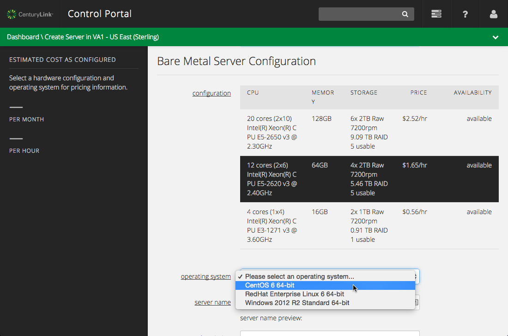

{{{
  "title": "Creating a New Bare Metal Server",
  "date": "7-5-2015",
  "author": "Bryan Friedman",
  "attachments": []
}}}

### Description
Creating a bare metal server on CenturyLink Cloud follows a similar flow as [creating a virtual server](../Servers/creating-a-new-enterprise-cloud-server.md), with a few exceptions. The steps below demonstrate how to provision new bare metal machines in the CenturyLink Cloud. For specifications on which capabilities are supported for bare metal servers as opposed to virtual machines, you may reference the [Server Comparison Matrix](../Servers/server-comparison-matrix.md) for details. For more information on Bare Metal servers in general, please refer to the [Bare Metal FAQ](../Servers/bare-metal-faq.md).

### Steps

1. To start the "Create Server" Process, use the **+** icon on the left side of the **Servers** area and choose **+ Server** to bring up the **Create Server** page.

  

2. Just like for any server you create, you will first need to select the **data center** to deploy it to and a **group** to put the server in. Then, select the **Bare Metal** option (if it is available in the data center you selected).

  

3. After selecting **Bare Metal**, you will be presented with a set of configuration options to choose from - each with a different mix of CPU, memory, and storage capacity. Simply click on the desired configuration (if it is available in the selected data center) to select it for provisioning.

  

  You should also notice the warning message that appears regarding no backups or storage redundancy. Bare Metal servers do not offer standard or premium backup options, so make sure you implement your own solution if you need backups for the server.

4. Now, choose the operating system for this server. Bare Metal servers currently offer a subset of the OS options offered for virtual machines on CenturyLink Cloud: Windows 2012 R2 Standard, Red Hat 6, and CentOS 6.

  

5. Next, you'll need to set the server name, description, and administrator password for this server, just as you do with any CenturyLink Cloud server. As usual, the name entered is part of a formatted name that is arranged as: **(data center name)** + **(account alias)** + **(user-provided server name)** + **(counter index)**. The administrator password will set the "Administrator" password in Windows or the "root" password in Linux.

  

4. Finally, select the account network, primary DNS and secondary DNS for the server, the same as you would for any CenturyLink Cloud server.

  

5. After the server has been provisioned, use the Server Details page to see the details of the server and perform actions on it.

  
