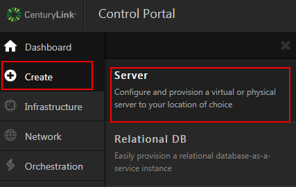
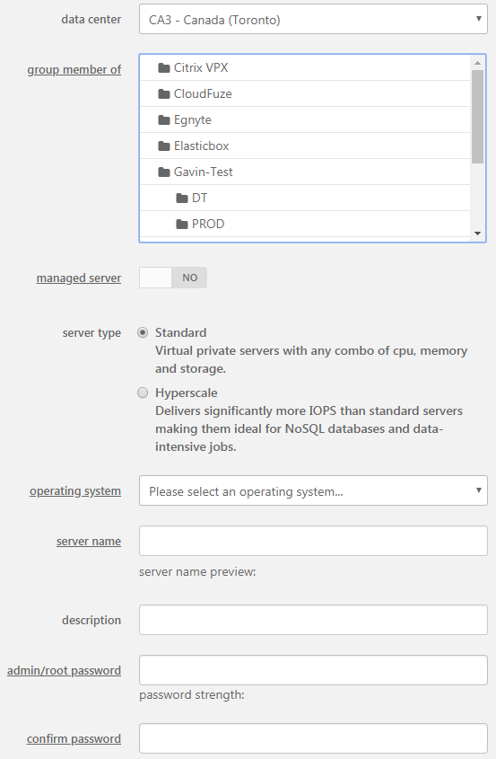
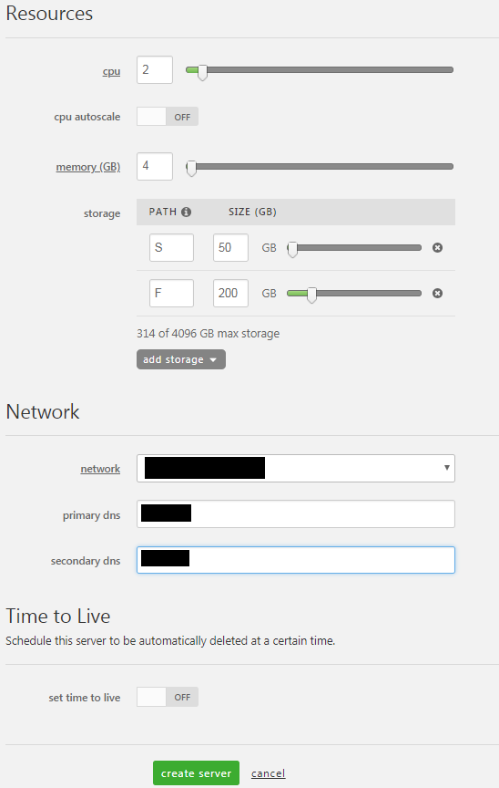

{{{
  "title": "Creating a New Cloud Server",
  "date": "5-4-2018",
  "author": "Chris Little",
  "attachments": [],
  "contentIsHTML": false
}}}

### Overview
The heart of the CenturyLink Cloud Platform is the ability to create and manage virtual infrastructure. In this KB article, we demonstrate how to provision new virtual machines in CenturyLink Cloud. Once you've gone through this KB article and created a new server, you can follow the [getting Started guide](../Servers/getting-started-how-to-securely-connect-to-your-server.md) to learn how to securely connect to your new server.

### Guided Steps

1. Login to the [Control Portal](//control.ctl.io) and select **Create >> Server** from the menu.

    

2. Input the appropriate general information for your new server.
    * Data Center Location
    * Group Membership
    * [Managed Operating System](https://www.ctl.io/managed-services/operating-system/) (if available in selection location)
    * Server Type: [Standard](https://www.ctl.io/servers/) 
    * [Operating System](../Support/supported-operating-systems.md)
    * [Server Name](../Servers/server-naming-convention.md)
    * Description
    * Admin/Root Password

    

3. Input the required resources, network and other advanced configuration information for your new server.
    * CPU, RAM & Storage up to [the platform maximums](../Servers/cloud-server-instance-size-and-performance.md). Virtual server configurations can be modified after deployment.
    * Enable a [CPU autoscale](../General/Autoscale/creating-and-applying-autoscale-policies.md) policy if desired.
    * Select a [Network](../Network/creating-and-deleting-vlans.md) for your virtual machine.
    * Set a primary and secondary dns server. (CenturyLink provides the following default DNS servers: 172.17.1.26 and 172.17.1.27)
    * Enable a Time to Live (TTL) if desired for your virtual machine to be destroyed.

    

4. Select the **Create Server** button and this will place your build into the queue.
