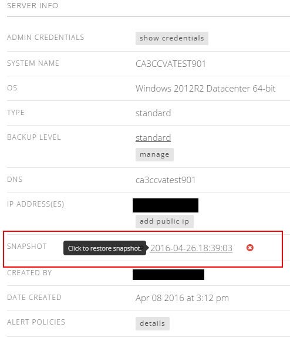

{{{
  "title": "Creating and Managing Server Snapshots",
  "date": "9-12-2017",
  "author": "Chris Little",
  "attachments": [],
  "contentIsHTML": false
}}}

### Overview
Snapshots are a feature of our platform that allow a machine to be quickly reverted back to a set point in time. This can be very useful for things such as short term testing of updates or configuration changes.  However, due to the way that snapshots operate they should not be kept active for extended periods of time . **A snapshot is not a backup of a machine and should not be used as such!** Snapshots do not contain a duplicate copy of the machines data rather they operate more like a change log that starts from the point in time the snapshot is initiated. Due to the nature of their operation snapshots are in a constant state of growth from the time they are created and the larger a snapshot becomes the longer delete or revert operations of the snapshot will take. If left active for an extended period of time snapshots also have the potential to completely fill the storage the machine is housed on causing many additional problems.  In order to avoid these performance issues snapshots should not be kept active longer than 10 days. **Any snapshot active longer than 10 days WILL be removed without notice as part of our maintenance process.**

### Snapshot Implications
* Using snapshots with a very high rate of change can cause significant performance degradation when the snapshot is removed. Your server may **lose connectivity** or become **unavailable** for several minutes or longer during the removal process.
* Snapshots are not supported on Standard Virtual Servers with greater than 1 TB of  Storage Allocated. Hyperscale Servers cannot leverage the Snapshot feature.
* Configuration changes to Virtual Servers, such as CPU/RAM/Disk, cannot be performed while a snapshot is present.  
* Cloning of virtual servers with a snapshot is a supported operation.  Please review [How To: Clone a Virtual Machine](../Servers/how-to-clone-a-virtual-machine-os-instance.md) for more information.
* Customers who leverage the [Simple Backup Service](//www.ctl.io/simple-backup-service/) should avoid the use of snapshots on a reccuring basis or while simple backup services are in use. Simple backup leverages a **local** file manifest to track file changes and should a customer revert to an old snapshot the ability to restore any backup sets taken **after** the snapshot was initiated will be lost without manual intervention from Customer Care. This is primarily due to the current manifest being replaced with an old snapshot copy when the entire Virtual Machine is reverted to an older state. 

### Create a snapshot of an existing server

1. Select the **Snapshot** button on the server details page.

  

2. Choose the snapshot lifespan. Snapshots created by users must be deleted within 10 days.

  

3. After the job is completed, the user can see their snapshot on the server details page. A server can only have a single snapshot at a time. The snapshot entry shows the date the snapshot was taken.

  

### Create a snapshot of a group of servers

1. Select the **Snapshot** button on the group of servers you wish to take a snapshot.  Choose the Virtual Servers and how long you wish to retain the snapshots.

  

### Restore a server snapshot
Users can use snapshots to restore a VM to its previous state by simply clicking on the snapshot name in the server details. After restoring a server to a snapshot, the snapshot itself is reset and retained.

  

  

### Delete a server snapshot
Customers can delete a snapshot by selecting the red X next to the snapshot name in the servers detail page.

  

  
  
### Scheduling Snapshots
1. One-time snapshots can be configured as a [Scheduled Task](creating-a-scheduled-task.md)
2. There are cases where a customer will benefit from taking or reverting snapshots of a server or group on a regular basis. Our [Runner Service](../runner/getting-started-with-runner.md)provides the ability to schedule repeating snapshot events, there is an existing published Runner Snapshot Job.

### Summary
The basic points to remember about snapshots:
* Not a viable form of backup (in fact not a form of backup at all)
* Useful for **short term** rollback of changes only
* Performance issues result from old snapshots
* Should not be kept longer than 10 days
* The platform uses the following VMware Options flags in the Snapshot
  * Memory: true; a dump of the internal state of the virtual machine is included in the snapshot.
  * Quiesce: true; VMware Tools is used to quiesce the file system in the virtual machine. Quiescing a file system is a process of bringing the on-disk data of a physical or virtual computer into a state suitable for backups. This process might include such operations as flushing dirty buffers from the operating system's in-memory cache to disk, or other higher-level application-specific tasks.
  * A more technical overview of  VMware snapshots can be found on [VMware.com](http://kb.vmware.com/kb/1015180)
