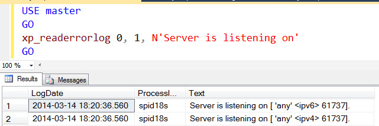
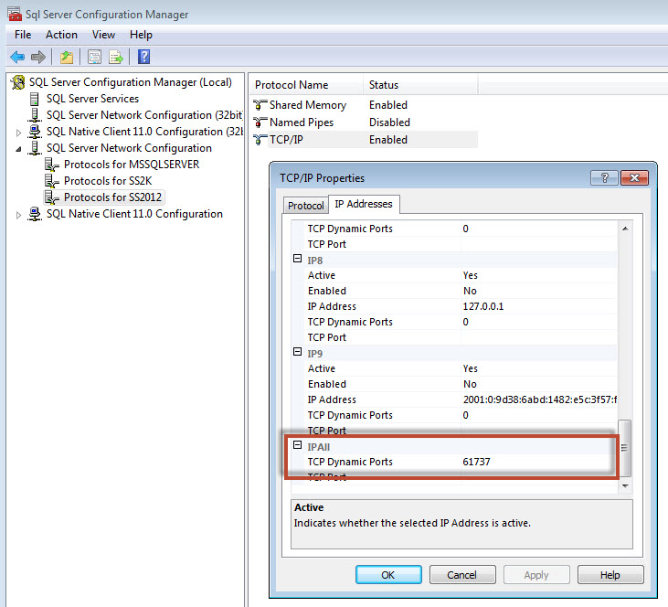

{{{
  "title": "Determine The Ports Used By A SQL Instance",
  "date": "04-01-2015",
  "author": "Jake Malmad",
  "attachments": [],
  "contentIsHTML": false
}}}

###OVERVIEW
It is common knowledge that the default SQL instance uses port 1433. However, when SQL server hosts multiple instances, or a custom port is being used, communication problems can arise. There are two easy ways to determine which ports are being used by a given SQL instance.

###METHOD ONE: SQL Query/Stored procedure
1. Execute the following SQL Query (if one-off) or as a stored procedure (if executing multiple times)

    

2. The output should appear with the ports listed:

    

    In this instance, port 61737 is being used.

###METHOD TWO: SQL Configuration Manager

1. Open "SQL Configuration Manager"

2. Expand "SQL Server Network Configurations" and select "Protocols for "INSTANCE NAME"

3. In the right pane, right-click on "TCP/IP" and select "Properties".

4. Choose the "IP Addresses" tab, and the port will be shown at the bottom:

    
