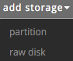
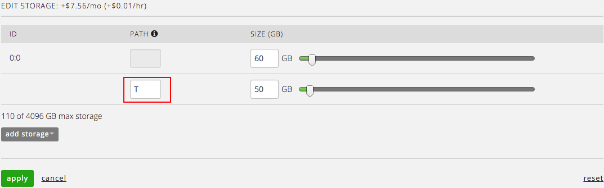
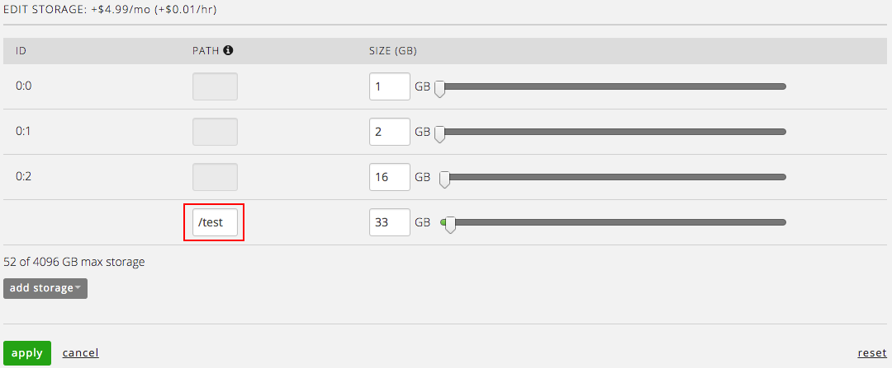
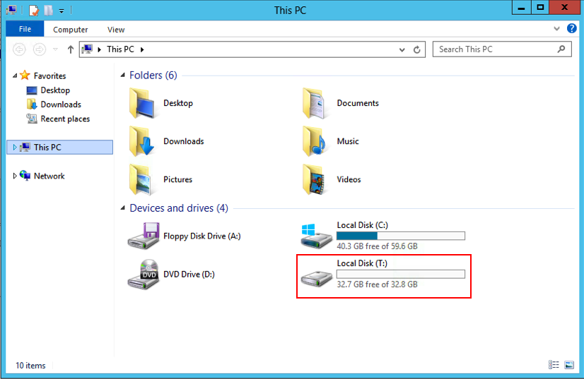
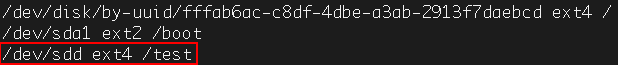
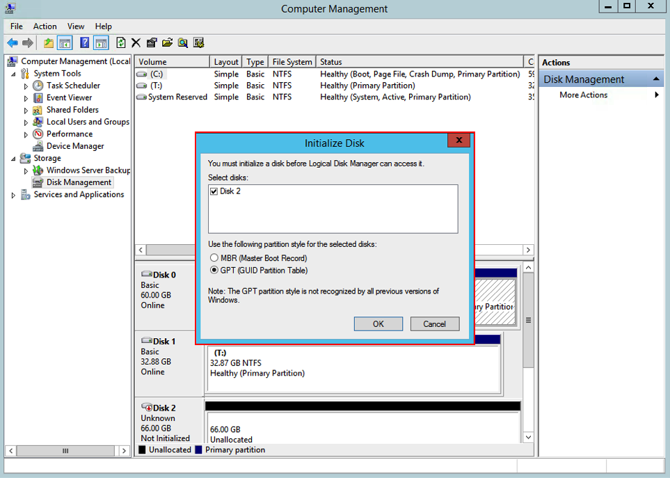
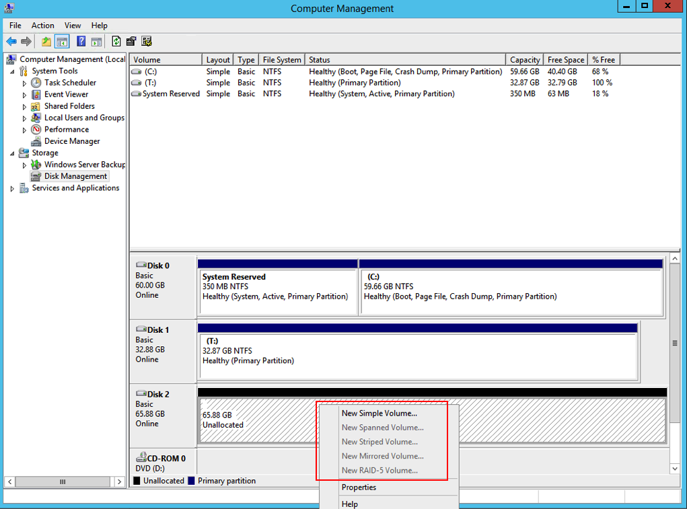
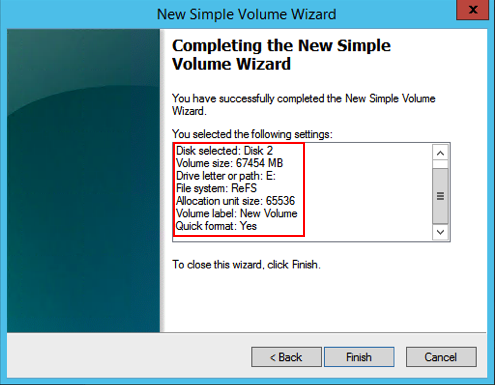

{{{
  "title": "Difference between partition and raw disk",
  "date": "11-13-2015",
  "author": "Anthony Hakim",
  "attachments": [],
  "related-products" : [],
  "contentIsHTML": false,
  "sticky": false
}}}

### Overview
When we create a server, or modify storage on an existing server, we face the option of using a partition or raw disk.

This guide outlines the differences between the two options.

### What is a Partition?
A partition, in the case of a Virtual Server, is an area that has been carved out of a virtual disk. When adding a partition to a Windows Server in the Control Portal, you are required to provide a drive letter.

When adding a partition to a Linux Server in the Control Portal, you are required to provide a path.

Once the partition has been successfully added to the Virtual Machine (VM) in the Control Portal, it will most likely appear as a new drive, without a need for additional configuration.

### What is Raw Disk?
Raw disk typically means more flexible configuration options. When we add raw disk to a VM, additional configuration is necessary before it is considered usable. Size is the only mandatory information required when adding a raw disk to a VM (Windows or Linux) in the Control Portal.

Once the raw disk has been successfully added to the VM in the Control Portal, the disk will need to be initialized within the Operating System (OS), in this case, Windows Server.

After the raw disk has been initialized, a new volume can be created, a drive letter can be assigned (or not), and you are presented with the various options of file systems to format the volume to prepare it for use.

Linux servers require similar configuration, such as fdisk to create a new partition, then the partition is formatted and mounted to prepare it for use within the OS.
