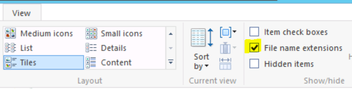
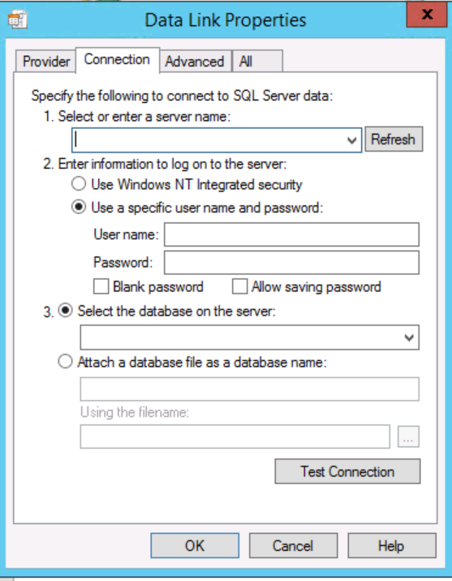
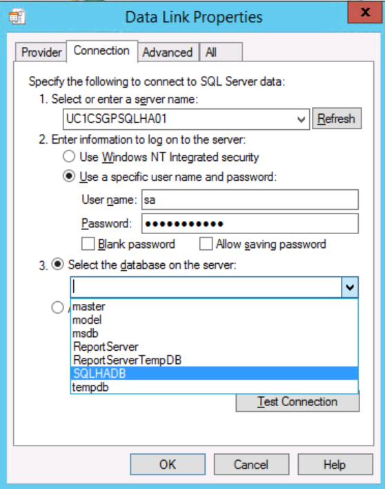

{{{
  "title": "Easily Check a Database Connection from any Windows Server",
  "date": "3-20-2015",
  "author": "Jake Malmad",
  "attachments": [],
  "contentIsHTML": false
}}}

###OVERVIEW
A common troubleshooting step in database backed applications is making certain that communication is possible from the web or application server directly to the database. This article outlines a fast and easy way to verify connectivity from a Windows Server to a Microsoft SQL database.

###Detailed Steps
1. Create a new text folder on the server by right click-> New -> "New Text Document". You may want to name it similar to the database to be tested, in this instance it is simply called "test.txt"

2. Change the file extension to .udl. You may need to enable "Show File Extensions" in the view pane

  

3. Rename the file extension to ".UDL"

4. Open the file, and you will be greated with a connection dialog.

  

5. You can now enter the appropriate database hostname, credentials, and even choose the desired database from the drop down menu:

  

6. Simply select "Test Connection" and you will be informed if the connection is successful or fails.
