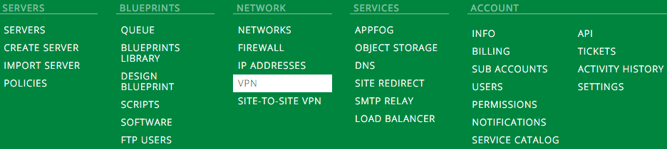
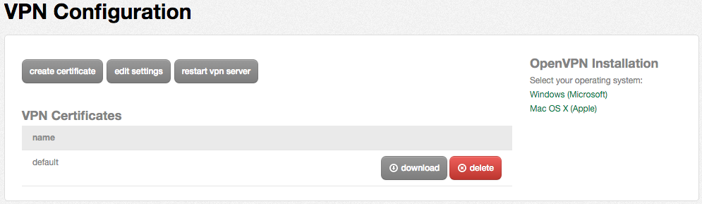
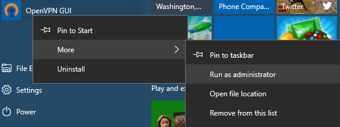
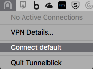
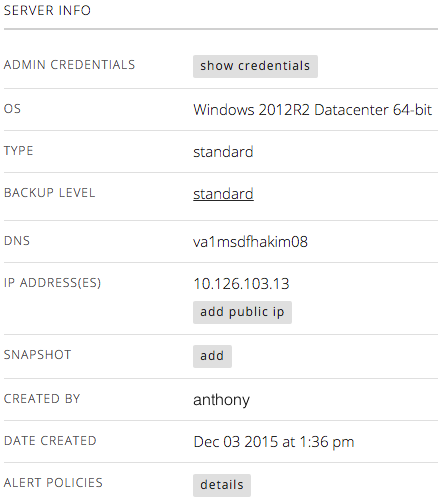
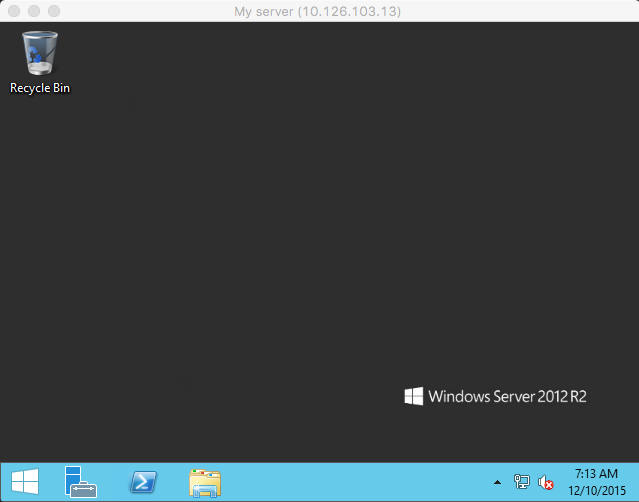
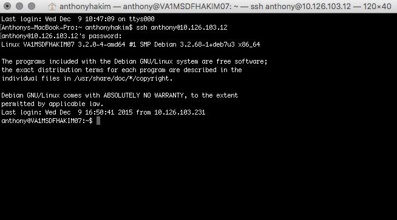

{{{
  "title": "Getting Started: How to securely connect to your server",
  "date": "12-10-2015",
  "author": "Anthony Hakim",
  "attachments": [],
  "related-products" : [],
  "contentIsHTML": false,
  "sticky": false
}}}

## You have a shiny new virtual server - now what?
Congratulations! You've just built a new virtual server on CenturyLink Cloud - we assume you have created a new virtual server.  If not, [follow this other guide first](../Servers/creating-a-new-enterprise-cloud-server.md), then return to this guide.

Now what?  How do you securely connect to your server(s)?  Some customers have the option of using a site-to-site VPN tunnel, MPLS, CNS, etc.  If your company doesn't have these options available, then follow the steps below to use OpenVPN.

## Connect to your shiny new virtual server
In order to connect to your shiny new virtual server, you will need to:

1. Download and install the OpenVPN client
2. Download and install the certificate/OpenVPN configuration
3. Launch the OpenVPN client and connect to your VPN
4. Launch your Remote Desktop or SSH client, and connect to your server

### 1. Download and install the OpenVPN client
You will use the OpenVPN client to securely connect to your new virtual server.

For Windows:
* Download the OpenVPN client from the [OpenVPN client](https://openvpn.net/index.php/open-source/downloads.html) website. There is currently a known issue when using OpevnVPN client version 2.4.5 with OpenVPN servers provisioned prior to June 2017, to resolve use  2.3.18-I602 64-bit release. Additional information can be found in our [Troubleshooting Article](../Network/vpn-client-connection-troubleshooting.md).
* Click `Run` to begin the installation.

  

* Accept all defaults during the installation.

For Mac (OS X):
* Download the OpenVPN (Tunnelblick) client [here](https://tunnelblick.net/).
* Double-click to begin the installation.

  

* If prompted to enter your password, do so. Once the installation has completed, you will be prompted to either Quit or Launch Tunnelblick - click `Quit`.

### 2. Download and install the certificate/OpenVPN configuration

Now that we have the OpenVPN client installed, we need to install the certificate/OpenVPN configuration.

* Logon to your user account in the [Control Portal](https://control.ctl.io).
* Hover over the green menu in the Control Portal, then click `VPN` under Network.

  

* On the VPN Configuration page, you will see `default` under VPN Certificates.  Click on the `download` button.

  

For Windows:
* After downloading the certificate, extract the contents of the .ZIP file to the OpenVPN config folder:

  `C:\Program Files (x86)\OpenVPN\config` or `C:\Program Files\OpenVPN\config`

For Mac (OS X):

* After downloading the certificate, extract the .ZIP file, then Double-click the `default.opvn` file.
* Choose whether the 'default' configuration is available for `All Users` or `Only Me`.  Enter your password to install the configuration.

### 3. Launch the OpenVPN client and connect to your VPN
For Windows:
* Launch the OpenVPN GUI (Right-click | More | Run as administrator).

  

For Mac (OS X):
* Launch Tunnelblick (Go | Applications | Tunnelblick, if not already running).
* Click Tunnelblick in the running programs menu, then choose Connect default.

  

### 4. Launch your Remote Desktop or SSH client, and connect to your server
You will need the following things:

1. The IP address of your server.

  Navigate to your server in the Control Portal. The IP Address will be on the right-hand side of the page under `SERVER INFO`.

  

2. Logon credentials for your server.

  Click on the `show credentials` button.

3. Remote Desktop client software.

  For Windows: Remote Desktop
  For Mac (OS X): SSH, Putty, Secure CRT

__Connect to your Windows server__

Launch your Remote Desktop client, enter the IP Address for your server, and then connect.

  

__Connect to your Linux server__

Open up a Terminal, and type in `ssh <user>@<IP Address>`

  `ssh anthony@10.126.103.12`

  
