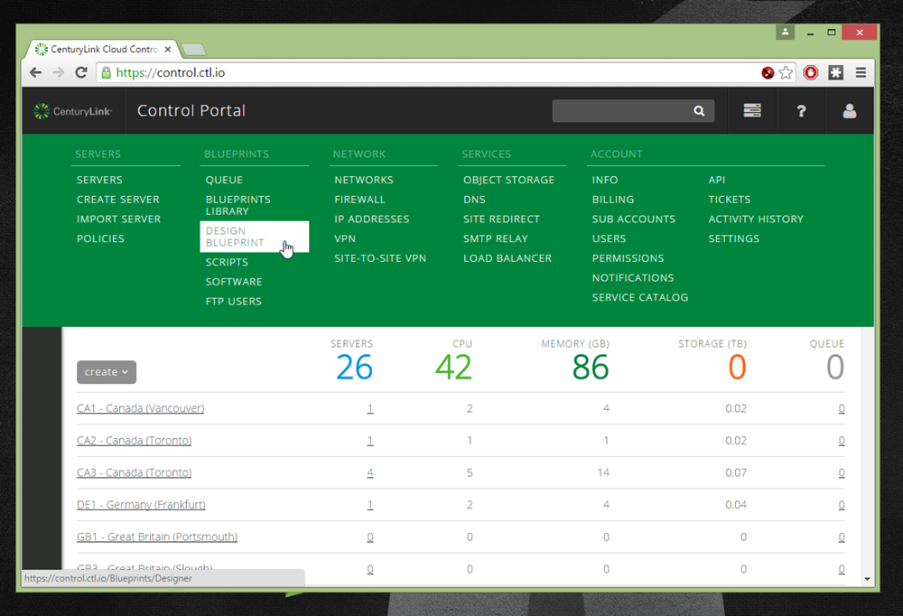
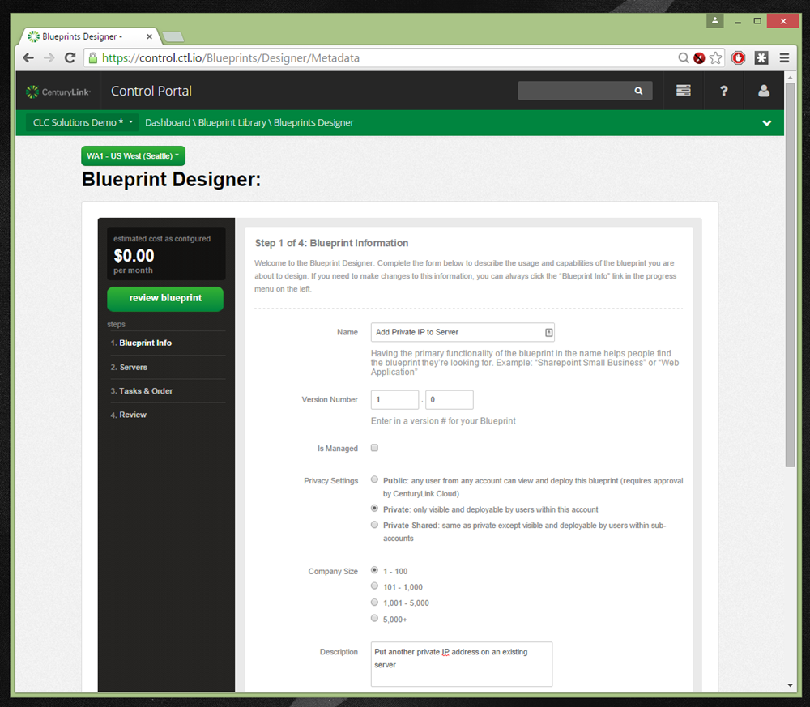
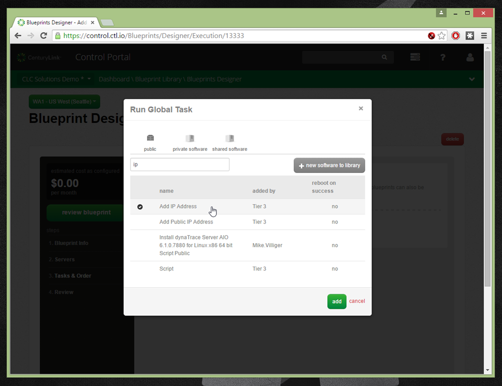
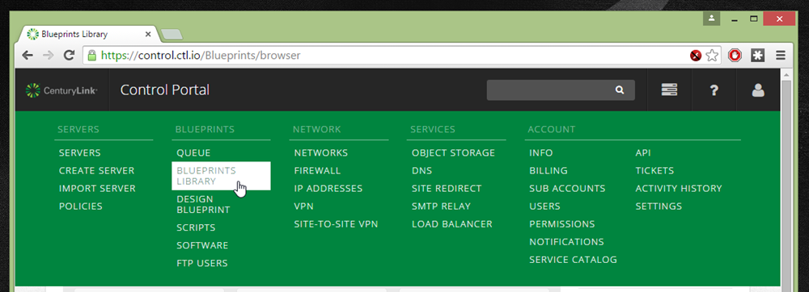
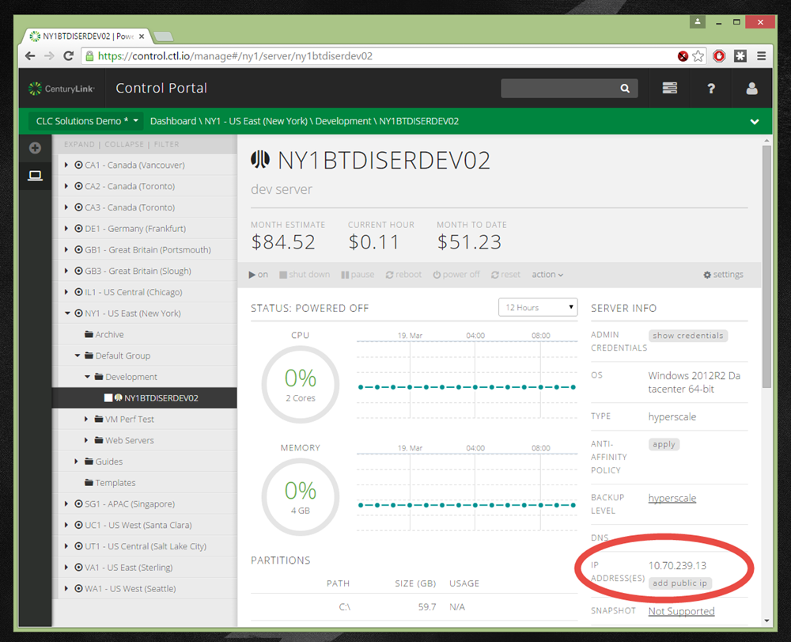
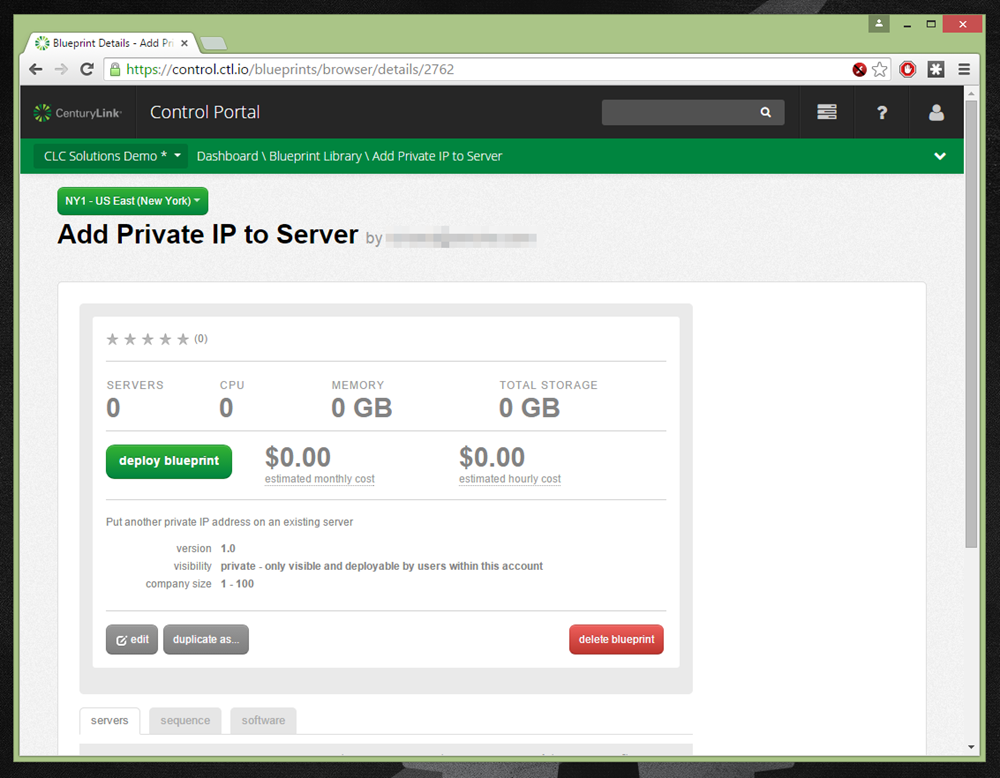
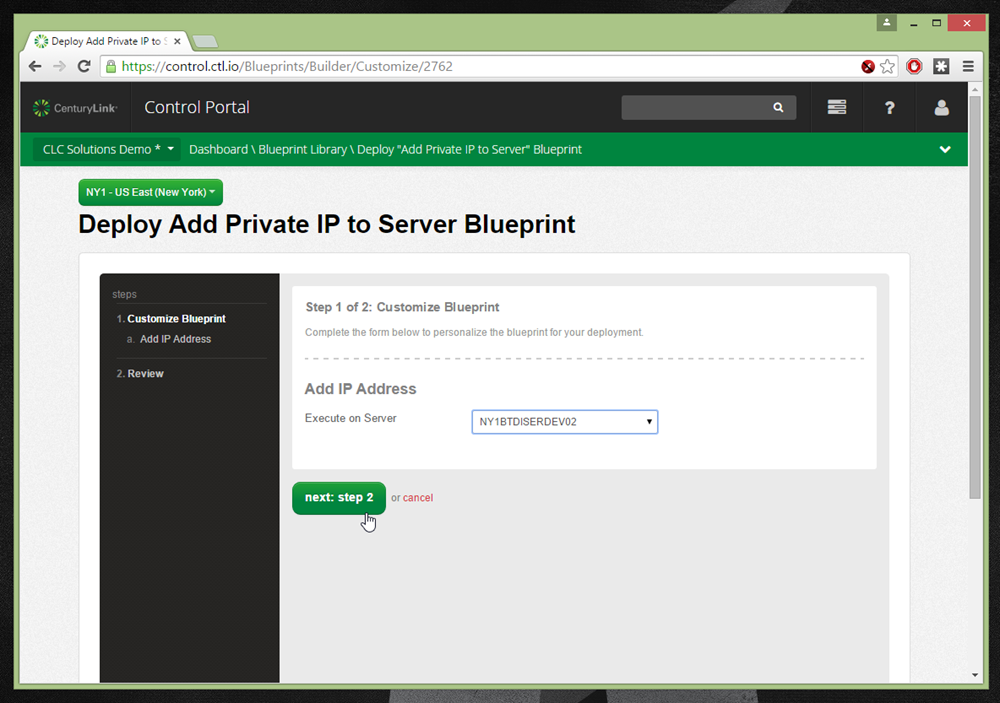
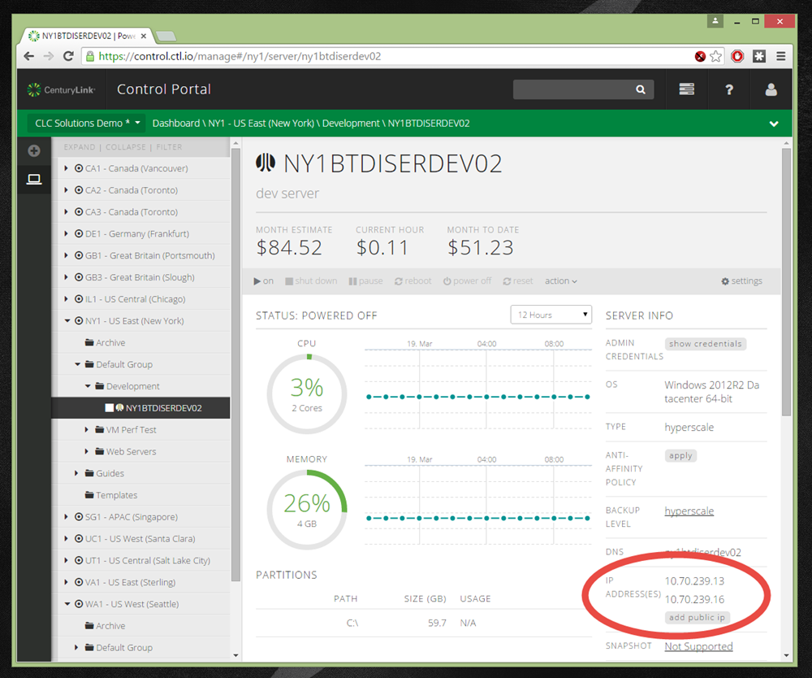

{{{
  "title": "How to Associate Additional Private IPs with a Cloud Server",
  "date": "3-19-2015",
  "author": "Richard Seroter",
  "attachments": [],
  "contentIsHTML": false
}}}

###Description
For some scenarios, you may want more than one private IP associated with a cloud server. While the Control Portal does not offer this ability directly, customers can leverage Cloud Blueprints to achieve it. **Note that while you can follow these steps to add a new private IP, there is no self-service way to remove a private IP.**

###Detailed Steps

1. Log into the Control Portal.
1. From the top menu, locate the **Design Blueprint** option under the **Blueprints** section.

1. Give the new Blueprint a name, version number, visibility setting, and description. When finished, click the **next: add servers** button at the bottom.

1. Because we are going to run this Blueprint against an existing server, there is no need to explicitly **add** a server to this Blueprint. Click the **next: tasks & order** button.
1. Click the gray **add task** button to pop up a window that lists public, private, and shared software/script packages.
1. Find the public package named **Add IP Address** and select it. Click the **add** button.

1. On the Blueprint designer, see the automatic prompt to choose which server to run this **Add IP Address** task on. Because we want this to be reusable for any server, choose the **Select During Deployment** option from the dropdown list and click the **add task** button.

1. Click the **next: review** button, and assess the Blueprint. If satisfied, click the **submit for publishing** button.
1. From the top menu, locate the **Blueprint Library** option under the **Blueprints** section.

1. Switch to the **Servers** view and identify the server that needs additional private IP addresses. Record the name of that server.

1. The previously-built Blueprint will be available immediately in whichever cloud data center you built it in, and within minutes, be available in every cloud data center around the world. Click on the new Blueprint from within the Library to view the details.

1. Click the **deploy blueprint** button and select the target server from the dropdown list. Note that because the **Select During Deployment** option was chosen at design time, this Blueprint can be used over and over again with ANY server in ANY datacenter. Also be aware that this Blueprint works whether the server is powered on or off. Click the **next: step 2** button.

1. Review the proposed change and click **deploy blueprint.** Note that you are not prompted for a network, as the IP address is taken from the same network that the server is already part of.
1. After the Blueprint complete, revisit the affected server's details page and observe the new private IP address.

1. Confirm the new IP address on the server itself by using your VPN connection to connect to the target server. In the screenshot below, the Windows Server machine shows the two IP addresses.

