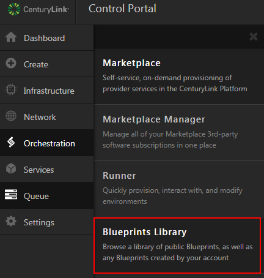
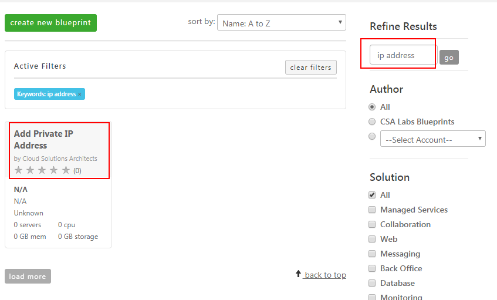
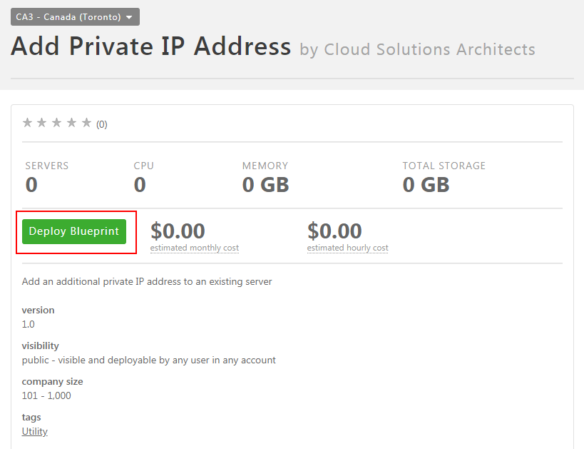
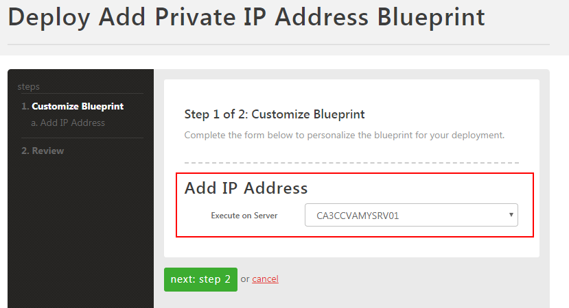
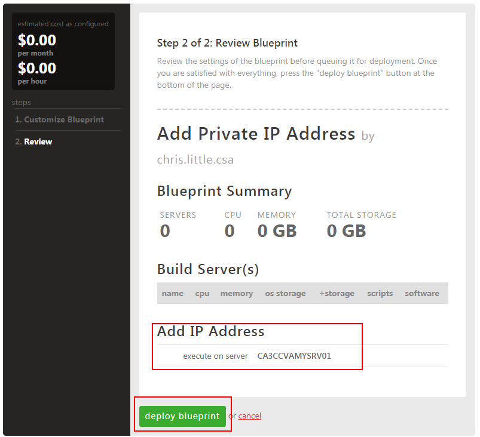

{{{
  "title": "How to Associate Additional Private IPs with a Cloud Server",
  "date": "04-18-2018",
  "author": "Chris Little",
  "attachments": [],
  "contentIsHTML": false
}}}

### Description
For some scenarios, you may want more than one private IP associated with a cloud server. While the Control Portal does not offer this ability directly, customers can leverage Cloud Blueprints to achieve it. **Note that while you can follow these steps to add a new private IP, there is no self-service way to remove a private IP.**

### Support
If you experience issues or have questions with the execution of this blueprint package [contact customer care.](../Support/how-do-i-report-a-support-issue.md)

### Detailed Steps

1. Log into the Control Portal.

2. From the side menu bar, locate **Orchestration > Blueprint Library.** Select the data center your server is located in.

    

3. Use the Search term 'ip address' to refine the library list and find the **Add Private IP Address** blueprint package.

    

4. Select the blueprint package, and use the **deploy blueprint** button.

    

5. Select the virtual machine you wish to add the additional IP address to from the server menu list, and proceed to **Next: Step 2**.

    

6. Perform a final validation of the blueprint package and select **deploy blueprint**.

    

7. Once the blueprint job completes validate the additional private ip address is present in the Control Portal & inside the Virtual Machine's Operating system.
