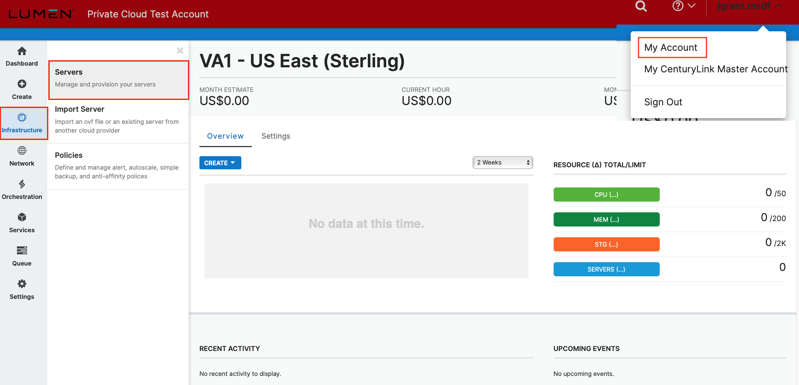
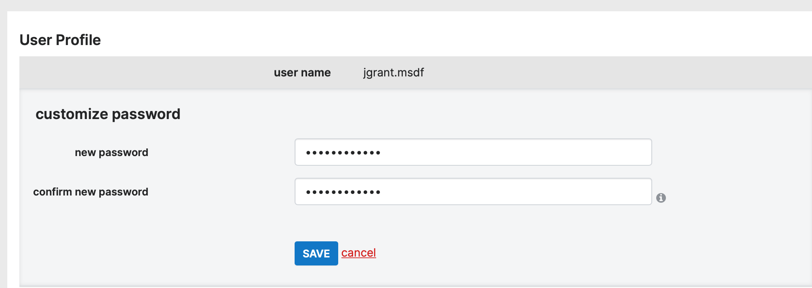

{{{
  "title": "How to change a server administrator or root password",
  "date": "09-30-2021",
  "author": "Nathan Young",
  "attachments": [],
  "contentIsHTML": true
}}}

You can change your password easily through the&nbsp;<a href="https://control.ctl.io/">Lumen Cloud Control Portal</a>. It's important that the Control Portal and your server's password match in order to perform certain control functions such as adding disks, adding IP addresses, and deploying blueprints. There are a couple of pre-requisites required to perform this task:

<ol>
  <li>First, you must have an account that has administrator or root access for your company.&nbsp;&nbsp;</li>
  <li>Next, you must have the prior password for the server that was sent to you when your server was created. If this password has changed, please change it back within the Operating System to match the portal before proceeding.</li>
</ol>
 If you meet both these requirements, log in to the Control Portal and follow the steps below:

From the left navigation menu, click <b>Infrastructure</b> > <b>Servers</b>.

This will take you to the Servers page, which lists the servers in your environment. Select the server who's administrator or root password you wish to change, and then click the account link on the top right of the screen.

On the <b>User Profile</b> page, you can update your password for control. Click on the <b>password</b> field, and type a new password.

&nbsp;

Click the <b>SAVE</b> button to save your changes and apply your new password.

<b>Important Information for Windows Domain Controllers and mismatch of root/administrator password between control and server.</b>

 
 
 Our system periodically connects to VMs to get partition information that can be displayed in control. It does this by attempting to use the local administrator account that is registered with it to log in and query the OS. On Domain Controllers, this will most likely show periodic failed login attempts in your event logs, since a local administrator user does not exist. If you view your server in control, you will not see any partition information displayed, which is the result of a failure to get that information from the server's OS. This is a known control portal limitation if a server password doesn't match the control portal, or if the expected administrator/root isn't available. Cloning a Domain Controller is not supported. On both Linux and Windows servers, cloning and other automation will fail if passwords don't match.
