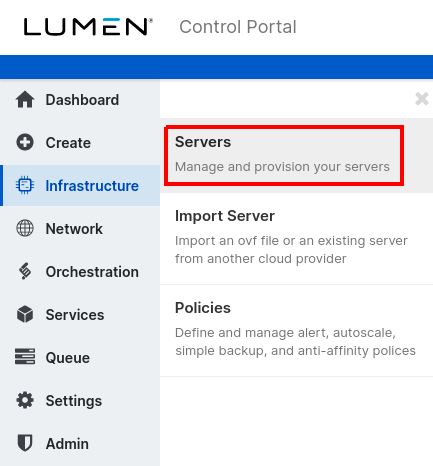
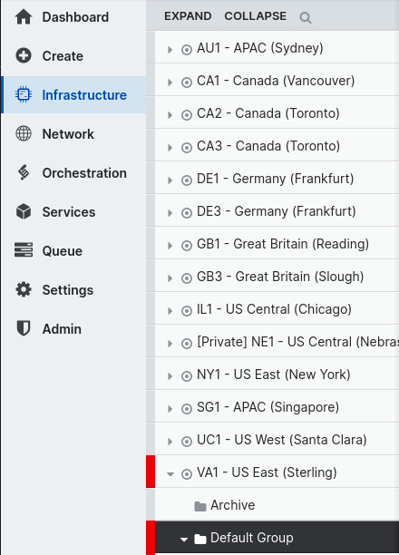
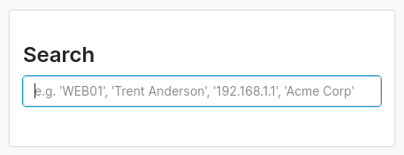
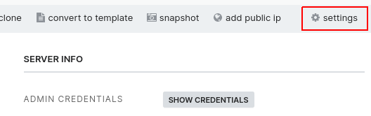
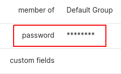
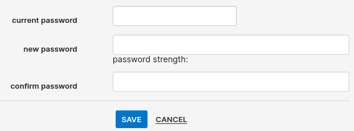

{{{
  "title": "Changing a Server Administrator or Root Password",
  "date": "11-09-2021",
  "author": "Derek Jansen",
  "attachments": [],
  "contentIsHTML": false
}}}

## Description

It is important that the control portal and the server's password match for the following functionality.

- performing certain functions such as adding disks, adding IP addresses, or cloning virtual machines
- displaying disk partition information

---
## Prerequisites

- a [control portal user]() with the [appropriate permissions]()

---
## Detailed Steps

There are two tools that can be used to performing this action: the control portal, and the API.

#### API

There is a CLI tool available for performing a number of API calls. Installation and usage of this tool is covered in our knowledge base article "[Public Cloud Guide to CLI](../Servers/lumen-cloud-guide-to-cli.md)".

Alternatively, our API can be [called directly](//www.ctl.io/api-docs/v2/#servers-set-server-credentials).

#### Control Portal

1. Log into the [Public Cloud control portal](//control.ctl.io).
2. On the left side of the page, select "infrastructure" then "servers".  

3. Select the relevant data center, the server's group, then the server itself.  

    - Alternatively, use the search function by selecting the magnifying glass icon on the top-right corner of the page next to your username, then provide either the server's name or private IP address.  
      
    
4. On the right side of the action control bar, select "settings".  

5. In the information list, select "password".  

6. Fill out the appropriate fields.  

    - Current Password: Provide the password that is [currently stored in the control portal](). If this password is different from the one set on the OS side of the server, proceed to the [troubleshooting section](#troubleshooting).
    - New/Confirm Password: These fields should have the desired new password.

---
## Troubleshooting

We have covered a few common troubleshooting scenarios below.

#### Windows Domain Controllers

The event logs may show periodic failed login attempts since the local user "administrator" is disabled. As noted at the top of this article, these logins are attempting to gather disk partition information to be displayed by the platform system via the control portal and the API.

If there is an active user "administrator" on the domain, then the event logs may show periodic failed login attempts because the password, stored by the platform, does not match the one set for that domain user. This can be fixed by following the below steps.

#### OS Password Does Not Match the Platform

When viewing the password stored by the platform via the control portal or the API, it is possible that it does not match what is actually set on the server. The here are two options for fixing this issue.

Option 1:

1. Log into the server and change the password so that it maches what is currently shown by the control portal or the API.
2. Follow the instructions in the [detailed steps section](#detailed-steps) of this article to change the password in order to ensure that the platform with the server's OS are synchronized.

Option 2:

1. When running the tool the first time, set the following values.
    - Current Password: This should be the value **currently stored by the platform**.  
    - New Password: This should be the password that **actually set in the OS**.
2. During the second run, use the following values.
    - Current Password: Since the platform and the server now match, make this the actual current value.  
    - New Password: Provide the desired value.

If the password set on the server is not known, [open a ticket](../Support/how-do-i-report-a-support-issue.md) for assistance with resetting the password.
