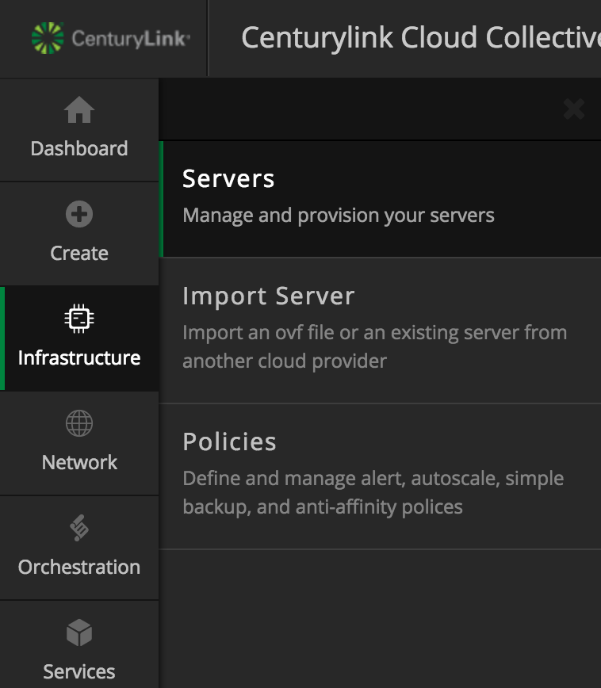
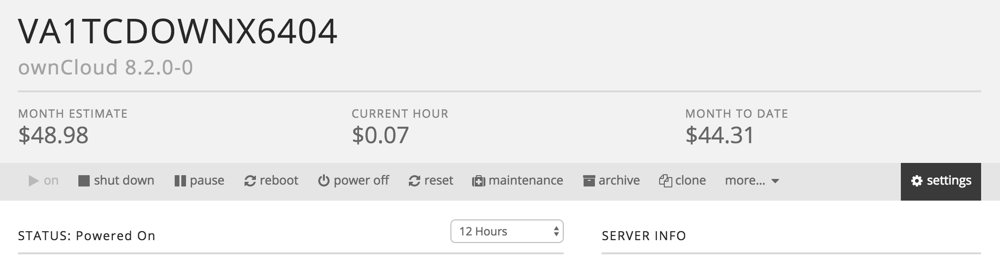
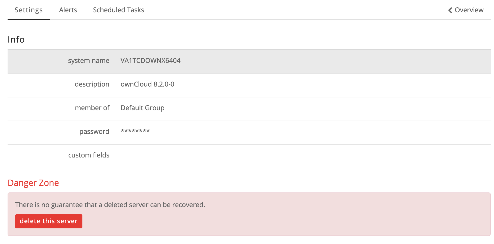

{{{
  "title": "How to Delete a Server in the Control Portal",
  "date": "08-30-2016",
  "author": "Brandy Smith",
  "attachments": [],
  "related-products" : [],
  "contentIsHTML": false,
  "sticky": false
}}}

### Overview

How to delete a server and a server API in the Control Portal.

### Audience

Lumen Cloud Customers

### Steps

* Log in to the [Control Portal ](https://control.ctl.io).

* In the left side navigation bar choose **Infrastructure** > **Servers**.

* Select the server that you wish to delete.

* Click on the Settings button on the far right.

* Click **delete this server** button and accept the pop up confirmation.

* To learn about how to delete server APIs visit: https://www.ctl.io/api-docs/v1/#server-delete-server

*  To learn about how to archive a server visit: https://www.ctl.io/knowledge-base/servers/managing-and-controlling-costs-in-lumen-cloud/
