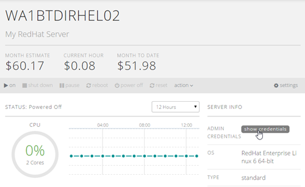

{{{
  "title": "How to retrieve Root/Administrator password",
  "date": "6-26-2015",
  "author": "Richard Seroter",
  "attachments": [],
  "contentIsHTML": false
}}}

Retrieving the Administrator or Root password for a server can be done quickly through the Control Portal. Navigate to the server by going to Servers, selecting the correct group, and click on the server. At the top right click the box: "Admin Credentials" and button labeled "show credentials":

The Admin Server Password box will now show the username and password which can be used to access the server. A record of your request is added to the server's "activity history."

