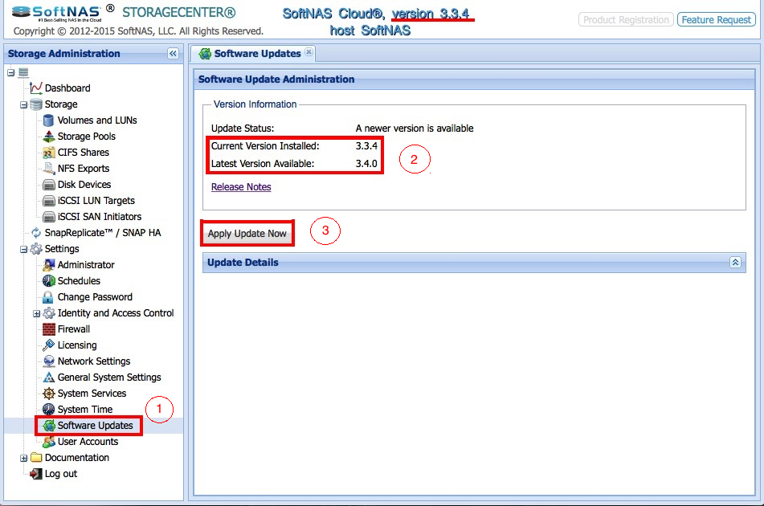
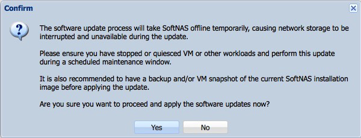

{{{
  "title": "SoftNAS: How to update software",
  "date": "11-30-2015",
  "author": "Maxim Volkov",
  "attachments": [],
  "related-products" : [],
  "contentIsHTML": false,
  "sticky": false
}}}

### Introduction

SoftNAS Cloud is the software behind a virtual NAS appliance provided by SoftNAS, a CenturyLink ecosystem partner. The software gets updated on a regular basis to receive bug fixes and new features. This brings the necessity to periodically upgrade your SoftNAS instance. 

### Prerequisites

1. A SoftNAS appliance was [ordered](../Ecosystem Partners/Marketplace Guides/getting-started-with-softnas-cloud-file-gateway-appliance.md) and [set up](using-a-software-defined-virtual-nassan-on-centurylink-cloud.md) in the CenturyLink Cloud.
2. You have administrative rights to access the appliance's GUI interface.
3. Your SoftNAS Cloud license is active.

### Preparation

The update process will interrupt normal operation of your NAS, so you have to make sure that any processes using the virtual appliance are stopped. Normally the entire operation may take up to five minutes to download fresh package, install it, and resume operation.

The upgrade is data-safe, however, as precaution it is a good idea to backup your data and/or for perform a [snapshot](creating-and-managing-server-snapshots.md) of the entire VM.

### Update process (GUI)

Log in into your appliance

1. Navigate to: Settings >> Software Updates.
2. Compare the current version and the available one.
3. Initiate update by clicking "Apply Update Now" button.

You will be presented with confirmation window.

Once agreed, the update process will begin and you will be presented with the download process bar.

Once the download is complete, installation will began automatically and you will lose web connectivity to your SoftNAS GUI interface due to restart. You can login back into it momentarily and start verification process.

That concludes SoftNAS Cloud software update using GUI.

### Update Process (CLI)

It is also possible to perform a SoftNAS update using a command line interface. To use this method, you must have shell access to the server where the SoftNAS appliance is hosted.

A "softnas-cmd" command allows to perform many different operations, however for the purpose of this document we will concentrate on the steps related to the update itself:

1. login - Login to SoftNAS.
2. checkupdate - Check if new software updates are available.
2. executeupdate - Execute and apply software updates.
3. statusupdate - Return the status on an update that is currently in progress.

A typical session would look like this:

### 1. Authentication.

### Command
softnas-cmd login USERNAME PASSWORD --base_url `https://localhost/softnas` --pretty_print

### Response
    {
        "result": {},
        "session_id": 408,
        "success": true
    }

### 2. Check for the update candidate version.

### Command

softnas-cmd checkupdate

### Response I - A new software is available for installation
    {
      "success" : true,
      "session_id" : 408,
      "result" : {"success":true,"msg":"A newer version is available",
      "records":{
        "statusupdate":"",
        "version":"3.4.0",
        "newversion":"3.4.1",
        "updateavailable":true,
        "msg":"A newer version is available",
        "recent_versions":[]
      },
      "total":6}
    }

### Response II - A running software is up to date
    {
        "result": {
            "msg": "You are running the latest version",
            "records": {
                "msg": "You are running the latest version",
                "newversion": "3.4.1",
                "recent_versions": [],
                "statusupdate": "",
                "updateavailable": false,
                "version": "3.4.1"
            },
            "success": true,
            "total": 6
        },
        "session_id": 408,
        "success": true
    }

### 3. Start update process.
### Command
softnas-cmd executeupdate

### Response
      {
        "success" : true,
        "session_id" : 408,
        "result" : {
          "success":true,
          "msg":"Update was started successfully. Version '3.4.1' installation is underway...",
          "records":{"newversion":"3.4.1",
          "msg":"Update was started successfully. Version '3.4.1' installation is underway..."},
          "total":2
        }
      }

### 4. Check update status.

### Command
softnas-cmd statusupdate
### Response I - Installation is in progress
      {
        "success" : true,
        "session_id" : 408,
        "result" : {
          "success":true,
          "msg":"Installing packages...",
          "records":{
            "msg":"Installing packages..."},
            "total":1
          }
      }

### Response II - SoftNAS is rebooting
      {
        "success" : true,
        "session_id" : 408,
        "result" : {
          "success":true,
          "msg":"Updating SoftNAS Console (updates available after next reboot - no reboot required now)...",
          "records":{
            "msg":"Updating SoftNAS Console (updates available after next reboot - no reboot required now)..."},
            "total":1
          }
      }

### Response III - Update is finished
      {
        "success" : true,
        "session_id" : 408,
        "result" : {
          "success":true,
          "msg":"OK.",
        "records":{
          "msg":"OK."
          },
        "total":1
        }
      }

### Conclusion

For more information on Getting Started with SoftNas on CenturyLink Cloud visit [Getting Started with SoftNAS Cloud File Gateway - Appliance](../Ecosystem Partners/Marketplace Guides/getting-started-with-softnas-cloud-file-gateway-appliance.md)
