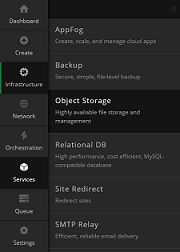
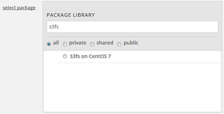
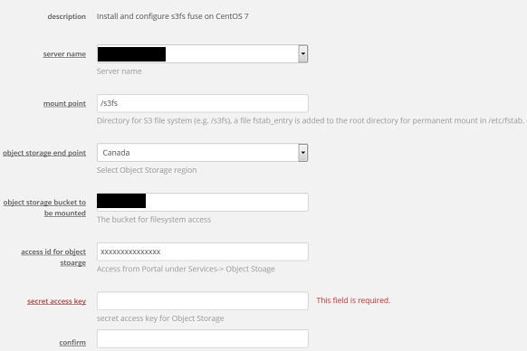

{{{
  "title": "Lumen Cloud Guide to Access Object Storage as a Filesystem Using s3fs",
  "date": "09-14-2016",
  "author": "Gavin Lai",
  "attachments": [],
  "contentIsHTML": false
}}}

### Table of contents

* [Overview](#overview)
* [Prerequisites](#prerequisites)
* [Use Case Scenarios](#use-case-scenarios)
* [Preparation](#preparation)
* [Deployment](#deployment)
* [Testing](#testing)
* [Troubleshooting](#troubleshooting)
* [Support](#support)

### Overview

s3fs is a FUSE filesystem that allows you to mount a S3 compatible bucket as a local filesystem. It stores files natively and transparently in S3 compatible Objective Storage (i.e., you can use other programs to access the same files). Maximum file size=64GB (as of this article, limited by s3fs, not Lumen Cloud Object Storage).  The limitations of s3fs is listed [here](//github.com/s3fs-fuse/s3fs-fuse).  For pricing of Object Storage, please see the [pricing page](//www.ctl.io/pricing).

### Prerequisites

-   Access to the Lumen Cloud platform as an authorized user

-   Identify a CentOS Linux platform that you would like to have s3fs installed

-   Understanding the functions of Object Storage (beyond the scope of this article), to learn more, please see this [knowledge article](../Storage/Object Storage/introducing-object-storage.md)

-   Ability to install packages on the server

-   Access to Lumen Cloud Object Storage

### Use Case Scenarios

As Object Storage is accessed using the Internet, it can be used in many scenarios.  While mounting Object Storage as a Linux file system makes consuming Object Storage much easier, keep in mind that it is only accessed via the Internet, hence the speed and latency is not the same as local storage.  With this in mind, using Object Storage in a file system can be a good alternative to expensive local storage.  Use cases can be:

-   Data archiving

-   Backup

-   Internet speed data storage

-   Long term storage

If encryption is a requirement, please see [s3QL](//github.com/s3ql/s3ql), files created with S3QL can only be accessed using S3QL.


### Preparation

In preparation. There are several factors need to be considered:

-   Deployment of s3fs will install Git, gcc along with Make and Fuse (for full list of packages, please refer to [s3fs GitHub site](//github.com/s3fs-fuse/s3fs-fuse))

-   Mountpoint for the Object Storage filesystem


### Deployment
There are two methods to deploy s3fs in Lumen Cloud, it can be done manually or using a package.

**Manual deployment**
1.  s3fs deployment is done with the following commands on the CentOS 7 server:

    ```
    sudo yum install automake fuse fuse-devel gcc-c++ git libcurl-devel libxml2-devel make openssl-devel
    git clone https://github.com/s3fs-fuse/s3fs-fuse.git
    cd s3fs-fuse
    ./autogen.sh
    ./configure
    make
    sudo make install
    ```

2.  Once installed, access to the Object Storage screen in the Control Portal

    

3.  Locate the user and bucket for this deployment and record both the "Access Key ID" and "Secret Access Key"

4.  Create a password file with the "Access Key ID" and "Secret Access Key" and make proper permission on the file, for example:
    ```
    echo access_key_id:secret_access_key > /path_to_password_file/password_s3fs
    chmod 666 /path_to_password_file/password_s3fs
    ```
5.  Once the above steps are completed, create a directory for the mount point of the new filesystem

**Execute using a package**

A script (S3fs on CentOS 7) is created to speed up the deployment of s3fs on Lumen Cloud.  The detail of the package is available [here](//control.ctl.io/Blueprints/Packages/Details?uuid=e12db1ac-9783-45fa-b3f6-ab07c3ab195a&classification=Script&type=AccountLibrary).  The package can be install via the portal, API or CLI.  

For API, please refer to the [Execute Package API](//www.ctl.io/api-docs/v2/#server-actions-execute-package).  

The CLI deployment can be done following the command in the [Lumen Cloud Guide to CLI](//www.ctl.io/knowledge-base/servers/lumen-cloud-guide-to-cli/#advanced-usage).  

When using the portal, this [Knowledge article](../Servers/using-group-tasks-to-install-software-and-run-scripts-on-groups.md)

In the portal, the package can be found by searching for s3fs:



The parameters required for this script are:



### Testing
- Test the installation with the command below. For the current list of Object Storage end points, please see [this knowledge article](../Storage/Object Storage/object-storage-regions-and-service-points.md):

    ```
    s3fs mybucket:/ /path_to_mountpoint -o passwd_file=/path_to_password_file/password_s3fs -o url=https://canada.os.ctl.io/
    ```

- If the command ran successfully, then a /etc/fstab entry can be inserted to mount the Object Storage bucket permanently, a fstab_entry file is created in the /root directory if the package is used (debug level set at info, it can be removed to minimized logging):

    ```
    s3fs#mybucket:/ /path_to_mountpoint fuse _netdev,dbglevel=info,allow_other,nodnscache,retries=5,url=https://canada.os.ctl.io/,passwd_file=/path_to_password_file/password_s3fs
    ```
    or
    ```
    mybucket:/ /path_to_mountpoint fuse.s3fs _netdev,dbglevel=info,allow_other,nodnscache,retries=5,url=https://canada.os.ctl.io/,passwd_file=/path_to_password_file/password_s3fs
    ```


### Troubleshooting
- Debug and run s3fs in the foreground can help during troubleshooting (-d x 2 to direct messages to STDOUT):

    ```
    s3fs mybucket:/ /path_to_mountpoint -o passwd_file=/path_to_password_file/password -o url=https://canada.os.ctl.io/ -d -d -f -o f2 -o curldbg
    ```


### Support
* For issues related to deploying s3fs or accessing the deployed software, please visit the [s3fs Website](//github.com/s3fs-fuse/s3fs-fuse)
* For issues related to cloud infrastructure (VM's, network, etc), or if you experience a problem deploying any Blueprint or Script Package, please open a Lumen Cloud Support ticket by emailing [help@ctl.io](mailto:help@ctl.io) or [through the Lumen Cloud Support website](//t3n.zendesk.com/tickets/new).
