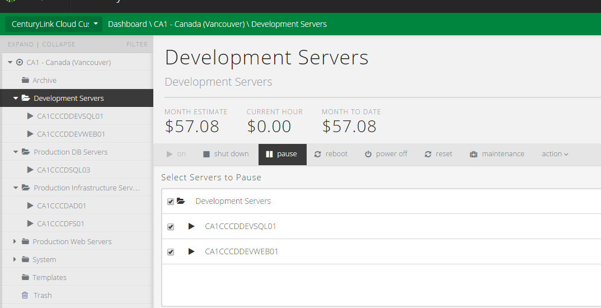
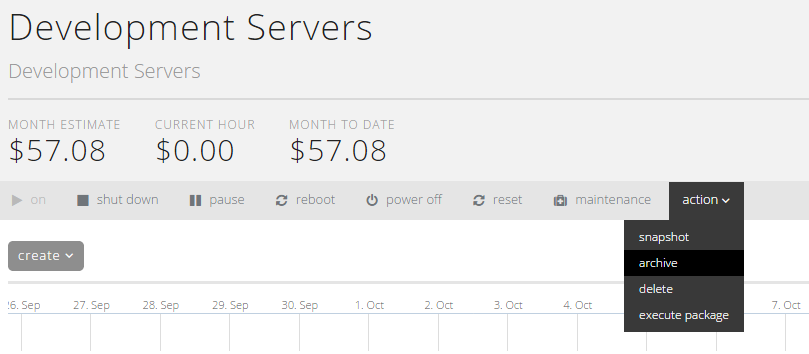
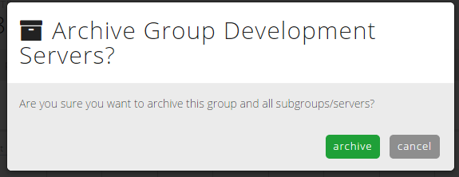
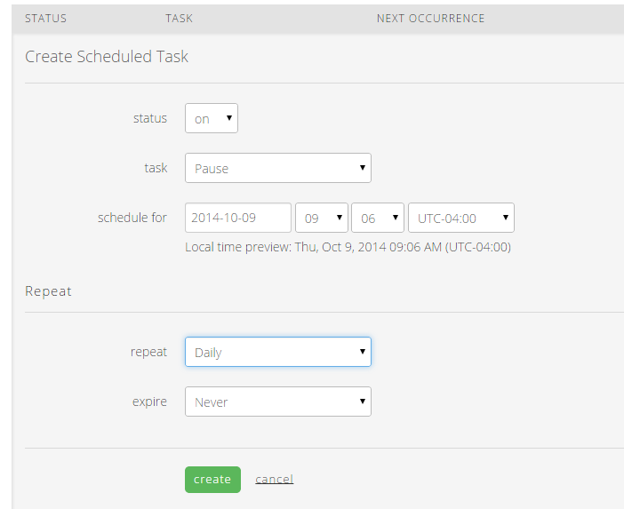
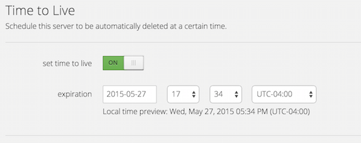
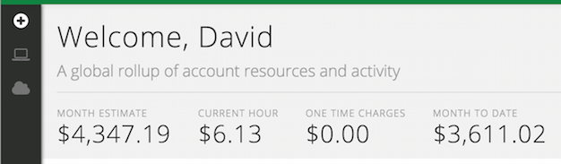

{{{
  "title": "Managing and Controlling Costs in CenturyLink Cloud",
  "date": "5-26-2015",
  "author": "Chris Little",
  "attachments": [],
  "contentIsHTML": false
}}}

### Overview

CenturyLink Cloud provides several tools to enable customers to maximize the benefits of cloud computing. This article will outline some of the controls available to minimize cost. These tools are: pausing, archiving, scheduled tasks, autoscale policies, time-to-live server settings, and dashboard estimates.

### Audience

- CenturyLink Cloud Customers

### Reference Material

- [Understanding VM Deployment Options & Power States][1]
- [Creating a Scheduled Task][2]
- [Creating & Applying Autoscale Policies][3]

### Methods

#### Pausing

Pausing is the act of suspending a virtual machine. Servers in a paused state are not billed for compute (RAM, CPU) usage - only storage consumption and licensing costs. Individual machines or entire groups can easily be paused through our Control
Portal. To do so, simply select the appropriate group and use the **pause** button located on the control bar.

A box will appear which will allow you to choose one or all of the servers to be paused. When this is done, select **Pause**.

#### Archiving

Pausing a server is an effective way to temporarily reduce costs. However, you may have a server that is no longer be needed in production while still being needed for reference or for planned production usage at a later date. This server can be archived. This suspends the virtual machine and moves it to a significantly cheaper storage tier.

A customer pays for the archival storage consumed by the machine along with, if applicable, non-OS licensing (eg, MSSQL) and Managed OS or application support. No compute or OS licensing costs are levied. Please review our [pricing page][4] for more information on these additional costs and on archival storage pricing.

To archive a server, simply select the **archive** option from the actions menu. Note that doing this on a group will archive the entire group of servers, though there will be a prompt to ensure this is the desired action before execution.

#### Scheduled Tasks

Server actions can be scheduled on an individual or group level. To do so, simply select **settings** on either a group or individual VM then select the **Scheduled Tasks** tab. You will then be able to schedule an operation (ie, power operations, archival, snapshot creation/deletion), the desired time for the operation, and the expiration date. You can also set schedules to "propagate" through child groups in a hierarchical fashion to control, for example, an entire development stack. Scheduling the pausing of servers is a great way to reduce resource utilization during off-hours for non-critical servers; simply pause your servers at night or over the weekend, and schedule them to power on at the start of the work week.

#### Autoscale

The CenturyLink Cloud platform supports both vertical autoscaling of CPU capacity for servers as well as horizontal autoscaling of servers. This makes it possible to scale servers up and down (vertical) or in and out (horizontal) based on utilization, ensuring optimal deployment of resources for cloud environments under a variety of conditions.

In vertical Autoscale, servers that exceed a user-defined CPU utilization threshold will instantly scale up, and servers that go below will scale down (and reboot) during a user-defined window. In horizontal Autoscale, groups of servers that exceed a user-defined CPU/RAM utilization threshold will scale out by powering on one or more additional servers in the group, and groups of servers that go below in by powering them off.

Autoscale makes it possible for a server or group of servers to self-regulate and deliver only the capacity it needs at any given time. This offers users two benefits: cost savings and a reduction in administrative overhead. Instead of requiring system administrators to closely monitor and scale servers based on changes in utilization, you can create policies that add and remove capacity automatically. This ensures that you don't have unnecessary CPUs allocated or additional servers powered on unless you need them.

#### Time to Live

When creating a new server, the CenturyLink Cloud Control user interface includes a quick and easy way to put a time limit on the duration of the server's existence. By setting the "Time to Live" policy, users can be assured that their server will not accrue charges beyond a specific length of time. This feature is especially helpful during demonstrations and illustrations of the platform's capability.

#### Estimation Engine

At the CenturyLink Cloud Dashboard and at various places within the CenturyLink Cloud Control interface, users are presented with an estimate of what their monthly charges will look like at the current rate of consumption. This estimate is continually updated as the user considers different configuration options, and instant feedback is given when considering a change. This makes it easy for CenturyLink Cloud users to instantaneously understand the financial impact of any proposed infrastructure modification.

### Summary

The CenturyLink Cloud platform includes numerous useful tools for helping users keep their costs below a budgeted threshold.
- **Pausing** servers is a quick way to remove them from the CPU and RAM metering.
- **Archiving** further reduces the cost of the cloud server by moving the device to a lower cost storage tier.
- **Scheduled Tasks** allow users to define custom, time-oriented policies against which cost management actions can occur.
- **Autoscale Policies** can be used to right-size infrastructure to match actual demand patterns with resource deployment.
- **Time to Live** durations can be applied to servers with a known period of utility.
- **Estimate Engine** is a continually running feature that prominently displays the cost impact each infrastructure element on an easy-to-understand, monthly forecasted basis.

[1]: https://www.ctl.io/knowledge-base/servers/understanding-vm-deployment-options-and-power-states "Understanding VM Deployment Options and Power States"
[2]: https://www.ctl.io/knowledge-base/servers/creating-a-scheduled-task "Creating a Scheduled Task"
[3]: https://www.ctl.io/knowledge-base/autoscale/creating-and-applying-autoscale-policies "Creating & Applying Autoscale Policies"
[4]: https://www.ctl.io/pricing "Pricing Catalog"
