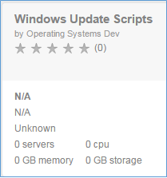
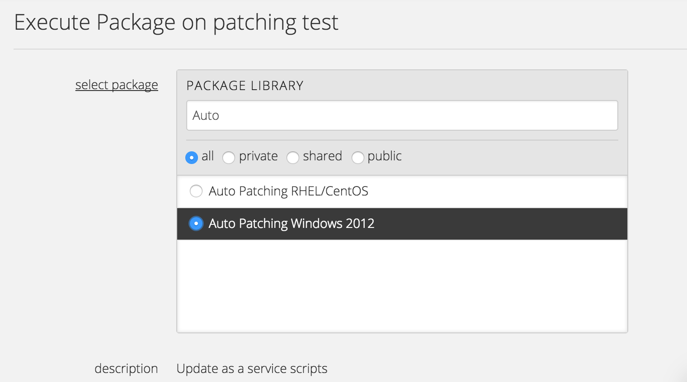
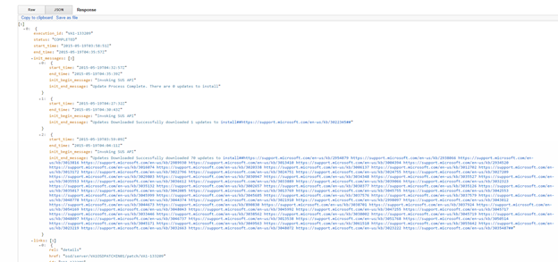

{{{
  "title": "Patching as-a-Service",
  "date": "5-29-2015",
  "author": "Benjamin Swoboda",
  "attachments": [],
  "contentIsHTML": false
}}}


### Description

This document describes how to launch a script package for patching and how to collect information on patches deployed.

 This service allows the user to patch a VM to the latest available patches provided by the OS vendor. The package will kick off one or multiple attempts to apply patches, including a series of reboots. Reboots will cease and the execution will complete when there are no more patches to apply.

Currently, the Operating Systems that may be updated with this service are show below:

* Windows 2012
* Windows 2012R2


### Audience:

CenturyLink Cloud Users

### Support:

This service has been tested for the scope identified within this article. Product improvement is important to us so our Product Team will be aware of issues related to this service, but no one will providing direct client support. If you have suggestions for improvement, please submit a feature request.

### Pricing
This service is free of charge.

# Executing Script Package

There are thee ways to deploy the package, described below. It can be executed against one VM at a time with a Blueprint or multiple VMs in a server group either through Control Portal's action functionality, or via an API request.

### Steps:

1\. **Maintenance Mode**

  The process initiated by the script package may include several, automated reboots, so - regardless how you choose to execute the package - please disable alerts by putting the VM(s) in maintenance mode first.

2\. **Select an Option for Executing the Package**

| Operating Systems | Public Script Package Name | Package ID |
| --- | --- |
| Windows 2012 and 2012R2 | Windows Update Scripts | 94bd395f-9b54-4693-94ae-4f3aa93fc239 |


  * **OPTION 1: Use a Blueprint:**

    * Locate and select "Windows Update Scripts" within the Blueprint Library.

      
    
    * Click the Deploy Blueprint Button
    * Set required parameters (Select whether you want to run under the default server administrator or specify credentials. Select the server you want to patch from the drop down. Press the green “next step 2” button.)
    * Review and Confirm the Blueprint
    * Deploy the Blueprint (You will see the deployment details stating the Blueprint is queued for execution. This will kick off the Blueprint deploy process and load a page where you can track the deployment progress. Deployment times may vary. Please wait for the build queue to update deployment status.)


  * **OPTION 2: Use the API to [Execute Package](https://www.centurylinkcloud.com/api-docs/v2/#server-actions-execute-package):**

  Please reference [API Documentation about authentication](https://www.centurylinkcloud.com/api-docs/v2/#authentication) to retrieve the Bearer token to include in all other requests. Use the package ID in the table above. There are currently no parameters to add. Below is a JSON example:

  ```
  {
    "servers": [
        "{servername1}", "{servername2}"
    ],
    "package": {
        "packageId": "94644f15-a6c6-4db2-881a-bf645a56cbe0",
        "parameters": {

        }
    }
}
```


  * **OPTION 3: Use a Group Action:**

  Navigate to the group and select "execute package" from the [action drop-down](https://www.centurylinkcloud.com/knowledge-base/servers/using-group-tasks-to-install-software-and-run-scripts-on-groups/). The name of the package to search for is "Windows Update Scripts."


  


3\. **Deployment Complete**

The execution will continue even after the completion of the script so please leave your VM in maintenance mode until you receive an email informing you of completion.

4\. **Execution Complete**

After the patching is complete you will receive an email that patching is complete. Please remove the VM from maintenance mode.


# Summary of All Patches Deployed to a Server

A history of all executions against your server is available for your review. The response will contain a high-level overview of all the patches installed for each execution and when they were applied.




#### Authentication

Reference [API Documentation about authentication](https://www.centurylinkcloud.com/api-docs/v2/#authentication) to retrieve the Bearer token to include in all other requests.

## URL

### Structure

```
Get  https://patching.useast.appfog.ctl.io/rest/servers/{alias}/server/{server}/patch

```

### Example

```
Get  https://patching.useast.appfog.ctl.io/rest/servers/OSD/server/VA1OSDPATCH33/patch
```

## Request

####URI and Querystring Perameters

| Name | Type | Description |
| --- | --- | --- |
| accountalias | string | Short code for a particular account |
| servername | string | The control-portal name assigned as VM creation, comprised of datacenter code, account alias, custom name, and two-digit number |

## Response

| Name | Type | Description |
| --- | --- | --- |
| execution_id | string | The execution ID associated with a particular patch |
| status | string | Could be pending or completed |
| start_time | date/Time | Either the start time of the entire execution (which contains all initiations) or a particular initiation.|
| end_time |  date/Time | Either the end time of the entire execution (which contains all initiations) or a particular initiation. |
| init_messages | complex | Shows the quantity of initiations |
| init_begin_message | string | "Invoking SUS API" |
| init_end_mesasge | string | identifies how many updates were installed and the URLS of the patches |

# Detail of Patches Deployed in an Execution

Details on all attempted patches for a single execution against a server are available for your review. The response will contain information from the vendor about the patch and the status of the attempt.


#### Authentication

Reference [API Documentation about authentication](https://www.centurylinkcloud.com/api-docs/v2/#authentication) to retrieve the Bearer token to include in all other requests.

## URL

### Structure

```
Get https://patching.useast.appfog.ctl.io/rest/servers/{alias}/server/{server}/patch/{execution_id}
```

### Example

```
Get https://patching.useast.appfog.ctl.io/rest/servers/OSD/server/VA1OSDPATCH33/patch/VA1-132457
```

## Request

####URI and Querystring Perameters

| Name | Type | Description |
| --- | --- | --- |
| accountalias | string | Short code for a particular account |
| servername | string | The control-portal name assigned as VM creation, comprised of datacenter code, account alias, custom name, and two-digit number |
| execution_id | string | Correlation ID for all the patches included with a single update execution, obtained from the Patch Summary response or emails regarding a patch request. The execution ID format will be aa#-######. |


## Response

| Name | Type | Description |
| --- | --- | --- |
| execution_id | string | The execution ID associated with a particular patch |
| status | string | Could be pending or completed |
| start_time | date/Time | When this value is superior to patches, indicates the start time of the entire execution (which contains all initiations). When this value is inferior to patches, indicates the start time of the patch.|
| end_time |  date/Time | When this value is superior to patches, indicates the end time of the entire execution (which contains all initiations). When this value is inferior to patches, indicates the end time of the patch. |
| Duration | string | The minutes and seconds between the start and end time. |
| begin_message | string | "Update Process BEGIN" |
| end_message | string | "Updating Complete" |
| patches | Number | Quantity of patches installed |
| patch_begin_message | string | Identifies the Software or OS updated and the reference number (KB#######) for that particular update |
| patch_end_message | string | Result code from the vendor, defining the possible results of an install. https://msdn.microsoft.com/en-us/library/windows/desktop/aa387095(v=vs.85).aspx |
| status | string | for an individual patch, could be pending, completed, or failed |
