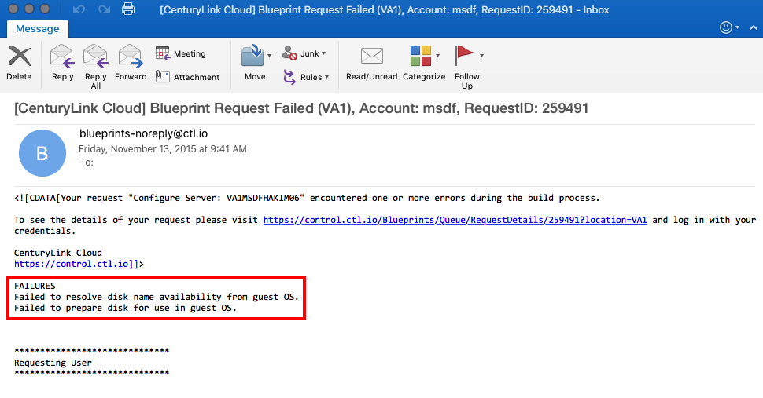

{{{
  "title": "Required ports to be opened on a server in order to allow Control functionality",
  "date": "11-12-2015",
  "author": "Anthony Hakim",
  "attachments": [],
  "related-products" : [],
  "contentIsHTML": false,
  "sticky": false
}}}

### Overview
Customers that prefer to "harden" their servers sometimes inadvertently block communications with the platform. This breaks Control Portal functionality such as cloning the server, reading/reporting partition info, providing/changing the Administrator password, etc.

Use this guide to keep necessary communications between Virtual Machines (VMs) and the Control Portal intact. For additional security-related information, read [Recommended Security Practices for Using CenturyLink Cloud](https://www.ctl.io/knowledge-base/servers/recommended-security-practices-for-using-centurylink-cloud/).

### Linux
For Linux VMs, customers need to ensure that the following ports are running:

* SSH (port 22).

  

### Windows
For Windows VMs, customers need to ensure that the following ports are running:

* WinRM (5985).

  
