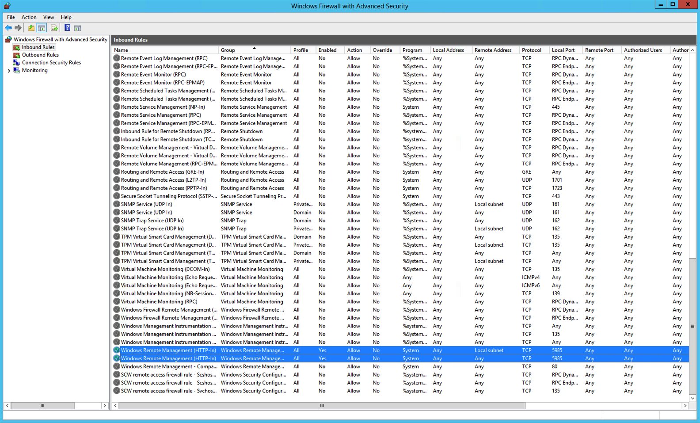

{{{
  "title": "Required ports to be opened on a server in order to allow Control functionality",
  "date": "11-13-2015",
  "author": "Anthony Hakim",
  "attachments": [],
  "related-products" : [],
  "contentIsHTML": false,
  "sticky": false
}}}

### Overview
Customers that prefer to "harden" their servers sometimes inadvertently block communications with the platform. This causes issues with the Control Portal and API functionality such as:

* Cloning a server.

  

* Modifying storage on a server.

  

Use this guide to keep necessary communications between Virtual Machines (VMs) and the Control Portal intact. For additional security-related information, read [Recommended Security Practices for Using Lumen Cloud](https://www.ctl.io/knowledge-base/servers/recommended-security-practices-for-using-lumen-cloud/).

### Linux
For Linux VMs, customers need to ensure that the following ports are running:

* SSH (port 22).

  

### Windows
For Windows VMs, customers need to ensure that the following ports are running:

* WinRM (5985).

  
  
  ### Important Information for Windows Domain Controllers and mismatch of root/administrator password between control and server.   
 Our system periodically connects to VMs in order to get partition information that can be displayed in control. It does this by attempting to use the local administrator account that is registered with it to log in and query the OS. On Domain Controllers this will most likely show periodic failed login attempts you may see in your event logs since a local administrator user does not exist. If you view your server in control, you will not see any partition information displayed, which is the result of a failure to get that information from the server's OS. This is a known control portal limitation if a server password doesn't match the control portal or if the expected administrator/root isn't available. Cloning a Domain Controller is not supported. On both Linux and Windows servers cloning and other automation will fail if passwords don't match.
