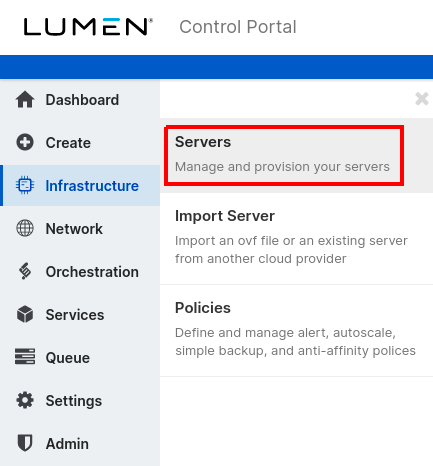
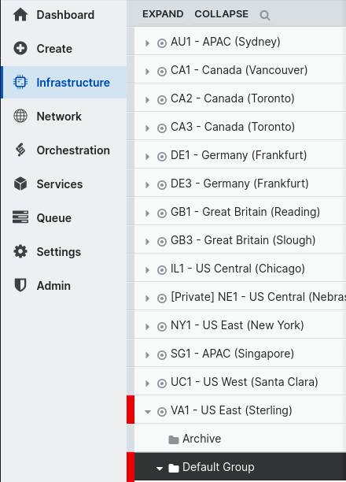

{{{
  "title": "RHUI 2-to-3 Migration",
  "date": "11-09-2021",
  "author": "Derek Jansen",
  "attachments": [],
  "related-products" : [],
  "contentIsHTML": false,
  "sticky": false
}}}

## Description

This article will provide instructions for remediating 404 responses from T3N.DOM repositories when updating RHEL 6 or RHEL 7 servers. An example of such a 404 response is as follows.

```
https://VA1T3NRHCDS02.t3n.dom/pulp/repos///content/dist/rhel/rhui/server/7/7Server/x87_64/os/Packages/kernetl-devel-3.10.0-862.e17.x86_64.repm: [Errno 14] HTTPS Error 404 - Not Found
```

---
## Prerequisites

- SSH access for Root

---
## Detailed Steps

The issue can be fixed by running a package script provided by the Public Cloud platform. The following steps are instructions on running the stated package script via the control portal or the API.

#### Control Portal

1. Log into the [control portal](//control.ctl.io).
2. Select "infrastructure" on the left-hand navigation menu, then select "servers".  

3. Select the server's group (e.g. "Default Group").  

4. On the action bar above the graphs, select "execute package".  

5. Select the package script.
    1. Provide "rhui" in the package library search field.
    2. Select the "all" radial button.
    3. Select "RHUI 2 to 3 Migration Script".  
    
6. Select the desired server from the server list, then select "execute package".
7. You will be redirected to the deployment queue. Once the job is complete, log into the server and run `yum clean all` before attempting another update.

#### API

There are two methods of calling the API: [directly](//www.ctl.io/api-docs/v2/#server-actions-execute-package), or by using the [Public Cloud CLI tool](../Servers/lumen-cloud-guide-to-cli.md). When passing the package ID and parameters to the API, the object should look something like the following where `XXX` is the data center ID (e.g. VA1).

```
{
    "packageId":"4d4fe45c-feae-471d-8ca7-f410151f5ddd",
    "parameters":{
        "T3.Datacenter":"XXX"
    }
}
```

---
## Troubleshooting

If SSH access is not enabled for Root, then the job will fail because the platform uploads and runs the script package via SSH as Root.
