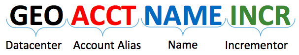
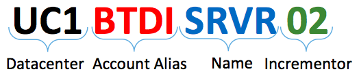

{{{
  "title": "Server Naming Convention",
  "date": "6-30-2015",
  "author": "Mark Turpin",
  "attachments": [],
  "contentIsHTML": false
}}}

All CenturyLink Cloud servers follow a standard naming convention that incorporates a number of pieces of information to make a unique key.

* **Datacenter**: 3 character alphanumeric code associated with the cloud datacenter.  Always two letters and one number. (system defined)
* **Account Alias**: 2 to 4 letter alphanumeric code associated with the account that owns the server.  Account owner selects the account alias when creating the account and afterwards this is immutable.
* **Name**: 1 to 6 character alphanumeric code associated with the server itself.  User selects this when deploying the server.  If deploying a Blueprint a default value will be provided.
* **Incrementor**: 2 character numeric code (up to 99) beginning with 01 and incrementing each time a server with this naming prefix is deployed to guarantee a globally unique naming key within the cloud portal. This extends to three or characters (non-zero padded) beginning with the 100th instance.  (system defined)

###Example

###Considerations
* The name associated with a server in the control portal need not match the actual server name at the OS, internal DNS, or external DNS levels.  On initial deployment the server's OS name and control portal name match.
* When servers are moved between datacenters as a Service Task they are renamed to match the new geography
* Once a server is deleted in the control portal, that server name cannot be reused.  If a new server is deployed with the same name (and in the same account and datacenter), the control portal will increment to the next numeric code.  For example, UC1BTDISRVR02 is created and then deleted; the next server will become UC1BTDISRVR03.
