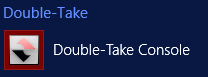
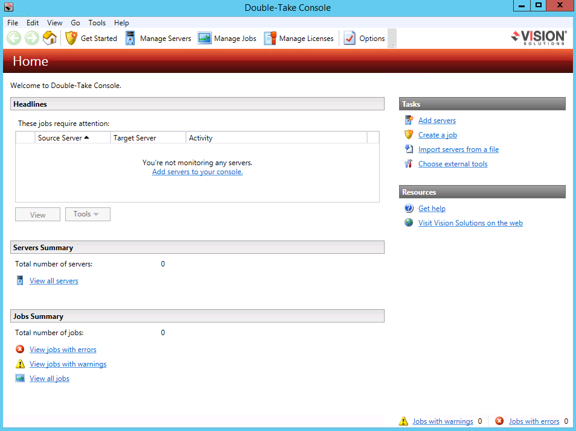
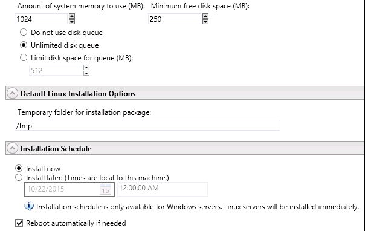

{{{
  "title": "Setting up disaster recovery using Visions Solutions Double-Take Availability",
  "date": "11-6-2015",
  "author": "Gavin Lai",
  "attachments": [],
  "contentIsHTML": false,
  "sticky": false
}}}

### Table of contents

* [Overview](#Overview)
* [Prerequisites](#Prerequisites)
* [Use Cases](#Use-Cases)
* [Setting up disaster recovery from on premise server to CenturyLink Cloud](#Setting-up-disaster-recovery-from-on-premise-server-to-CenturyLink-Cloud)
* [Considerations](#Considerations)
* [Source Server](#Source-Server)
* [Target Server](#Target-Server)
* [Setting up Double-Take Availability](#Setting-up-Double-Take-Availability)
* [Perform a Test fail over](#Perform-a-Test-fail-over)

### Overview
Double-Take allow customer to have a DR environment setup with a few
easy steps. With Vision Solutions created Blueprint in CLC, this further
simplifies the deployment process.

Before deploying any software, a DR plan needs to be in place. Depending
on the business requirement, the server can be backup from on premise
infrastructure to CenturyLink Cloud, CLC to CLC or CLC to another
location. In this walk through, a one to one scenario is used for both
the Double-Take DR for Windows and Availability for Linux. For detail of
the products, please see Vision Solutions website.

### Prerequisite

-   Access to the CenturyLink Cloud platform as an authorized user.

-   Identify a Network VLAN you want the Vision Solutions servers to
    reside on.

-   Possess a Double-Take license key

-   Target or Repository server should have enough disk space for
    replication

-   [Firewall
    rules](//www.ctl.io/knowledge-base/ecosystem-partners/marketplace-guides/getting-started-with-double-take-blueprint/#postrequisite)
    are in place for Double-Take Console and agent communication (Please
    see Knowledge Base article [**Getting Started with Double-Take -
    Blueprint**](../ecosystem-partners/marketplace-guides/getting-started-with-double-take-blueprint.md)

### Use Cases

For ease of management, a Double-Take console software is

For DR product, there are minimum three servers, the source server, the
repository server and the target server. The source server is the server
requires DR, with repository server to store the data and target servers
for disaster recovery (see below).

For Availability product, there is a real time synchronization between
source and target servers (see below).

Starting with the Blueprint, apply the appropriate license to the server
during the Blueprint setup. Please see the **Getting Started with Double
Take - Blueprint** for details of licensing request.

### Setting up disaster recovery from on premise server to CenturyLink Cloud

On premise Linux server requires a high availability setup, an offsite
warm server is needed to meet the business requirement. By using Double
Take Availability and CenturyLink Cloud, this can be done in a few
steps.

### Considerations

In preparation, there are several factors need to be considered:

-   Verify the Linux version on the source server is supported by
    [Double
    Take](//www.visionsolutions.com/docs/default-source/ha-dr-solution/double-take-availability-for-linux/doiuble-take-availability-for-linux---technical-data-sheet.pdf?sfvrsn=2)

-   Currently Double-Take Blueprints are available on CentOS 5/6, RHEL
    5/6 and Microsoft Windows 2008 R2 and 2012 R2

-   Bandwidth and connectivity between source and target

-   Double-Take Console (for management) is part of the Windows
    Blueprint installation

### Source Server

For this example, the source server is running CentOS 6.

-   Deploy Double-Take Console on a VM in CenturyLink Cloud by running
    the [Double-Take Windows Blueprint from the blueprint
    library](../ecosystem-partners/marketplace-guides/getting-started-with-double-take-blueprint.md) or install Double-Take Console on a workstation that can communicate with both source and target server (Refer to [Double-Take User Guide](//download.doubletake.com/_download/dt53/docs/Availability/User's%20Guide/Double-Take%20Availability%20User's%20Guide.htm#CSHID=ConsoleInstall.htm|StartTopic=Content%2FConsoleInstall.htm) )

-   Once installed, start the Console from the “Start’ Menu

    

-   Double-Take Console will be the management interface to set up the DR environment

    

    Once in the Management Console, go to ‘Help’ and ‘Check for Updates’
    and install any updates available

    

-   Create the target server by running the Double-Take Blueprint on
    CentOS 6 from the Blueprint library, enter the Linux Double-Take
    Availability for Linux license in the Blueprint screen

    

    

-   To manage the new server from the Double-Take Console by clicking on
    ‘Get Started’ and ‘Add Servers’

    

-   Enter the IP address or hostname, user name and password in the
    prompt:

    

-   The ‘Manage Servers’ screen will show the status of the management
    connectivity

    

-   Once connected, the server name and license will be displayed on the
    Management Console

    

-   The server details can be seen by double clicking the server

    

### Target Server

-   From the Double-Take console, repeat the ‘Add Servers’ steps using
    the source server hostname/IP address, user name and password

-   The source server will appear on the managed server list with
    ‘Cannot Connect to Double-Take’ activity.

    

-   Right click on the source server and click on ‘Install’

    

-   The ‘Install’ screen will give the installation option, like
    temporary directory, installation path as well as schedule of the
    installation

    

-   The ‘Manage Server’ screen will display the status of the
    installation, once completed, the source server will have ‘idle’
    status and license status displayed

    

    Under ‘Server Preperties’, the network traffic can be encrypted

    

### Setting up Double-Take Availability
-   Click on ‘Get Started’ and pick ‘Double-Take Availability’

    

-   Use the “Protect files and folders, an applaication or an entire
    Windows or Linux server’

    

-   Pick the source server

    

-   Depending on the data protection requirement, the options can be
    configured at this screen

    

    Replication Rules

    

-   Pick the target server, in this case, the server in CenturyLink
    Cloud

    

-   Setting the options of the replication, please note, there is a
    single NIC in CenturyLink Cloud by default, please make sure it
    matches to the primary interface of the source server, in this
    case eth0. It is important to choose ‘Retain target network
    configuration’ from ‘Failover Identity’ as changing the IP address
    on the CenturyLink Cloud server would make the server inaccessible.

    

-   For Reverse Protection option, the data synchronize both ways.
    Depending on the business requirement, it could be helpful. In this
    scenario, one way data replication is configured.

    

-   An important checklist as the last step, verify all the items of the
    checklist before proceeding

    

-   Once started, the ‘Manage Job’ screen will display the status of the
    replication

    

    Double click on the job can display the detail status

    

-   Now, a Double-Take Availability pair is created and all changes from
    the source will be replicated to the target server

### Perform a Test fail over

-   Before testing, take a snapshot of the target server using the built
    in snapshot tool in CenturyLink Cloud (please refer to knowledge
    article [Creating and Managing Server
    Snapshots](//www.ctl.io/knowledge-base/servers/creating-and-managing-server-snapshots/)

-   Right Click on the job and choose ‘Failover, Cutover, or Recover'

    

-   From the ‘Failover and Cutover’ dialogue box, choose a ‘Perform test
    failover’

    

-   The target server will be reboot and restart as an identical server
    as the source server

    

-   Once failed over, please ensure the password of the new server
    matches the password of the target server in the CenturyLink Cloud
    portal, as this would break automation due to password mismatch

-   The hostname of the server would be changed to be the same as the
    source server

-   Once everything tests out, the target server can be rolled back
    using the snapshot to continue the continuous protection

> With this in place, whenever a test or a real failover is required, it
> can be done from the Double-Take Management Console.
