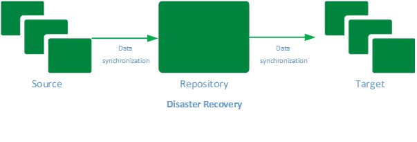
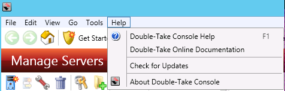
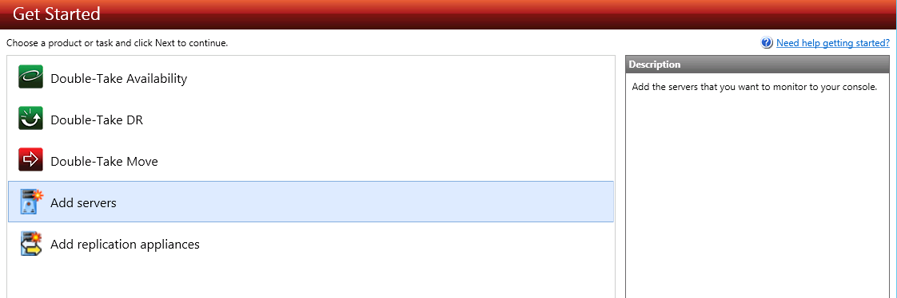
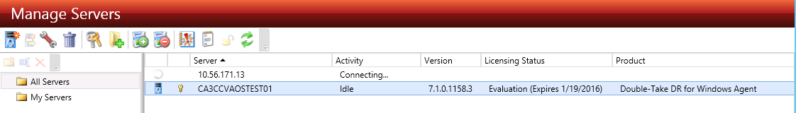
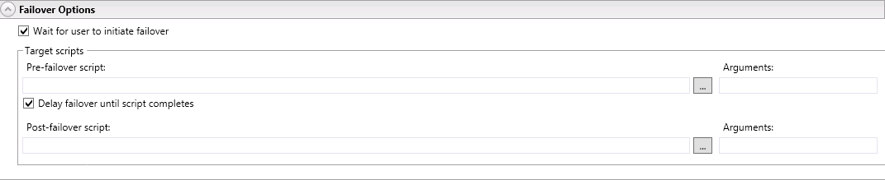

{{{
  "title": "Setting up disaster recovery using Visions Solutions Double-Take Availability",
  "date": "11-6-2015",
  "author": "Gavin Lai",
  "attachments": [],
  "contentIsHTML": false,
  "sticky": false
}}}

### Table of contents

* [Overview](#overview)
* [Prerequisites](#prerequisites)
* [Use Cases](#use-cases)
* [Setting up disaster recovery from on premise server to CenturyLink Cloud](#setting-up-disaster-recovery-from-on-premise-server-to-centurylink-cloud)
* [Considerations](#considerations)
* [Source Server](#source-server)
* [Target Server](#target-server)
* [Setting up Double-Take Availability](#setting-up-double-take-availability)
* [Perform a Test fail over](#perform-a-test-fail-over)

### Overview
Double-Take enables customer to have a DR environment created with a few
easy steps. With Vision Solutions created Blueprint in CenturyLink Cloud (CLC), this further
simplifies the deployment process.

Before deploying any software, a DR plan needs to be in place. Depending
on the business requirement, the server can be backup from on premise
infrastructure to CenturyLink Cloud, CLC to CLC or CLC to another
location. In this walk through, a one to one scenario is used for both
the Double-Take DR for Windows and Availability for Linux. For detail of
the products, please see Vision Solutions website.

### Prerequisite

-   Access to the CenturyLink Cloud platform as an authorized user

-   The DR [Operating System is supported in CenturyLink Cloud](../Support/supported-operating-systems.md)

-   Identify a Network VLAN you want the Vision Solutions servers to
    reside on

-   Possess a Double-Take license key

-   Target or Repository server should have enough disk space for
    replication

-   [Firewall
    rules](../Ecosystem Partners/Marketplace Guides/getting-started-with-double-take-blueprint.md)
    are in place for Double-Take Console and agent communication (Please
    see Knowledge Base article [**Getting Started with Double-Take
    Blueprint**](../Ecosystem Partners/Marketplace Guides/getting-started-with-double-take-blueprint.md)
-	 Review the [Self-Service VM Import / OVF Requirements](../Servers/self-service-vm-import-ovf-requirements.md) to ensure successfully DR

### Use Cases

For ease of management, a Double-Take console software is the single pane of glass for managing all Double-Take servers, jobs and licenses.  There are two products being covered as part of the knowledge articles, Double-Take DR and Double Availability.

- Double-Take Availability
  - Consists of minimum two servers, the source and Target Server
  - there is a real time synchronization between source and Target Servers (see below).
  

- Double-Take DR
  - there are minimum three servers, the Source Server, the repository server and the Target Server.
  - The Source Server is the server requires DR, with repository server to store the data and Target Servers for disaster recovery (see below).
  

  This knowledge article covers Double-Take Availability.

Starting with the Blueprint, apply the appropriate license to the server during the Blueprint setup. Please see the [Getting Started with Double-Take Blueprint](../Ecosystem Partners/Marketplace Guides/getting-started-with-double-take-blueprint.md) for details of licensing request.

### Setting up disaster recovery from on premise server to CenturyLink Cloud

On premise Linux server requires a high availability setup, an offsite warm server is needed to meet the business requirement. By using Double-Take Availability and CenturyLink Cloud, this can be done in a few
steps.

### Considerations

In preparation, there are several factors need to be considered:

-   Verify the Linux version on the Source Server is supported by
    [Double-Take](//www.visionsolutions.com/docs/default-source/ha-dr-solution/double-take-availability-for-linux/doiuble-take-availability-for-linux---technical-data-sheet.pdf?sfvrsn=2)

-   Currently Double-Take Blueprints are available on CentOS 5/6, RHEL 5/6 and Microsoft Windows 2008 R2 and 2012 R2

-   Bandwidth and connectivity between source and target

-   Double-Take Console (for management) is part of the Windows Blueprint installation

### Source Server

For this example, the Source Server is running CentOS 6.

1. Deploy Double-Take Console on a VM in CenturyLink Cloud by running
    the [Double-Take Windows Blueprint from the blueprint
    library](../Ecosystem Partners/Marketplace Guides/getting-started-with-double-take-blueprint.md) or install Double-Take Console on a workstation that can communicate with both source and Target Server (Refer to [Double-Take User Guide](//download.doubletake.com/_download/dt53/docs/Availability/User's%20Guide/Double-Take%20Availability%20User's%20Guide.htm#CSHID=ConsoleInstall.htm|StartTopic=Content%2FConsoleInstall.htm) )

2.   Once installed, start the Console from the “Start’ Menu

    

3.  Double-Take Console will be the management interface to set up the DR environment

    

    Once in the Management Console, go to ‘Help’ and ‘Check for Updates’
    and install any updates available

    

4.   Create the Target Server by running the Double-Take Blueprint on
    CentOS 6 from the Blueprint library, enter the Linux Double-Take
    Availability for Linux license in the Blueprint screen

    

    

5.   To manage the new server from the Double-Take Console by clicking on
    ‘Get Started’ and ‘Add Servers’

    

6.   Enter the IP address or hostname, user name and password in the
    prompt:

    

7.   The ‘Manage Servers’ screen will show the status of the management
    connectivity

    

8.   Once connected, the server name and license will be displayed on the
    Management Console

    

9.   The server details can be seen by double clicking the server

    

### Target Server

1.   From the Double-Take console, repeat the ‘Add Servers’ steps using
    the Target server hostname/IP address, user name and password

2.   The Source Server will appear on the managed server list with
    ‘Cannot Connect to Double-Take’ activity.

    

3.   Right click on the Source Server and click on ‘Install’

    

4.   The ‘Install’ screen will give the installation option, like
    temporary directory, installation path as well as schedule of the
    installation

    

5.   The ‘Manage Server’ screen will display the status of the
    installation, once completed, the Source Server will have ‘idle’
    status and license status displayed

    

    Under ‘Server Properties’, the network traffic can be encrypted

    

### Setting up Double-Take Availability
1.   Click on ‘Get Started’ and pick ‘Double-Take Availability’

    

2.   Use the “Protect files and folders, an application or an entire
    Windows or Linux server’

    

3.   Pick the Source Server

    

4.   Depending on the data protection requirement, the options can be
    configured at this screen

    

    Replication Rules

    

5.   Pick the Target Server, in this case, the server in CenturyLink
    Cloud

    

6.   Setting the options of the replication, please note, there is a
    single NIC in CenturyLink Cloud by default, please make sure it
    matches to the primary interface of the Source Server, in this
    case eth0. It is important to choose ‘Retain target network
    configuration’ from ‘Failover Identity’ as changing the IP address
    on the CenturyLink Cloud server would make the server inaccessible.

    

7.   For Reverse Protection option, the data synchronize both ways.
    Depending on the business requirement, it could be helpful. In this
    scenario, one way data replication is configured.

    

8.   An important checklist as the last step, verify all the items of the
    checklist before proceeding

    

9.   Once started, the ‘Manage Job’ screen will display the status of the
    replication

    

    Double click on the job can display the detail status

    

10.   Now, a Double-Take Availability pair is created and all changes from
    the source will be replicated to the Target Server

### Perform a Test fail over

-   Before testing, take a snapshot of the Target Server using the built
    in snapshot tool in CenturyLink Cloud (please refer to knowledge
    article [Creating and Managing Server
    Snapshots](../Servers/creating-and-managing-server-snapshots.md) for quick recovery

    1. Right Click on the job and choose ‘Failover, Cutover, or Recover'

      

    2. From the ‘Failover and Cutover’ dialogue box, choose a ‘Perform test
    failover’

      

    3. The Target Server will be reboot and restart as an identical server
    as the Source Server

      

    4. Once failed over, please ensure the password of the new server
    matches the password of the Target Server in the CenturyLink Cloud
    portal, as this would break automation due to password mismatch

-   The hostname of the server would be changed to be the same as the
    Source Server

-   Once everything tests out, the Target Server can be rolled back
    using the snapshot to continue the continuous protection (if snapshot is not available, the test server can be deleted and a new one can be created using the steps above)

    Also this procedure can be repeated to set up multiple servers in a complex environment and managed from the Double-Take Management Console.  For multi-tiers application environment, both the time-out and script option under the 'Set Options' page (step 6 of [Setting up Double-Take Availability](#Setting-up-Double-Take-Availability)) can be used to control the start up sequence of the new environment.
    

    

With this in place, whenever a test or a real failover is required, it can be done from the Double-Take Management Console.

A second article will cover how to set up a disaster recovery environment using Double-Take DR.
