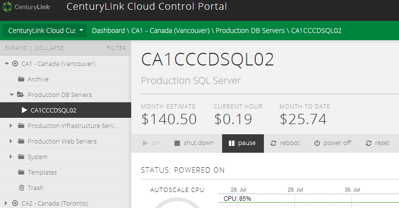
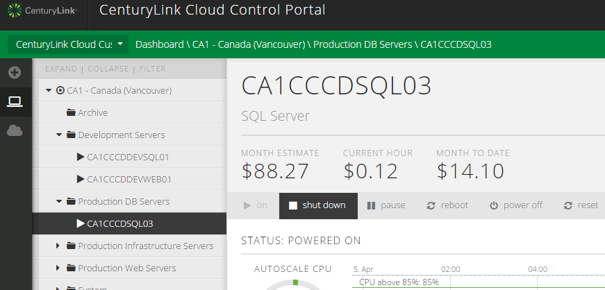
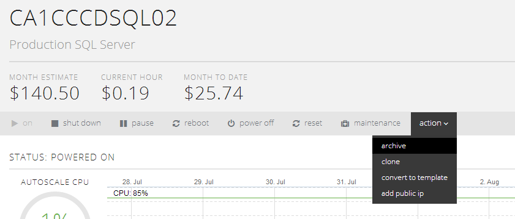

{{{
  "title": "Understanding VM Deployment Options and Power States",
  "date": "4-6-2015",
  "author": "Chris Little",
  "attachments": [],
  "contentIsHTML": false
}}}

### Templates

**Definition:** A Virtual Machine template provides a standardized group of hardware and software settings that can be used repeatedly to create new virtual machines configured with those settings.

**How To:** [How To Create A Customer Specific OS Template](../Servers/how-to-create-customer-specific-os-templates.md)

**Costs** Customer specific template storage is billed on a per GB basis as Standard Storage. Out of the box Virtual Machine templates in the CenturyLink Cloud platform do not incur a storage fee.

**Sample Use Case** ISV would like to build a virtual machine base template that includes the OS, software packages and security customization to improve speed of delivery to their client base.

### Clones

**Definition** Cloning creates an independent, duplicate copy of an existing virtual machine which is nearly identical to the “source” virtual machine. The cloned machine retains the same hardware, operating system, application and configuration items as the original virtual machine; however, certain items, such as the server’s security identifier, are changed during the process. For some further information around cloning, please see [Cloning Best Practices](../Servers/cloning-best-practices.md)

**How To:** [How To Clone A Virtual Machine Instance](../Servers/how-to-clone-a-virtual-machine-os-instance.md)

**Costs** As a virtual machine clone is a completely separate copy of a VM, it is billed per hour based on the resources assigned.

**Sample Use Case** IT department needs to reproduce and find a resolution to a software bug that is affecting theircustomers. In order to avoid changes and downtime to the production environment , a clone of the problem virtual machine is created allowing for further troubleshooting without customer impact.

### Snapshots

**Definition:** A snapshot preserves the state and data of a virtual machine at a specific point in time. The state includes the virtual machine’s power state (for example, powered-on, powered-off, suspended). The data includes all of the files that make up the virtual machine. This includes disks, memory, and other devices, such as virtual network interface cards.

**How To:** [Creating & Managing Server Snapshots](../Servers/creating-and-managing-server-snapshots.md)

**Costs:** Snapshots are included as part of the CenturyLink Cloud platform. Snapshots can be automatically created or deleted using the built in scheduler.

**Sample Use Case:** IT Department is preparing for the monthly patch release cycle for their Windows servers. For rapid fallback group level snapshots are created against the production environment prior to application of patches.

### Pause

**Definition:** Pausing a virtual machine suspends the operating system. A virtual machines pause or power state can be changed in a rapid fashion.

**How To:** The Pause function is available at both the group or individual virtual machine details pane. Customers can leverage the built in scheduler to perform automated changes to power states against individual or groups of virtual machines.

**Costs:** In the pause state, a customer pays for storage consumed by the virtual machine and licensing costs. Compute and memory costs are not levied. *Managed Services costs are Levied in a pause state*.

**Sample Use Case:** A customer maintains a development and staging environment for their production workloads. This environment is only used during business hours 8 AM to 8 PM EST. The IT department, in order to save costs, creates a scheduled pause and power on event during off hours. This automated task eliminates CPU & RAM fee's between the 8 PM and 8 AM EST time window for these environments.

### Shutdown/Power Off

**Definition:** Shutting Down (or powering off) a virtual machine performs a graceful (or un-graceful using the power off command) shutdown of the operating system in a controlled way. A virtual machines power state can be changed in a rapid fashion.

**How To:** The Shutdown/Power Off function is available at both the group or individual virtual machine details pane. Customers can leverage the built in scheduler to perform automated changes to power states against individual or groups of virtual machines.

**Costs:** In the shutdown/Power Off state, a customer pays for storage consumed by the virtual machine and licensing costs. Compute, memory and *Managed OS* costs are not levied.

**Sample Use Case:** A Managed Server customer maintains a development and staging environment for their production workloads. This environment is only used during business hours 8 AM to 8 PM EST. The IT department, in order to save costs, creates a scheduled shutdown event during off hours. This automated task eliminates CPU, RAM and Managed Server fee's between the 8 PM and 8 AM EST time window for these environments.

### Archive

**Definition:** Archiving a virtual machine suspends the operating system and migrates the instance to a significantly cheaper storage tier. Bringing a virtual server out of an archive state can take a few hours.

**How to:** The Archive function is available in the individual virtual machine details pane. Customers can leverage the built in scheduler to automate migrate of virtual machine in or out of archive.

**Costs:** In the archive state, a customer pays only for the archival storage consumed by the virtual machine (at a reduced rate). Compute, memory and licensing costs are not levied.  *Managed Servers cannot leverage the Archive Feature*.

**Sample Use Case:** The business department has a reporting server that pulls data on a monthly basis from a 3rd party and generates reports for business analysis. This virtual machine is only required for 2 days per month and otherwise is unused. To save costs, the IT department schedules the server to be placed in archive and brought out of archived for operation during just these 2 days of the month.

**Note:** Archived servers are not backed up or replicated (for premium storage customers) daily. Rather, only a single copy of the server exists. To restore a VM in which you have archived, simply unarchive it.
