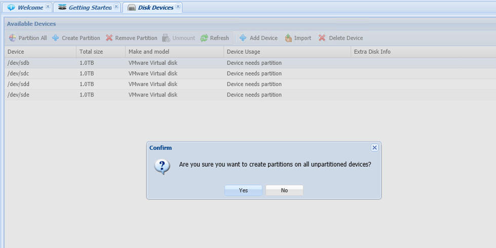

{{{
  "title": "Using a Software-Defined Virtual NAS/SAN on CenturyLink Cloud",
  "date": "4-15-2015",
  "author": "Chris Little",
  "attachments": [],
  "contentIsHTML": false
}}}

### Using a Software-Defined Virtual NAS/SAN on CenturyLink Cloud
Customers looking to operate CIFS, NFS or iSCSI services within the cloud platform can import software-defined virtual appliances via a [service task](//www.ctl.io/products/support/service-tasks). By using a **qualified** unified storage virtual appliance customers can deliver NAS based storage services to virtual instances, pool disks to exceed 1 TB disk limits imposed by the cloud platform or deliver legacy shared-storage iSCSI volumes for database clusters. In this knowledge base we will be using a [SoftNAS](//www.softnas.com) Virtual Appliance. [SoftNAS](//www.softnas.com) is a software-defined unified NAS/SAN storage solution for businesses that need powerful, frictionless and agile storage.

### Supporting Information
CenturyLink Cloud provides no support for the SoftNAS virtual appliance. The goal of this KB is to provide a sample use case to deliver unified storage services within the parameters of the cloud platform. Customers are responsible for configuration and sizing of the virtual appliance resources according to the vendors best practices. There are a large number of configuration options/customization's not covered in this KB and customers should read the installation guides provided by SoftNAS.

### Security Notes
In this sample deployment no security services were put in place around access to either iSCSI block or filesystem (CIFS, NFS) services. SoftNAS and the CenturyLink Cloud provide a wide range of authentication and security components customers can and should implement that are outside the scope of a basic functionality overview.

### Prerequisites

* A CenturyLink Cloud Account
* [Service Task for OVF Import](//www.ctl.io/products/support/service-tasks)
* [A licensed copy of SoftNAS](//www.softnas.com/wp/purchase)

### Basic Configuration of the Virtual Appliance

1. Once your SoftNAS virtual appliance is provisioned to the appropriate account via Service Task, login to Control, navigate to the Virtual Appliance, choose edit storage. Provision the appropriate number of RAW disks you wish to pool together into a larger storage pool. In this sample we've chosen to add 4 x 1 TB RAW Disks. NOTE: Understanding the [platform maximums](../Servers/cloud-server-instance-size-and-performance.md) by VM type is important. We recommend you import your Virtual Appliance as a **Standard VM** type if you wish to use up to the 4 TB Maximum.

    

2. Once the RAW disks are added, login to the SoftNAS StorageCenter, select disk devices. The RAW disks added via Control should be present. Quick Tip: use the refresh button if disks don't show up immediately.

    

3. Select the Partition All button and confirm you wish to create partitions on all the devices.

    

4. In the SoftNAS StorageCenter navigate to Storage Pools and select the create icon. Provide a friendly Pool name and choose an appropriate level of RAID you wish to use on this group of RAW disks. In this example, we leveraged RAID0/striping, as all RAW storage disks provisioned in CenturyLink Cloud already have data protection capabilities in the infrastructure. Select create.

    

    

5. If you plan to deliver iSCSI volumes you need to establish an create an iSCSI Target on the SoftNAS. Navigate to iSCSI Lun Targets in the SoftNAS StorageCenter and create a new target. the Default option 'Don't Create new LUN' is adequate as these will be created later.

    

6. In the SoftNAS StorageCenter navigate to Volumes and LUNs and select the create icon. The Create Volume dialog box allows you to choose the type of Volume/LUN you wish to deploy. Choices include CIFS, NFS and iSCSI.

    ##### NAS (CIFS or NFS)
    * Provide a volume name
    * Choose the storage pool previously provisioned
    * Select Filesystem (NFS, CIFS)
    * You can choose to export this volume as NFS, CIFS or Both
    * Choose the storage provisioning options: Thin or Thick
    * Choose the storage optimization options: Compression and/or Deduplication
    * Choose if you wish to leverage snapshots and their schedule.

    

    

    ##### iSCSI Block Storage
    * Provide a volume name
    * Choose the storage pool previously provisioned
    * Select Block Device (iSCSI LUN) &amp; Share as iSCSI LUN
    * Choose the storage provisioning options: Thin or Thick
    * Choose the storage optimization options: Compression and/or Deduplication
    * Choose if you wish to leverage snapshots and their schedule.
    * Select the iSCSI LUN Target created in Step #5

    

    

7. Once completed the SoftNAS StorageCenter should show the volumes/LUNs you've created.

    

### Connecting to NAS or Block Storage on Windows
The examples below are just examples of using a Windows 2012 R2 Virtual Instance to mount a CIFS and iSCSI Volume. Customers should follow standard NFS mount procedures for Linux Instances.
  * If you are leveraging a centralized Active Directory DNS we recommend you add an (A) record so the SoftNAS can be resolved via name or IP.
  * To map a CIFS share use the command line to execute (or Map Network Drive in the Desktop)

      ```
        net use * \\nasip or name\share name. In this example the command was net use * \\softnas\cifs_share.
      ```

    

  * To mount an iSCSI block volume locate the iSCSI initiator (built into Windows 2012, download for 2008 R2) and input the IP address of the SoftNAS virtual appliance, select quickconnect. Select the volumes and devices tab and choose auto configure. Use the disk management tools in Windows to bring online, initialize and format the newly presented iSCSI LUN.

    

    
