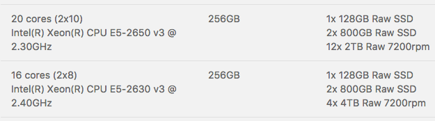

{{{
"title": "Using Runner to configure disks on Bare Metal servers",
"date": "10-17-2016",
"author": "Anthony Hakim",
"attachments": [],
"contentIsHTML": false,
"sticky": false
}}}

### Overview

Customers who build particular Bare Metal server types have the ability to customize the configuration using both JBOD (HBA) and RAID modes.  For those customers who would like an automated process to configure disks on Bare Metal (see below for prerequisites), please follow the instructions below.

If you'd prefer a more hands on approach, you can follow the step-by-step instructions in the [Configure the RAID controller on Bare Metal servers](../Servers/configuring-raid-on-bare-metal-servers.md) KB article.

### Prerequisites

A CenturyLink Cloud Bare Metal Server that supports JBOD/RAID:

### Use Runner to configure your disks

You've built your new Bare Metal server.  Now it's time to configure the disks.

* Logon to the Control Portal
* In the left Navigation menu, click on Orchestration, then select Runner.
* Click Products, locate the Bare Metal Storage Configuration product and click on it, then click "run".

    

    

* Please pay special attention to the warning notice regarding Disk Settings and Configuration.

  

* **Datacenter Picker** - Select the data center that contains the Bare Metal server you would like to configure disks.
* **Servers (Add To Inventory)** - Select one or more Bare Metal servers in that data center.
* **Controller Personality** - Select the Controller Personality:
  - RAID-Mode (RAID-x)
  - HBA-Mode (JBOD)
* **Partition/Format/Mount All Raw Disks** - Select whether you would like Runner to create a partition, format, and mount all raw disks, including ones not attached to the disk array controller.

  **Please note:** If HBA-Mode (JBOD) is selected, the following RAID option values will be ignored.

* **RAID Level** - Select your desired RAID level:
  - RAID-10
  - RAID-5
  - RAID-1
  - RAID-0
* **Set Encryption** - Select whether you would like to encrypt the RAID volumes.

  **Please note:** The encryption options below will only be applied if you chose RAID-Mode (RAID-X) above. If it is set to HBA-Mode (JBOD), the following option values will be ignored.

* **Security Key** - Enter the desired Security Key to set for disk encryption.

  **Please note:**	A password must be at least 9 characters and contain at least 3 of the following:
  - uppercase letters
  - lowercase letters
  - numbers
  - symbols

* **Key ID** - Enter the desired Key ID to set for disk encryption

* **Callbacks** - Configure your optional Callbacks:
  - HTTP
    - Status level:
      - Debug
      - Error
      - Result
    - URL:
      - http://callback/url

  - Email
    - Status level:
      - Debug
      - Error
      - Result
    - Subject:
      - Your email Subject
    - Recipient
      - john.doe@ctl.io

 * Click "run"

 After the job is submitted to Runner, you will be directed to the Job Execution page, where you are able to follow the progress of the job.

 

When the job completes successfully, the status bar will turn green (as above). If you have any issues, please check out the [Runner FAQ](https://www.ctl.io/knowledge-base/runner/runner-faqs.md) in our Knowledge Base.
