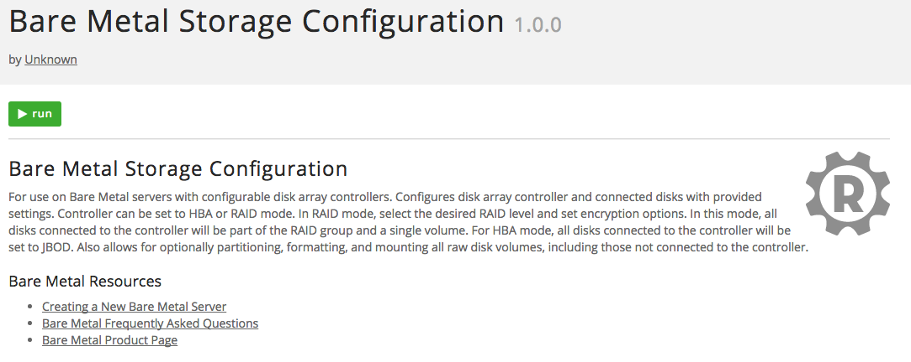
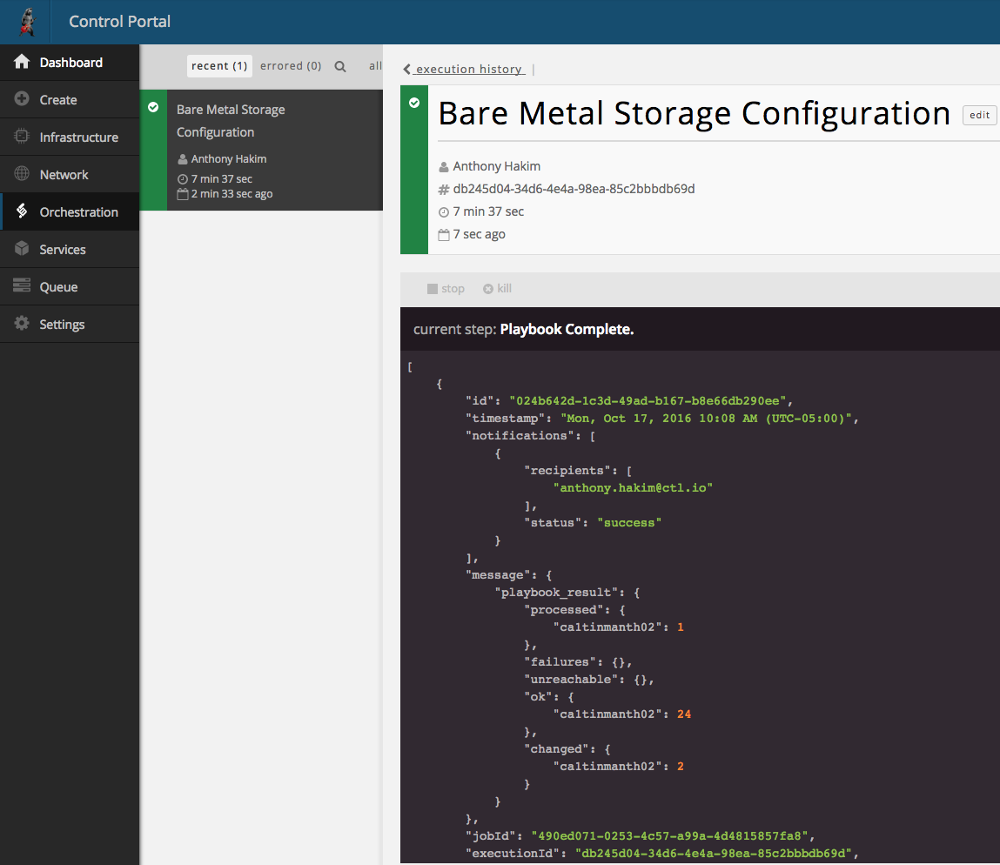

{{{
"title": "Using Runner to configure disks on Bare Metal servers",
"date": "10-17-2016",
"author": "Anthony Hakim",
"attachments": [],
"contentIsHTML": false,
"sticky": false
}}}

### Overview

Customers who build particular Bare Metal server types (see below for prerequisites), have the ability to customize the configuration using both JBOD (HBA) and RAID modes. For those customers who would like an automated process to configure all disks on your Bare Metal server into one RAID set or JBOD, please follow the instructions below.

If you'd prefer to carve the disks up in more of a custom fashion, such as multiple RAID sets or something more complicated, you can follow the step-by-step instructions in the [Configure the RAID controller on Bare Metal servers](../Servers/configuring-raid-on-bare-metal-servers.md) KB article.

### Prerequisites

A Lumen Cloud Bare Metal Server that supports JBOD/RAID:

* 20 cores E5/256 GB RAM/2x800GB SSD/12x2TB 7200 SATA2
* 16 cores E5/256 GB RAM/2x800GB SSD/4x4TB 7200 SATA2

The following Operating Systems are supported:

* CentOS 6 64-bit
* RedHat Enterprise Linux 6 64-bit
* Ubuntu 14 64-bit
* Windows 2012 R2 Standard 64-bit
* Windows 2012 R2 Datacenter 64-bit

### Use Runner to configure your disks

You've built your new Bare Metal server.  Now it's time to configure the disks.

1. Logon to the Control Portal
2. In the left Navigation menu, click on Orchestration, then select Runner.
3. Click Products, locate the Bare Metal Storage Configuration product and click on it, then click "run".

    

    

4. Please pay special attention to the warning notice regarding Disk Settings and Configuration.

  

5. **Datacenter Picker** - Select the data center that contains the Bare Metal server you would like to configure disks.
6. **Servers (Add To Inventory)** - Select one or more Bare Metal servers, with a configurable disk array controller, in that data center.
7. **Controller Personality** - Select the Controller Personality:
  - RAID-Mode (RAID-x)
  - HBA-Mode (JBOD)
8. **Partition/Format/Mount All Raw Disks** - Select whether you would like Runner to create a partition, format, and mount all raw disks, including ones not attached to the disk array controller.

  **Please note:** If HBA-Mode (JBOD) is selected, the following RAID option values will be ignored.

9. **RAID Level** - Select your desired RAID level:
  - RAID-10
  - RAID-5
  - RAID-1
  - RAID-0
10. **Set Encryption** - Select whether you would like to encrypt the RAID volumes.

  **Please note:** The encryption options below will only be applied if you chose RAID-Mode (RAID-X) above. If it is set to HBA-Mode (JBOD), the following option values will be ignored.

11. **Security Key** - Enter the desired Security Key to set for disk encryption.

  **Please note:**	A password must be at least 9 characters and contain at least 3 of the following:
  - uppercase letters
  - lowercase letters
  - numbers
  - symbols

12. **Key ID** - Enter the desired Key ID to set for disk encryption

13. **Callbacks** - Configure your optional Callbacks:

  - HTTP
    - Status level:
      - Debug
      - Error
      - Result
    - URL:
      - http://callback/url
  - Email
    - Status level:
      - Debug
      - Error
      - Result
    - Subject:
      - Your email Subject
    - Recipient
      - john.doe@ctl.io

14. Click **run**

Once the job is submitted to Runner, you will be directed to the Job Execution page, where you are able to follow the progress of the job.

 

When the job completes successfully, the status bar will turn green (as above).

### Before and After

Disk configuration (Windows Server 2012) before running the Bare Metal Storage Configuration Runner job on a Bare Metal server with 1 x 128GB SSD, 2 x 800GB SSD and 4 x 4TB 7200rpm disks.

 

After running the Bare Metal Storage Configuration Runner job using the RAID-10 option.

 

If you have any issues, please check out the [Runner FAQ](../Runner/runner-faqs.md) in our Knowledge Base.
