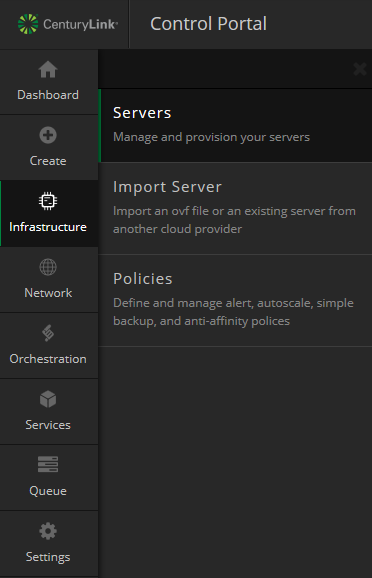

{{{
  "title": "Using Self-Service VM Import",
  "date": "06-09-2020",
  "author": "Derek Jansen",
  "attachments": [],
  "contentIsHTML": false
}}}

1. Before proceeding, ensure your OVF meets the requirements that are listed here in our [VM import preparation article](../Servers/vm-import-preparation.md).
2. Connect to your account's CenturyLink Cloud FTP site. Instructions on retrieving the connection details can be found in our [FTP users article](../Control Portal/ftp-users-in-control-portal.md).
  - You can import VMs to any available data center in your account. The OVF file is simply stored in your home data center FTP account for initial processing.
3. In the root directory of the FTP site, create a folder named “import” if it does not already exist.
4. Within the “import” folder, create another directory with a name that matches the name of your OVF. It must contain only alphanumeric characters because special characters may result in failure (e.g. “import/sampleovfname”).
5. Upload the OVF files (VMDK, VMX, etc) to the new directory.
  - The transfer of the OVF may take several hours depending on file sizes and the speed of your connection.
  - Any packet loss during the transfer may result in import failure.
  - **Note:** OVFs will be automatically deleted from your FTP server after 5 days. As such, please complete imports shortly after initial upload.
6. When the upload is complete, click "Import Server" under the infrastructure tab of the control portal navigation menu.
  
7. When the list finishes loading, you will then see your collection of uploaded OVFs.
  
8. Select the desired OVF to import, and proceed to complete the rest of the form including the data center and server group location of the VM.
  
9. Select "import server" to initiate the import process.

Upon successful import, your VM will appear in your chosen data center and server group location within a few hours. **However**, the exact timing for the availability of the new VM in the control portal depends on several factors, so there is no standard availability time.

**Note:** If your OVA import fails with any of the errors listed below, please see VMware's article here for resolution: https://kb.vmware.com/s/article/2151537.

- Invalid Ovf manifest entry
- The OVF package is invalid and cannot be deployed
- The following manifest file entry (line 1) is invalid: SHA256 (xxxxxxx.ovf)
