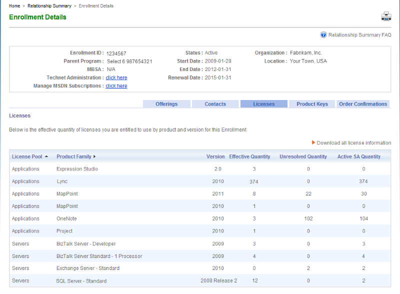
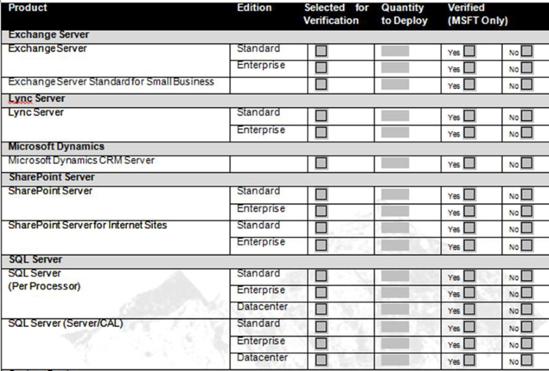

{{{
  "title": "Using Your Microsoft Licenses in the Lumen Cloud",
  "date": "10-27-2015",
  "author": "Jake Malmad",
  "attachments": [],
  "contentIsHTML": false
}}}

### Overview
Lumen Cloud provides SPLA licensing as a means of delivering cost-effective, utility computing. Customers may apply Microsoft or Red Hat enterprise licenses to their Virtual Machines and are billed the corresponding amount as long as the machine is in a live state. Customers who archive their servers do not pay for licensing until the Virtual Machine is placed back into production- archiving servers is a great way to manage costs while retaining operational agility.

Certain customers may wish to leverage their existing investment in the Microsoft ecosystem. Lumen Cloud is an authorized Microsoft Mobility partner, and as such, customers may deploy certain licenses to the cloud with no incurred cost. To be eligible for license mobility a customer:

1. Must be enrolled in Microsoft Volume Licensing (VL) program such as Microsoft Enterprise Agreement (EA), Select Plus or Open License.
2. Must have active Software Assurance (SA) coverage.

Microsoft License Mobility through Software Assurance only applies to eligible products listed in the Product Use Rights (PUR) list. The PUR list is updated frequently and can be viewed [here.](//www.microsoft.com/en-us/licensing/product-licensing/products.aspx)

**Windows Server, the Windows client operating system, and desktop application products are not included in License Mobility through Software Assurance.** Customers deploying to Lumen Cloud are required to use SPLA for all Windows Server operating systems.

Customers must maintain eligible licenses on the Authorized Mobility Partner’s (Lumen Cloud) IaaS Platform for a minimum period of 90 days. After the 90-day period, you can move the licensed software back to your premise or to another Authorized Mobility Partner’s server farm.

### Exceptions

* Customers leveraging [Lumen Managed Services](//www.ctl.io/managed-services/) are not eligible for license mobility as these packages include management and software as part of the solution offering.

### License Mobility verification process

1. Typically, the IT or procurement department in your organization can access the Microsoft licensing agreement details. The Microsoft Volume Licensing Service Center (VLSC) tool gives you a view of your Microsoft License Statement (MLS). You can log on to VLSC to view current license entitlement on the Enrollment Details page, which displays the estimated license entitlement.

    

2. Customer will need to complete and submit a license verification form available at [www.microsoftvolumelicensing.com.](http://www.microsoftvolumelicensing.com) This form requires you to include basic details about the licenses from your Volume Licensing agreement, which is used for License Mobility through Software Assurance, and is required by Microsoft to verify eligibility for this benefit. The form lists products that are eligible for license mobility, and you indicate which you are deploying with your Authorized Mobility Partner. Once you submit the form to Microsoft through your channel partner, you can deploy the licenses with the Authorized Mobility Partner, without waiting for Microsoft to finish the verification process.

    

3. Microsoft verifies that the licenses you move to the cloud are eligible per the terms of License Mobility through Software Assurance and informs you and the Authorized Mobility Partner of this status. If the verification fails for whatever reason, you will be notified of the reason on the returned verification form. If your verification is rejected, you can choose to take any one of the following steps:
    * Acquire appropriate licenses as required for License Mobility through Software Assurance via Volume Licensing and resubmit the form.
    * Acquire use rights to that software from the Authorized Mobility Partner (who would in turn use the SPLA program).
    * Discontinue use of the licenses in the Authorized Mobility Partner’s environment.

For detailed answers or deployment assistance, please contact Lumen Cloud Support.
