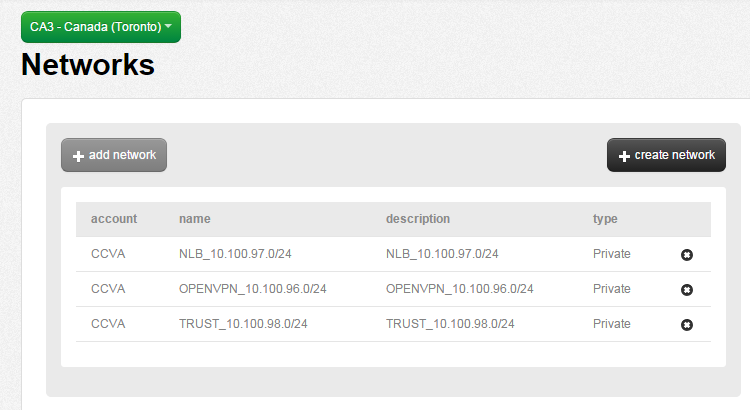
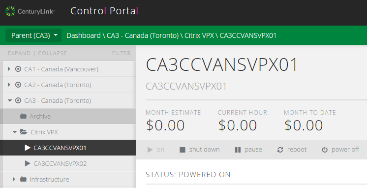

{{{
  "title": "Deploy a Dedicated Citrix VPX Appliance",
  "date": "2-23-2018",
  "author": "Chris Little",
  "attachments": [],
  "contentIsHTML": false
}}}

### Overview
This Knowledge Base article will guide a customer through the process of deploying dedicated Citrix VPX load balancer(s) via [Service Task](http://www.ctl.io/service-tasks) on the CenturyLink Cloud.

### FAQ

**Q: How is a Dedicated Citrix VPX Priced?**

**A:** Refer to our [Pricing Catalog](https://www.ctl.io/pricing) under Load Balancing for Citrix VPX License fees. These fees include **only** the license costs on a monthly basis. Compute usage for each appliance is based on a **2vCPU/2GB RAM/20GB Storage** Virtual Machine size.  Customers can leverage our [Online Price Estimator](https://www.ctl.io/estimator/) to determine this cost based on location. When using **Highly Available** configurations **both** licensing and compute costs will be **multiplied 2x**.

### Deploy a Load Balancing VLAN

* Deploy a [dedicated load balancing vlan](../Network/CenturyLink Cloud/creating-and-deleting-vlans.md) in your account within the appropriate data center.  We recommend the VPX reside in a dedicated VLAN which allows for maximum Firewall security control and scalability of VIPs.
* Costs for VLANs can be found in our [Pricing Catalog](http://www.ctl.io/pricing) or your CenturyLink Cloud MSA.
* Once this job completes we recommend you [apply a friendly name](../Network/CenturyLink Cloud/add-a-user-friendly-name-to-vlans.md) to this VLAN.

In the sample below in CA3 we have a network created and named NLB_10.100.97.0/24.

### Request a Service Task
[Create a formal request to the Service Task team.](../Service Tasks/requesting-service-tasks-on-centurylink-cloud.md)
In order to properly process your request to deploy Citrix VPX device(s) customers will need to supply the Service Task team with the following information.

* The [Account alias](../Support/determine-control-portal-alias.md) of the Account you wish to deploy the VPX(s) into.
* The Data Center in which you wish the VPX(s) to be deployed
* The Network into which the VPX(s) should be deployed. In this example above NLB_10.100.97.0/24 was leveraged.
* The Server Group you'd like the VPX(s) deployed into
* The number of VIP's you'd like reserved in the network for load balancing. The support team can later reserve more via a ticket. Generally, our team will reserve 10 VIPs out of the box unless stated otherwise.
* [Indicate which of the (6) dedicated load balancer types you wish to purchase.](http://www.ctl.io/load-balancing/#Pricing)
* Indicate the Quantity of devices you wish to purchase.  **If you require Highly Available Load Balancers 2 units must be purchased.**
* Indicate the VPX build version you wish to leverage:  10.5, 11, 11.1, 12 or **12.1new!**
* [Provide your pin](../Support/pin-authentication-for-support-requests.md)

### Accessing the VPX Appliance(s)

Once the Service Task team deploy's your VPX appliance(s) you will get a notification with details on your new devices. This list will include:

* The VM name of the VPX(s)
* The Management IP of the VPX(s)
* The RNAT IP of the VPX
* Username and Password to perform administration of your new appliances
* The list of VIP's reserved for the VPX

Citrix VPX Appliances will be shown in Control

### Additional Information

* [Dedicated Load Balancer Basic Management](../Network/CenturyLink Cloud/dedicated-load-balancer-basic-management.md)
* [Deploying a Dedicated Citrix VPX in a Multi-tenant Fashion](../Network/CenturyLink Cloud/deploying-a-dedicated-citrix-vpx-environment-in-a-multi-tenant-fashion.md)
* [Load Balancing Comparison Matrix](../Network/CenturyLink Cloud/load-balancing-comparison-matrix.md)
