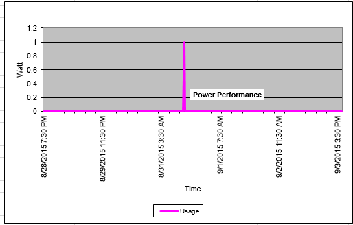

{{{
  "title": "Service Task Usage Reporting",
  "date": "11-16-2016",
  "author": "Sayed Haider",
  "attachments": [],
  "contentIsHTML": false,
  "sticky": false
}}}

### Overview
Usage reports provided by the Lumen Cloud’s service task team enables you to request and analyze reports on customized instances which are not available in the control Portal.

### Available Reports
You can request the following custom reports from the service task team:

#### The Data in Usage Report
A two-week Lumen Cloud utilization report in CSV spread sheet format for a given account alias - rolls up all sub-accounts(does not include machines that are powered off or templates).

Summary:
Servers: xx | CPUs: 82 Utilization: 7.3% | RAM: 274 GB Utilization: 13.0% | Storage: 12436.472 GB Utilization: 43.9%.

Spreadsheets are as follows:
* Two Week Utilization Metrics: A 13-day view rolling up each of these metrics for the entire account.
* High CPU: Virtual Machines with average CPU utilization over 70%.
* Low CPU: Virtual Machines with average CPU utilization under 25%.
* High RAM: Virtual Machines with average RAM utilization over 70%.
* Low RAM: Virtual Machines with average RAM utilization under 25%.
* High HD: Virtual Machines with average storage utilization over 70%.
* Low HD: Virtual Machines with average storage utilization under 25%.
* Two Week Server Metrics: A dump of all metrics for each of the Virtual Machines in the account.

#### Server Power Consumption Metrics
Captures the power consumption of servers and delivers the information in a chart format. See example below.

#### Custom Site to Site VPN Report Usage and Analysis
This report enable you to analyze the following VPN elements:
* IKE Gateway: This section will reveal the name of the IKE gateway and its status of up or down.
* IPsec SA's: This section will show you each SA and its index. It will also tell you if it's currently active or inactive.
* IPsec Policies: This section will show you each SA's policy details including the source and destination VLAN's. If the measure switch was used, you will also see the number of packets transmitted during a 3 second period where the policy was analyzed.

Customers may also request firewall rules, routes query, and traffic logs.
