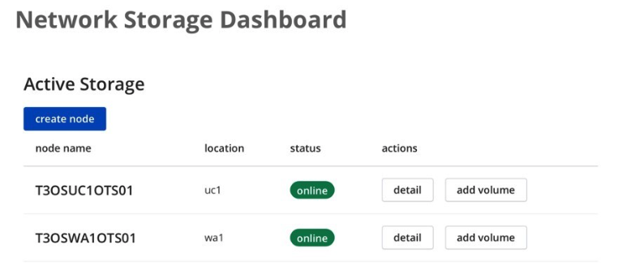
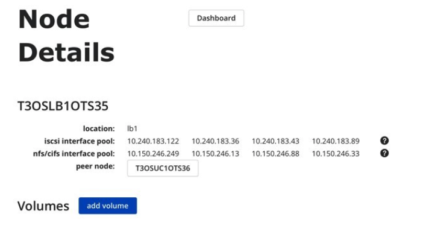
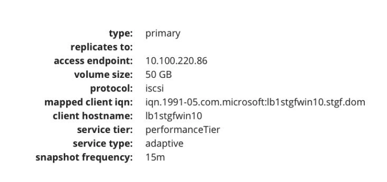
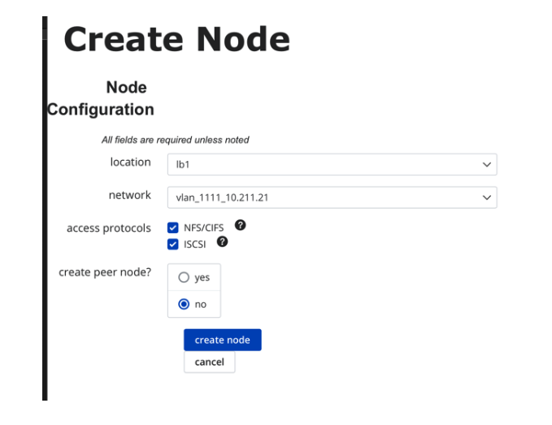
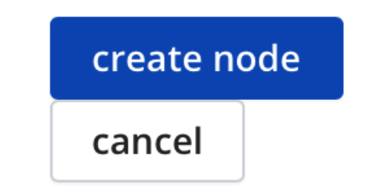
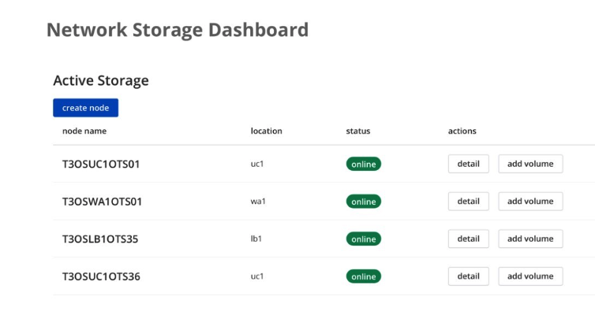
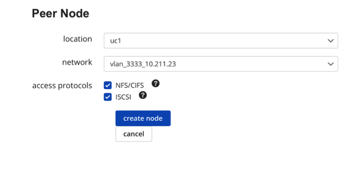
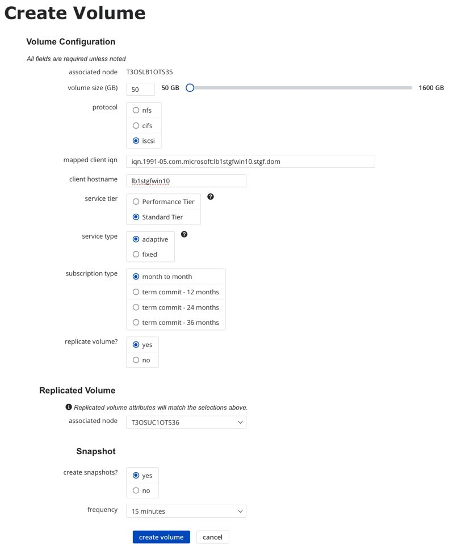
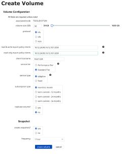
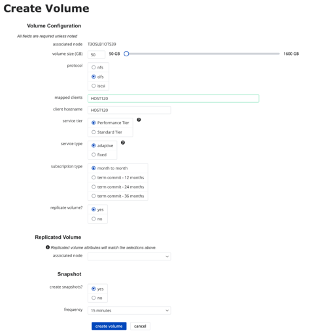

{{{
  "title": "Getting Started: Creating CNS Nodes and Volumes",
  "date": "05-14-2020",
  "author": "Brad Lewis",
  "attachments": [],
  "contentIsHTML": false
}}}

### Introduction

CenturyLink Network Storage 1.0 (CNS) is a storage offering providing customers storage volumes for storing their data. This one product offers NAS Volume (CIFS, NFS) and SAN LUNS (iSCSI) storage. Storage is available in two tiers, Performance and Standard, with Performance offering higher performance. CNS offers customers the option of replication of their storage volumes to another location.

The customer will create one or more CNS nodes during the provisioning process. The volumes they create are exported from these nodes via the storage protocol chosen for the individual volume. A CNS node is a storage virtual machine (SVM).

### Network Storage Dashboard

The Network Storage Dashboard is the CNS home page for creating Nodes and Adding Volumes. You can also access details for the nodes once they are created.

*	Select **detail** under actions to access **Node Details**. You will need this information to access the provisioned storage volumes.
*	Select **Add Volume** to provision volumes.

### Node Details

*	The location will be shown
*	The iSCSI IP addresses for the target portal will be shown
*	The IP Addresses used for CIFS and NFS will be shown
*	The peer location for replication will be shown
*	Select **Add Volume** to provision volumes from this screen

* Select Dashboard to return to the **Network Storage Dashboard**.

### Add Peer

* You may add a peer node from Node Details using **add peer** if you did not previously do so during the node create.

### Edit Volume Size or Delete Volume

* You may change the size of the volume using **edit** or delete the volume using **delete** from the node details screen.

### Volume Details

•	You may show the volume’s details by selecting details from the node details screen. This will show you the details from when you created the volume as well as the “optimal” access endpoint. This should be the IP you use to initially connect to for a LUN or the best path for an NFS or CIFS volume.

### Create CNS Node

A CNS Node is a Virtual Storage Machine (VSM) providing access to purchased storage volumes via iSCSI, CIFS or NFS for a desired location. For our offering, iSCSI for the node will require four IP addresses from the customer network. NFS and/or CIFS will also require four IP addresses from the customer network. If both protocols are chosen, a total of eight will be required. IP addresses will be autogenerated based on the network selected. If replication will be required, a peer node in the desired target location should be created.  

* Choose create node from the Network Storage Dashboard
* Choose the location from the dropdown.
* Choose the network
* Select the access protocols
* If you will be replicating volumes, choose yes to **create peer node?**
    - You will need to enter similar choices for the peer node as shown in **Create Peer Node**

* Choose Create Node once you have entered all the required information to begin creation.

The Network Storage Dashboard will be updated with the new node information when completed.

* Return to the **Network Storage Dashboard**

### Create Peer Node

* A peer node is used as a replication target.
* You will need to answer the same questions as the primary or source site for the replication target site

### Create Volume/Add Volume

#### iSCSI Volume

* Enter the volume size in GB
* Select iSCSI protocol
* Enter the IQN
* Enter the Hostname
* Choose the service Tier
    - Standard: Expected IOPS/TB  1000 , Peak IOPS/TB 3500 (both are per allocated)
    - Performance/Premium: Expected IOPS/TB  5000, Peak IOPS/TB 10000 (both are per allocated)
* Choose the service type
* Choose Yes/No if you wish to replicate the volume to the Peer node you created as part of the node creation
* Choose Yes if you want to enable snapshots and the schedule from the frequency drop down
* Choose Create Volume after confirming the values you have chosen

* You should confirm that the volume is online. You should record the iSCSI interface pool addresses. You will need these to discover the iSCSI target portal.

* You can review the volume’s details by selecting details. This will display additional information, e.g. **Volume Details**

#### NFS Volume

*	Enter the volume size in GB
* Select NFS protocol
* Enter Read & Write export policy clients. This is a comma separated list of IP Addresses or subnets in CIDR form that will be able to read and write to the volume. You may enter 0.0.0.0/0 to allow access to any client.
* Enter read only export policy clients. This is a comma separated list of IP Addresses or subnets in CIDR form that will be able to read the volume. You may enter 0.0.0.0/0 to allow access to any client.
* Enter a host name or other tag. This is meta data that will be applied the volume.
* Choose the service Tier
    - Standard: Expected IOPS/TB  1000 , Peak IOPS/TB 3500 (both are per allocated)
    - Performance/Premium: Expected IOPS/TB  5000, Peak IOPS/TB 10000 (both are per allocated)
* Choose the service type
* Choose Yes/No if you wish to replicate the volume to the Peer node you created as part of the node creation
* Choose Yes if you want to enable snapshots and the schedule from the frequency dropdown
* Choose Create Volume after confirming the values you have chosen

#### CIFS Volume

*	Enter the volume size in GB
*	Select CIFS protocol
*	Enter Mapped Clients
*	Enter a host name or other tag. This is meta data that will be applied the volume.
*	Choose the service Tier
    - Standard: Expected IOPS/TB  1000 , Peak IOPS/TB 3500 (both are per allocated)
    - Performance/Premium: Expected IOPS/TB  5000, Peak IOPS/TB 10000 (both are per allocated)
*	Choose the service type
*	Choose Yes/No if you wish to replicate the volume to the Peer node you created as part of the node creation
*	Choose Yes if you want to enable snapshots and the schedule from the frequency drop down
*	Choose Create Volume after confirming the values you have chosen

