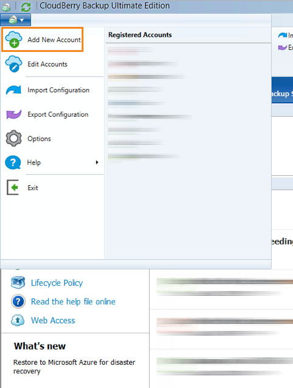
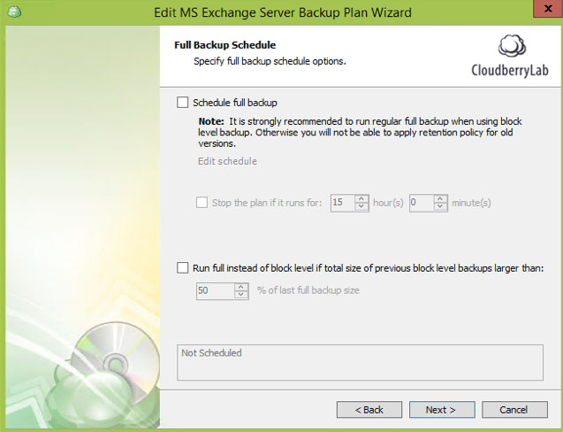

{{{
  "title": "Using Object Storage for Backup as a Service",
  "date": "08-14-2016",
  "author": "<a href='https://twitter.com/EvgenyRudinsky'>@EvgenyRudinsky</a>",
  "attachments": [],
  "contentIsHTML": false
}}}

### Overview
CenturyLink Cloud customers may wish to leverage our S3 compatible Object Storage for backup and recovery of file systems or applications. As Object Storage is consumable by any customer in a public fashion, applications or servers can be located within the CenturyLink Cloud or on premise. There are various industry backup tools that support object storage as a repository for data. In this Knowledge Base article we will focus on [Cloudberry Lab](http://www.cloudberrylab.com).

[Cloudberry Ultimate Edition](http://www.cloudberrylab.com/enterprise-cloud-backup-software.aspx) permits backup of Microsoft Windows Server File Systems (backup files, folders, **network shares** and **system image**), Microsoft SQL and Microsoft Exchange data.

[Cloudberry Backup for Mac](http://www.cloudberrylab.com/backupmac.aspx) permits backup of Mac OS X File Systems (backup files and folders).

[Cloudberry Backup for Linux](http://www.cloudberrylab.com/backuplinux.aspx) permits backup of Linux File Systems (backup files and folders).

[Cloudberry Backup for QNAP NAS](http://www.cloudberrylab.com/backup-qnap.aspx) offers QNAP NAS data backup directly to CenturyLink Object storage.

[Cloudberry Backup for Synology NAS](http://www.cloudberrylab.com/backup-synology.aspx) offers Synology NAS data backup directly to CenturyLink Object storage.

### Supporting Information
* Information and details around the CenturyLink Cloud Object Storage services can be found in our [Knowledge Base.](//www.ctl.io/knowledge-base/storage/object-storage)
* It is also important to note that CenturyLink Cloud provides no support for any 3rd party backup software tools. We are simply providing cloud based storage onto which backup software can store data.

### Prerequisites
* A CenturyLink Cloud Account
* Cloudberry Backup software licenses and installation
* [An object storage user and bucket for backups is created in the CenturyLink Cloud Control Portal.](../Storage/Object Storage/using-object-storage-from-the-control-portal.md)
* The source VM or Server has internet access

### Cloudberry Ultimate Edition capabilities

* [File level backup (files, folders, **network shares**)](#file-level-backup)
* [System image backup](#system-image-backup)
* [System state backup](#system-state-backup)
* [Microsoft SQL backup](#microsoft-sql-backup)
* [Microsoft Exchange backup](#microsoft-exchange-backup)

#### Configuring CentryLink Object storage

1. Open Cloudberry Backup Ultimate Edition, select file, in the main menu select «Add New Account» and select «CentryLink» icon.

  

  

2. Populate the S3 Compatible Account information with your CenturyLink Cloud [Object Storage Access Key, Secret Key, Service Point and bucket name.](../Storage/Object Storage/using-object-storage-from-the-control-portal.md) [All service points are listed here.](//www.ctl.io/knowledge-base/storage/object-storage/object-storage-regions-and-service-points/)

  

3. Optionally, you may input cost estimate parameters as part of the storage account setup. By using this component the Cloudberry Lab backup software is able to estimate your costs for storage. **This is an estimate on storage (excluding bandwidth charges) and does not necessarily reflect actual CenturyLink Cloud Object Storage fees.**

       

4. Your CenturyLink object storage account should now be created successfully.

  

#### Configuring file level backup for Windows

1. Make sure you are in «Home», select «Files».

  

2. Select the CenturyLink Object Storage account you created recently (as described above).

  

3. Specify a name for the backup plan. We recommend a name that encompasses the server name, backup type (file, SQL etc.) as a minimum. Additionally, it is advised that backup plan configurations are saved to the backup storage (Default).

  

4. Choose an appropriate backup mode based on the features you require. Typical enterprise customers will want to leverage the Advanced Mode approach as it provides for Data Encryption and complex retention policies.

  

5. It is recommended to have «Force using VSS (Volume Shadow Copy Service)» for file level backup in order to access files that potentially could be busy by the third-party application when the backup is in progress. Others - optionally, based on backup / restore requirements.

  

6. Select the backup source. Entire Windows volumes, specific directories, UNC Shares (**network shares**) or user profiles can be added to the backup plan.

  

7. The Advanced Filter allows administrators to include or exclude specific file types, folders and large files. Select the appropriate settings based on IT Department or business policies.

  

8. In order to secure backup data and reduce cost customers can enable encryption and compression. It is recommended that AES 128bit or higher is implement with long, complex encryption keys. Additionally, file name encryption adds another layer of security.

  

9. Specify the appropriate retention policy for backup files. Defaults can be viewed by selecting the 'options' hyperlink. Clients may wish to keep file system backups based on number of versions or based on data set age.

  

10. Choose a backup schedule that meets IT or business requirements. Generally, its best practice to perform a backup at least once per day during off hours. The Cloudberry Backup software supports recurring scheduled backups and even real-time backup of data.

  

11. In this example we selected recurring, and set the schedule for Daily at 8 PM.

  

12. Support is provided for Pre / Post commands if required.

  

13. Notification Options provide backup administrators with alerts for success or failure for each backup plan. Clients can leverage the the Cloudberry backup messaging service or specify an SMTP server.

  

14. A summary of the backup plan is provided once configurations are complete.

  

15. You have now configured a file system backup plan.

  

#### Configuring system image backup for Windows

1. Make sure you are in «Home», select Image Based».

  

2. It starts backup wizard, give it a name, select «Image Based Backup».

  

3. Select partitions that you want to backup.

  

4. Set advanced options accordingly (use block level and exclude files/folders).

  

5. In the same way (as in file level backup) it is possible to enable/disable compression / encyption, set required retention policy, schedule the backup plan, set the full backup plan time, work with pre/post scripts, notifications. All these options have been described in file level backup above.

#### Configuring system state backup for Windows

1. Make sure you are in «Home», select «Image Based».

  

2. It starts backup wizard, give it a name, select «Image Based Backup».

  

3. Select items you wish to backup in system state.

  

4. There are other steps similar to either file level or imaged based backups (e.g. compression and encryption options, retention policy, backup schedule, pre / post scripts and notifications).

#### Configuring Microsoft SQL Database backup

1. Make sure you are in «Home», select «MS SQL Server».

  

2. Select SQL Server instance to backup.

  

3. Select databases to backup in the following list.

  

4. Schedule your backup using default template or set times on your own.

  

  

5. Set rest of options based on your requirements (they are similar to File level backup).

#### Configuring Microsoft Exchange backup

1. Make sure you are in «Home», select «MS Exchange».

  

2. Select backup storage, give your plan name and pick up Exchange databases you want to archive.

  

3. Set compression and encryption, schedule recurrence and define full backup accordingly.

  

4. Rest of the options (e.g. notifications) are on your own (for more details please refer to the file level backup plan setup in this guide).

### Troubleshooting

In case of product issues:

1. Check [Knowledge Base][1d5c9166];
2. Support email - [support@cloudberrylab.com](mailto:support@cloudberrylab.com);
3. Solutions Architect group email - [sa-team@cloudberrylab.com](mailto:sa-team@cloudberrylab.com).

  [1d5c9166]: http://kb.cloudberrylab.com "Knowledge Base Cloudberry lab"
