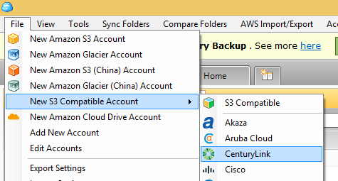
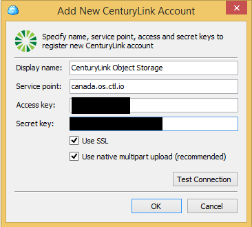
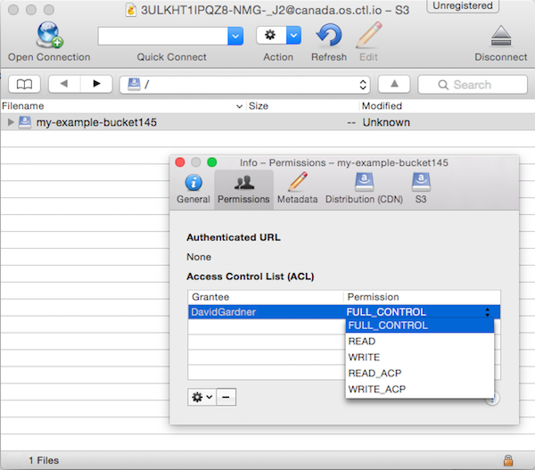

{{{
  "title": "Using Object Storage from 3rd Party Tools",
  "date": "05-02-2015",
  "author": "Chris Little",
  "keywords": ["clc", "cloud", "object", "permissions", "storage", "portal"],"
  "attachments": [],
  "contentIsHTML": false
}}}

### Overview
CenturyLink Cloud now has a robust, geo-distributed Object Storage service capable of storing any type of digital content. Perfect for data backups, media distribution, and file transfers, the Object Storage is Amazon S3-compatible and accessible from the Control Portal or via API. CenturyLink Cloud Object Storage is Amazon S3 compatible, which means that a host of tools are readily available for maintaining buckets and interacting with bucket objects.

### Audience
* Bucket Administrators
* Object Administrators
* Developers

### Prerequisites
* Have already created an Object Storage user account in the Control Portal
* Have already created a new bucket or have access permissions to an existing bucket

### Using Cloudberry Explorer for Amazon S3
[Explorer for Amazon S3](http://www.cloudberrylab.com/) is a freeware tool for Windows (a paid version also available) that works with CenturyLink Cloud Object Storage.

1. [Download and Install a copy of Explorer for S3.](http://www.cloudberrylab.com/free-amazon-s3-explorer-cloudfront-IAM.aspx)

2. You need both your **access Key ID** and your **secret access key**. Here is how to location that information. In the Navigation Menu, click **Services > Object Storage**.

3. On the Object Storage page, click the **Users** tab and then the appropriate username.
   

4. Capture the [service point for object storage](https://www.ctl.io/knowledge-base/storage/object-storage/object-storage-regions-and-service-points/).

5. Back in Explorer for Amazon S3, click **File > New S3 Compatible Account**. Choose the **CenturyLink** menu option in order to add the connection details for Object Storage.
   

6. Specify name, service point, access, and secret keys to register the new CenturyLink account.
   

7. Return to the Explorer for Amazon S3 main window. Using the drag and drop model of the software (or the Copy command), upload data to Object Storage.
   

   

8. Permissions can be applied at both the bucket and object level. Customers should review the documentation for information on apply ACL policies.
   

9. Explorer for Amazon S3 also lets users download objects, delete objects, view bucket/object properties, and preview objects.

### Using CyberDuck on Mac OS X
[CyberDuck](https://cyberduck.io/) is a freeware product for Mac OS X (paid version also available) that works with CenturyLink Cloud Object Storage.

1. Download a copy of [CyberDuck for OS X](https://update.cyberduck.io/Cyberduck-4.7.2.zip) from the product website.

2. Install CyberDuck and run the program. It looks like this when it starts up without any **Connections** (aka: Service Points or Servers) configured.

   

3. Download the CyberDuck profile [AWS S3 AWS2 Signature Version Profile for HTTPS](https://svn.cyberduck.io/trunk/profiles/S3%20AWS2%20Signature%20Version%20%28HTTPS%29.cyberduckprofile) to allow for AWS2 version authentication.

4. In the Control Portal, navigate to the Object Storage service and view the user record that you want to configure CyberDuck to use. Record the **Access Key ID** and the **Secret Access Key** for use in the tool.

   

5. Also you will need the **Service Point** (aka server) where your bucket exists (or will exist). In the Control Portal, on the Object Storage bucket listing page, either create a new bucket, or click on an existing bucket. When the **Bucket Info and Settings** page is displayed, copy/save the portion of the **bucket URL** that follows the bucket name. In this example, the bucket **Service Point** (server name) is: **canada.os.ctl.io**.

   

6. Open the **AWS S3 AWS2 Signature Version Profile for HTTPS**.  In the **Server** field, enter the name of the **Service point**. Change the Port field to **443**. Populate the **Username** field with your **Access Key ID**. Close the window. This will create a bookmark in your **Bookmarks** list.

7. Open the connection by clicking on the bookmark.  Populate the **Password** field with your **Secret Access key**.  Then click **Login**.

  1. For creating connections later, replace steps the previous 2 steps with this: Click the **Open Connection** icon (upper left corner) in order to configure the connection details for your Object Storage bucket. Select **S3 (Amazon Simple Storage)** from the drop down. In the **Server** field, enter the name of the **Service point**. Leave Port field set to **443**. Populate the **Username** field with your **Access Key ID** and populate the **Password** field with your **Secret Access key**.

   

8. After you have configured the Object Storage connection, CyberDuck will list the available buckets at that **Connection**. You can double-click on a bucket to upload files or even drag-and-drop files into the bucket.

   

9. Now that CyberDuck is configured to quickly connect to your CenturyLink Cloud Object Storage account and access the stored buckets, you should bookmark the account for easy access. Click the **Bookmark icon** to navigate to the Bookmark page.

   

10. Click the **Add Connection button** to add this Object Storage account to your Bookmarks.

   

11. Permissions can be applied at both the bucket and object level. A user could have **FULL ACCESS** rights for the bucket (and thus be able to add and remove objects) but only have **READ** rights to an individual object (and therefore couldn't update that object).

   

   
