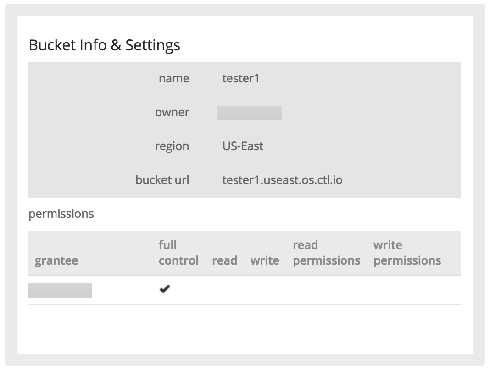

{{{
  "title": "Using Object Storage from the Control Portal",
  "date": "01-07-2015",
  "author": "Richard Seroter",
  "keywords": ["clc", "cloud", "object", "permissions", "storage", "portal"],"
  "attachments": [],
  "contentIsHTML": false
}}}

### Description
CenturyLink Cloud now has a robust, geo-distributed Object Storage service capable of storing any type of digital content. Perfect for data backups, media distribution, and file transfers. The CenturyLink Cloud Object Storage is Amazon S3-compatible and accessible from the CenturyLink Cloud Control Portal or via API. This KB article explains how to interact with Object Storage from the CenturyLink Cloud Control Portal.

### Audience
* Bucket Administrators

### Actions Supported in the CenturyLink Cloud Control Portal
Below, each action available in the Control Portal is explained and demonstrated.

### Create Object Storage Users
1. From the Navigation Menu, click **Services > Object Storage**.
     

2. On the Object Storage page, click the **Users** tab.
     

3. Click **create user** and enter the user's details.
   * The **name** field should contain a friendly alphanumeric identifier for the user.
   * Enter an **email** address for the user. Note that this value must be unique across the platform and can't be reused. The account cannot be deleted and the email address cannot be changed. We recommend using a distribution email address, rather than the email address of a single person. If needed, we will use this email address to reach out to the technical contacts who manage the bucket.
    

4. Click **save**.

5. Click the created user record to view the **access key id** and **secret access key** values which act as the username and password for this Object Storage user.
     

### Reset Object Storage User Secret Key
1. Navigate to the record for the chosen Object Storage user.

2. Click **reset secret key**.

3. Refresh the page to see the new **secret access key**.

### Create a New Object Storage Bucket and View Bucket Details
1. On the Object Storage page, click the **Buckets** tab.

2. Click the **create bucket** button.

3. Enter a **bucket name** value.
   * The name has to start and end with lowercase letters or numbers, and can only contain lowercase letters, numbers, and dashes. This value must be unique globally. If the name of the bucket is not unique, you receive an alert asking you to choose a new bucket name.
   * Select an **owner** from from the drop-down arrow. The owner is an important decision as the API retrieves lists of buckets by the owner name.
   * Select an Object Storage region from the drop-down arrow.
     

4. Click **save** to create the bucket.

5. View the list of all buckets. For each bucket in the list, you can see the following information:
   * name
   * owner (the text below the bucket name)
   * region
   * size
   * estimated cost

6. Click the bucket name to view the details of the bucket.
   * This page shows read-only details such as the bucket name, owner, region and API URL.
   * It also contains the list of active permissions associated with the bucket.
     

#### Manage Object Storage Permissions
1. View the details for an individual bucket.

2. Click the **permissions** section to the customize permissions.
     

3. Click **add grantee** to update the Access Control List (ACL) for the bucket.
   * The drop-down list shows all Users in this account, and two built-in Groups: **All Users** and **Authenticated Users**.
   * When you add **All Users** to a bucket -- and give it read permissions -- you are giving public Internet access to the bucket.
   * If you add the **Authenticated Users** group to the bucket, then any Object Storage user can access the bucket.

4. For any existing user, you can modify their permissions by adding or removing check marks associated with each permission. Note that the bucket owner always has full control.
   * To delete the user from the grantee list, click the red **x** to the right of the record.
   * Changes made to a bucket are instantly committed. For instance, if you add **All Users** with read permissions, then the buckets (and contained objects) are immediately available to anyone.
   * Likewise, if you use a 3rd party tool to manage Object Storage, changes to the grantee list are instantly visible in the Control Portal.

#### Delete Object storage buckets
1. Ensure the bucket is empty (required for deletion).
2. Select the bucket and click the red "delete" button in the upper right corner.
