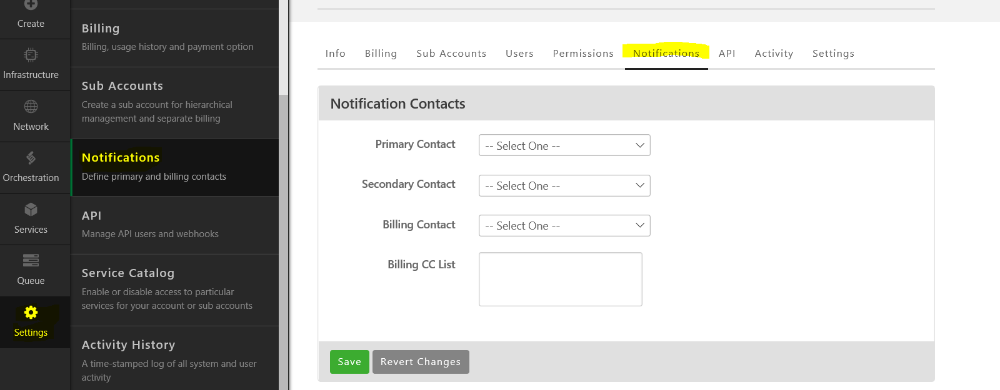

{{{
  "title": "Configuring System Notification Emails",
  "date": "12-24-2019",
  "author": "Ben Heisel",
  "attachments": [],
  "contentIsHTML": false
}}}

### Overview

Lumen Cloud periodically sends informational emails to users listed in the Notifications section of the Control Portal. The Notifications contacts are intended for individuals who are responsible for management of the account and are often used when Lumen Cloud is proactively contacting a customer.

Control Portal Notification emails are separate from Platform changes, incidents, and scheduled maintenance notifications which are subscribed to from our Status page, as described in our [Status FAQ article](../General/CenturyLinkCloud/centurylink-cloud-status-faq.md).

Environment-specific alerts that might be generated by individual servers such as high resource utilization, disk space, etc., can be configured as described in the [Server Alerting Article](../Servers/cloud-server-alerting-faq.md), these are also separate from the Control Portal Notification emails.

### Audience

All users of Lumen Cloud

### Prerequisites

Must be assigned the [Account Administrator](//www.ctl.io/role-permissions-matrix) role permission to edit Notification Contacts

### Steps

1. Navigate in the Control Portal to the Notifications tab. From the left-hand menu, Settings > Notifications  

  

2. Select the desired contact from the drop-down list of users.

### Configuring Additional Recipients

In order to send emails to additional email addresses, create an internal distribution list (i.e. CLCNotifications@companyname.com), use that email address to create an account in the Control Portal, and then assign it the Account Administrator role permission. Please note that a "Welcome" email containing a password is emailed to each newly-created user in the Control Portal. If you do not want this automatic "Welcome" email to be disseminated, create the distribution list, create the user in the Control Portal, and then add the appropriate internal resources to the distribution list.

 
