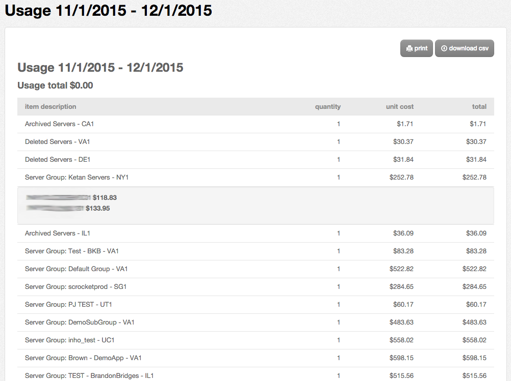

{{{
  "title": "Understanding Your Estimated Lumen Cloud Usage",
  "date": "09-28-2018",
  "author": "Jared Ruckle",
  "attachments": []
}}}

### Description

For customers that want to know more information about their estimated resource usage on Lumen Cloud, several options are available. This article explains a few of them.

### Self-Service Tools

Customers can analyze a detailed breakdown of estimated usage history in several different ways:

* __Via the Control Portal.__ Click on `Billing` in the main navigation link, then click `Usage History`. From there, click the month of interest to display a line-item view of your estimated usage. Click a line for more information on each item, such as a Group of servers.

  

* __Via Excel or other Spreadsheet Tool.__ From the screen shown above, click `download csv` for an Excel-friendly format of the estimated billing data.

* __Via API.__ Users can get usage estimates using [a simple REST call](https://www.ctl.io/api-docs/v2/#billing). The API will return a JSON object containing an array with invoicing data.

NOTE: The dollar amounts shown for these options will reflect what is configured in your pricing catalog for each account. Further, the summaries above, by design, do not display detailed timestamps of events that affect billing. However, platform activities that affect usage - such as pausing a server for a weekend - are reflected in your real-time estimates throughout the Control Portal AND in your actual usage estimate.

### Request a Service Task

More detailed usage is available upon request [as a service task](https://www.ctl.io/service-tasks/#usage-reporting).
