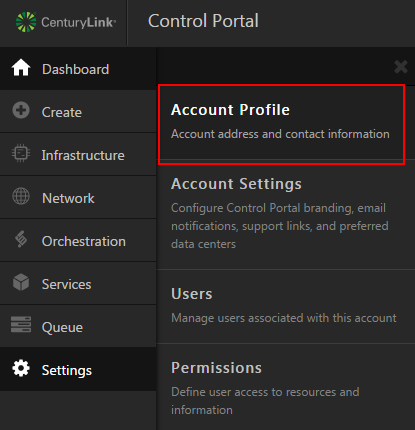
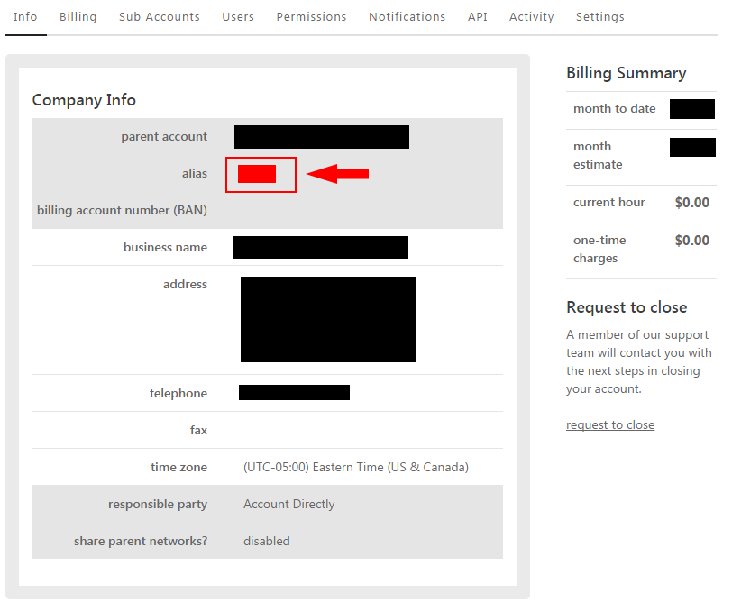

{{{
  "title": "How do I find my Control Portal account alias?",
  "date": "2-15-2017",
  "author": "Chris Little",
  "attachments": [],
  "contentIsHTML": false
}}}

### Overview
Customers at times may be required to find their Control Portal Account Alias.  This is a globally unique Alphanumeric character set used in support requests and other functions.  To obtain or determine your alias you can follow the steps below.

### Steps
1. Login to the [Control Portal.](//control.ctl.io)

2. Navigate to **Settings > Account Profile.**

  

3. The **Account Alias** will be shown on the info tab.

  
