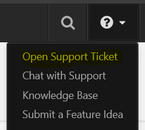
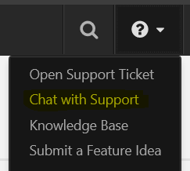
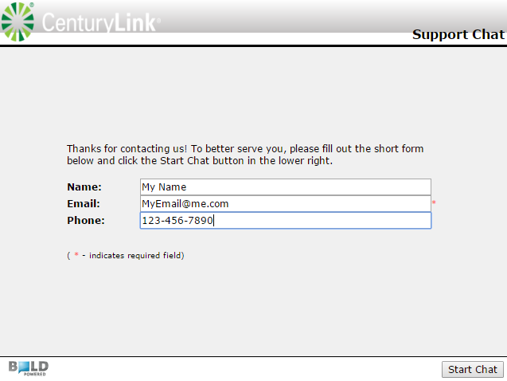

{{{
  "title": "How do I get support for CenturyLink Cloud services?",
  "date": "3-1-2018",
  "author": "Justin Lentz",
  "attachments": [],
  "contentIsHTML": false,
  "sticky": true
}}}

### Table of Contents

* [Overview](#overview)
* [Audience](#audience)
* [Exceptions](#exceptions)
* [Email Support](#email-support)
* [Chat Support](#chat-support)
* [Chat System Requirements](#chat-system-requirements)
* [Phone Support](#phone-support)
* [Latin America] (#latin-america)
* [FAQ](#faq)

### Overview
CenturyLink Cloud offers [flexible support options](//www.ctl.io/support/) for customers of all sizes, with optional add-on Service Engineering support as needed. In order to provide a quality service and quickly resolve incidents use the information below as a guide.  

### Audience

* CenturyLink Cloud Customers

### Exceptions
[Managed Services](//www.ctl.io/managed-services) customers should use the data below to request support for Managed OS or Applications:

**Phone**|**Email for Incidents**|**Email for Requests**
---------|---------|---------
US: 888.638.6771<br>UK: +44.118.322.6100<br>Singapore: +65.6305.8099| incident@centurylink.com | request@centurylink.com

### Email Support
1. Use the template below, providing relevant information for each line item.  It is very important that you include your [account alias,](../Support/determine-control-portal-alias.md) username and [user PIN](../Support/pin-authentication-for-support-requests.md) when submitting a support request as we use this information as a means of authenticating the request.

    ```
    Account Alias:
    Control Portal Username:
    User PIN:
    Data Center:
    Servers, Systems or Services Affected:
    Detailed Description of the Request/Problem:
    Dates/Time (if applicable):
    ```

2. Attach any error logs or other pertinent data captured.

3. Determine the priority level using the [Ticket Prioritization Matrix. ](../Support/ticket-prioritization-matrix.md)

4. Submit request:
* Send an email to [help@ctl.io](mailto:help@ctl.io) **or** [high@ctl.io](mailto:high@ctl.io) based on the priority.

* Alternatively, you may select the **?** icon inside the Control Portal and choose **submit a support request.** This will create a new ticket in our Support ticketing system. As described in the [Support Ticketing](../Support/zendesk-login-help-for-helpdesk-ticketing-and-kb-access.md) article, this is a separate user account from the Control Portal.

    

### Chat Support
Customers in the **Professional and Enterprise** support tier can leverage our real-time chat system.

1. Login to the [Control Portal](//control.ctl.io), select the **?** icon and choose **Chat with support.**

    

    

2. Provide your Account Alias, [user PIN](../Support/pin-authentication-for-support-requests.md) and description of the problem to the support engineer.

### Chat System Requirements
* Supported operating systems: Windows XP, Vista, 7, 8, 8.1, 10, Mac OS X 10.8 and newer
* Supported browsers: Chrome 31 and newer, Mozilla Firefox 29 and newer, Internet Explorer 7 and newer, Safari 6 and newer, Opera 12 and newer

### Phone Support
Customers in the **Professional and Enterprise** support tier can leverage our phone support.

1. Be prepared with the following information for phone support.

    ```
    Account Alias:
    Control Portal Username:
    User PIN:
    Data Center:
    Servers, Systems or Services Affected:
    Detailed Description of the Request/Problem:
    Dates/Time (if applicable):
    ```

2. Call the phone number for your appropriate region.

**Country**|**Phone Number**
-----------|----------------
USA|+1 (425) 321-0338
UK|+44 20 0333 0338
Hong Kong|+852 58032338
Australia|+61 7 4410 3380
Singapore|+65 3158 9575
Japan|+81-3-4540-3776

### Latin America
Customers in these countries in Latin America can contact support via email or phone:

  **Argentina:** <docbaires@centurylink.com>
  Local toll free: 0800 800 5383
  + 54 11 5170 5383
  After language selection press 3
  **Brasil:** <operacao@centurylink.com>
  Local toll free: 0800 887 3333
  + 55 11 3957 2288
  After language selection press 3
  **Chile:** <docsantiago@centurylink.com>
  Local toll free: 800 360 303
  +56 2 2422 5856
  After language selection press 3
  **Colombia:** <datacentercolombia@centurylink.com>
  Local toll free: 01800 011 7997
  + 57 1 611 9013
  After language selection press 3
  **Ecuador:** <docquito@centurylink.com>
  Local toll free: 1800 400 408
  +59 3 2400 5080
  After language selection press 3
  **Perú:** <doclima@centurylink.com>
  Local toll free: 0800 7 0662
  + 51 1 705 5777
  After language selection press 3
  **Venezuela:** <operadoresdc@centurylink.com>
  Local toll free: 0800 285 8300
  +58 212 204 9301
  After language selection press 3

### FAQ

**I have an email thread with my sales team on this issue. Why is this not being worked?**

The CenturyLink Cloud Customer Care team does not use email to provide support. All issues are tracked in the ZenDesk ticketing system.

**I just reopened a ticket - now what?**

When you reopen a ticket by responding after it's been marked "solved" (and within 72 hours), it is returned to the Support queue and a Customer Care engineer will respond in accordance with our [Ticket Prioritization Matrix. ](../Support/ticket-prioritization-matrix.md)

**How long do you wait before closing a ticket?**

After a ticket has been Solved, the automation will close the the ticket after 72 hours (3 days). All subsequent communication to the closed ticket will create a new "follow-up" ticket at normal priority.
