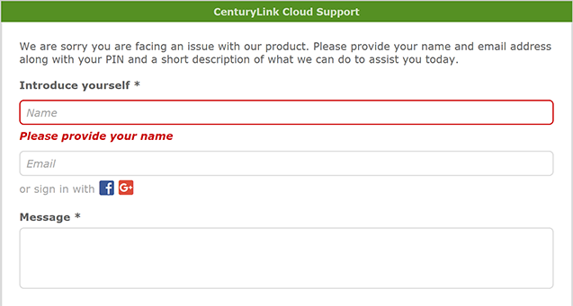

{{{
  "title": "How do I get support for CenturyLink Cloud services?",
  "date": "3-14-2016",
  "author": "",
  "attachments": [],
  "contentIsHTML": false,
  "sticky": true
}}}

### Table of Contents

* [Overview](#overview)
* [Audience](#audience)
* [Exceptions](#exceptions)
* [Email Support](#email-support)
* [Chat Support](#chat-support)
* [Phone Support](#phone-support)
* [FAQ](#faq)

### Overview
CenturyLink Cloud offers [flexible support options](//www.ctl.io/support/) for customers of all sizes, with optional add-on Service Engineering support as needed. In order to provide a quality service and quickly resolve incidents use the information below as a guide.  

### Audience

* CenturyLink Cloud Customers

### Exceptions
[Managed Services](//www.ctl.io/managed-services) customers should use the data below to request support for Managed OS or Applications:

**Phone**|**Email for Incidents**|**Email for Requests**
---------|---------|---------
US: 888.638.6771<br>UK: +44.118.322.6100<br>Singapore: +65.6305.8099| incident@centurylink.com | request@centurylink.com

### Email Support
1. Use the form below and populate the data points.

    ```
    Account Alias:
    Control Portal Username:
    User PIN:
    Data Center:
    Servers, Systems or Services Affected:
    Detailed Description of the Request/Problem:
    Dates/Time (if applicable):
    ```

2. Attach any error logs or other pertinent data captured.

3. Determine the priority level using the [Ticket Prioritization Matrix. ](../Support/ticket-prioritization-matrix.md)

3. Send an email to [help@ctl.io](mailto:help@ctl.io) **or** [high@ctl.io](mailto:high@ctl.io) based on the priority.  Alternatively, you may select the **?** icon inside the Control Portal and choose **submit a support request.**

    

### Chat Support
Customers in the **Professional and Enterprise** support tier can leverage our real-time chat system.
* [Chat Requirements](#chat-requirements)

1. Login to the [Control Portal](//control.ctl.io), select the **?** icon and choose **Chat with support.**

    

    

2. Provide your Account Alias, [user PIN](../Support/pin-authentication-for-support-requests.md) and description of the problem to the support engineer.


### Phone Support
Customers in the **Professional and Enterprise** support tier can leverage our phone support.

1. Be prepared with the following information for phone support.

    ```
    Account Alias:
    Control Portal Username:
    User PIN:
    Data Center:
    Servers, Systems or Services Affected:
    Detailed Description of the Request/Problem:
    Dates/Time (if applicable):
    ```

2. Call the phone number for your appropriate region.

**Country**|**Phone Number**
-----------|----------------
USA|+1 (425) 321-0338
UK|+44 20 0333 0338
Hong Kong|+852 58032338
Australia|+61 7 4410 3380
Singapore|+65 3158 9575

### FAQ

**I have an email thread with my sales team on this issue. Why is this not being worked?**

The CenturyLink Cloud support staff do not use email to provide support. All issues are tracked in the ZenDesk ticketing system.

**I have an old ticket, let's just reopen the ticket.**

When you reopen a ticket, it goes to the engineer that solved. Our engineers work shifts and therefore it is possible that engineer is off shift. In this case, the ticket update may never be seen for days because they are off.

**How long do you wait before closing a ticket?**

After a ticket has been Solved, the automation will close the the ticket after 3 days. All subsequent communication to the closed ticket will create a new ticket at Low priority.

### *Chat requirements*

1. Supported operating systems: Windows XP, Vista, 7, 8, 8.1, 10, Mac OS X 10.8 and newer 
2. Supported browsers: Chrome 31 and newer, Mozilla Firefox 29 and newer, Internet Explorer 7 and newer, Safari 6 and newer, Opera 12 and newer
