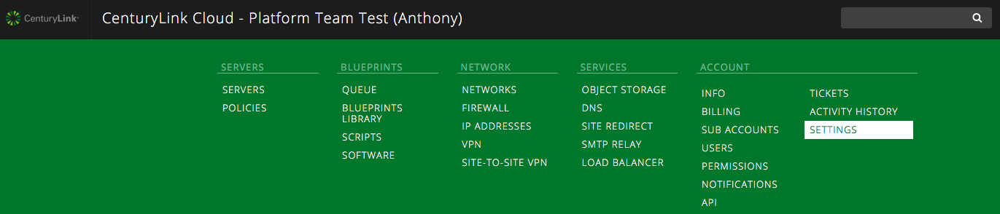
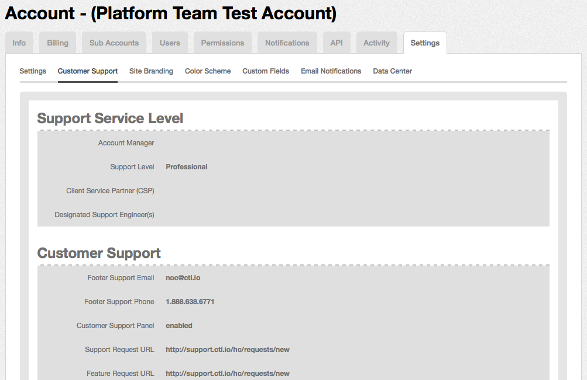

{{{
  "title": "How To Change Support Levels",
  "date": "11-03-2015",
  "author": "Anthony Hakim",
  "attachments": []
}}}

### Description
CenturyLink Cloud offers three different types of [Support Levels](https://www.ctl.io/support/):
* Developer (All online sign up customers)
* Professional (Default option for contracts)
* Enterprise (Premier level of support)

<<<<<<< HEAD
Customers have the option to change Support Levels by following the steps below.
=======
Customer have the option to change Support Plans by following the steps below.
>>>>>>> origin/master

### Steps

__Determine your current Support Level__
  * Logon to your user account in the [Control Portal](https://control.ctl.io), then choose SETTINGS under ACCOUNT.

<<<<<<< HEAD
    
=======
    
>>>>>>> origin/master

  * Click on Customer Support under the Settings Tab.

    

__Change your Support Level__

<<<<<<< HEAD
You can request a change to your Support Level by sending an email, with the following information, to [help@ctl.io](mailto:help@ctl.io):
=======
You can change Support Level by sending an email, with the following information, to [help@ctl.io](mailto:help@ctl.io):
>>>>>>> origin/master

* Account Alias to which changes are to be made.
* Support Level you are requesting.
* Your customer PIN for security verification.

Once your email is received, it will be forwarded to Customer Care, who may reach out for further information/discussion. You will receive a confirmation once the change has been made.
