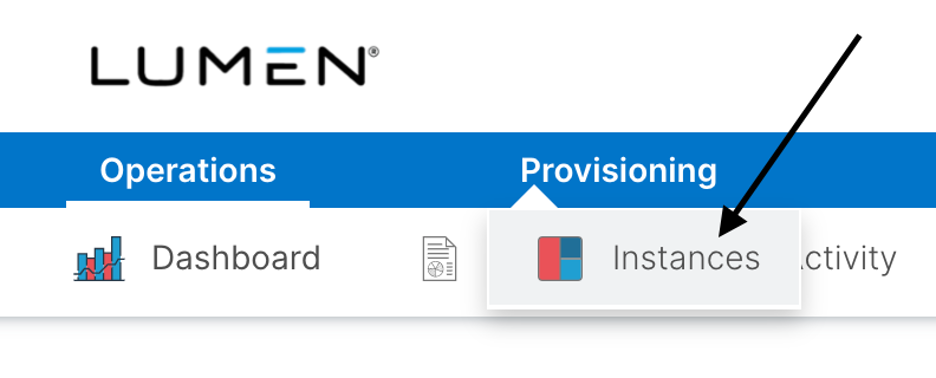
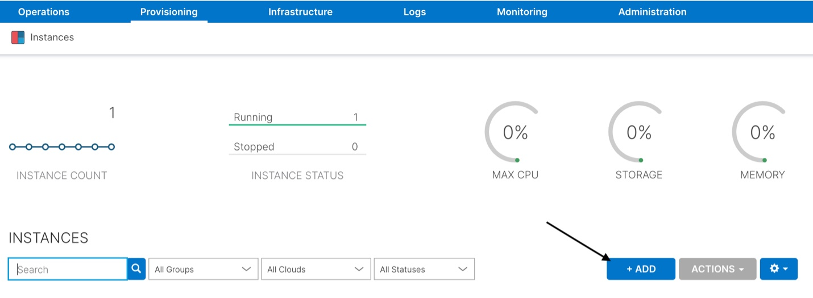
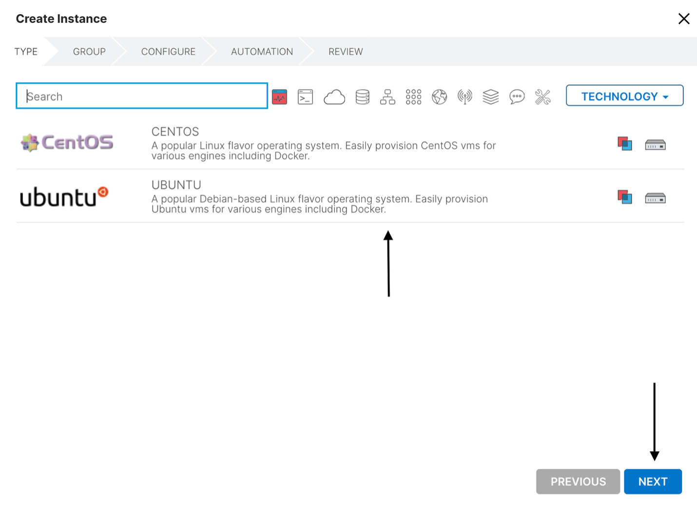
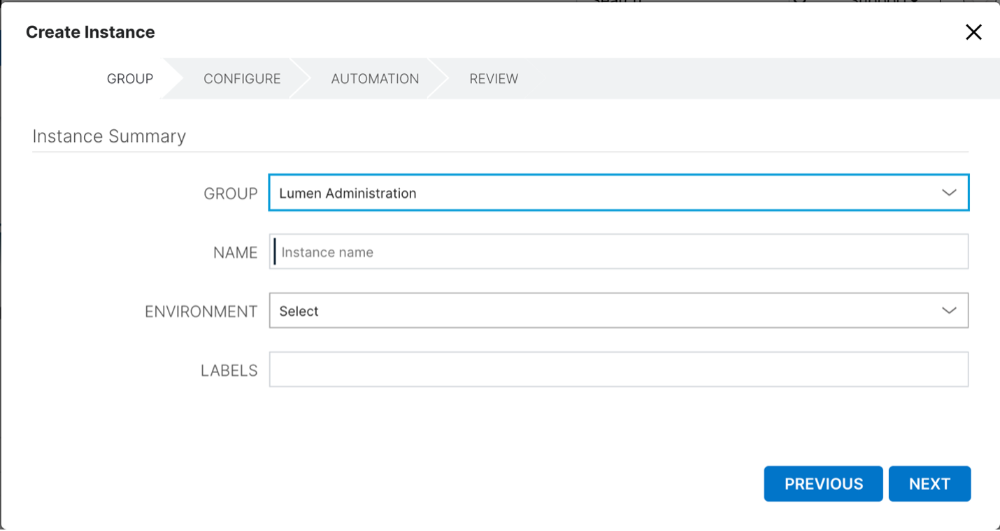
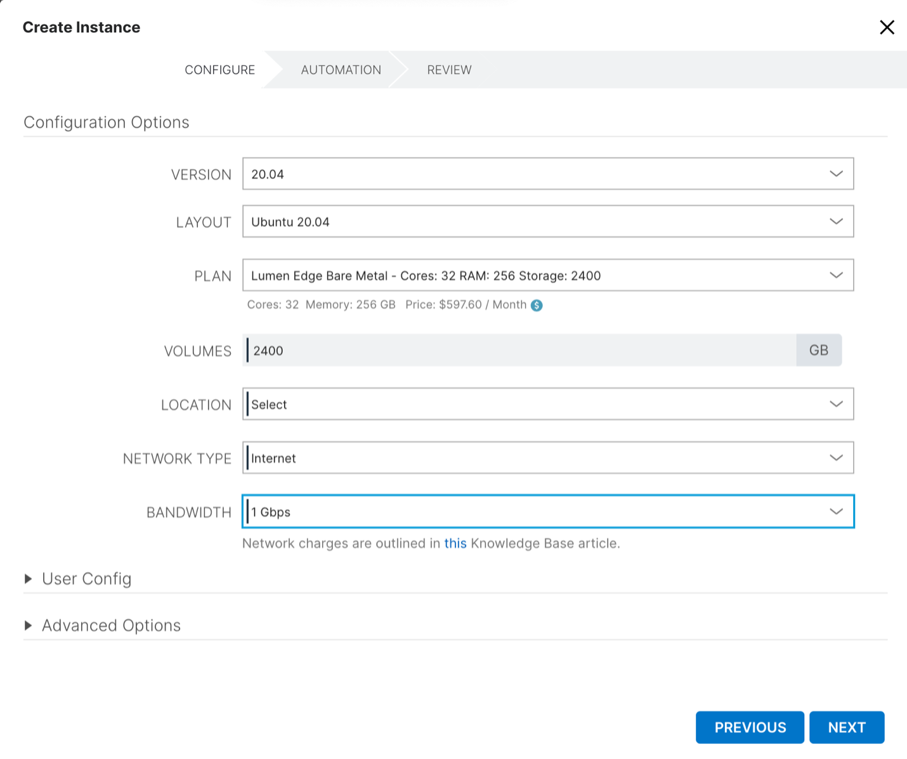
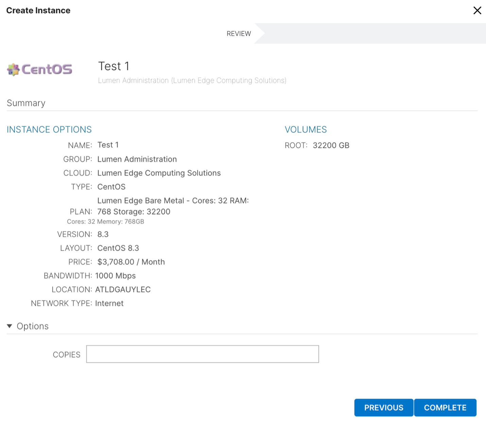

{{{
  "title": "How to Provision a Solana Validator Edge Bare Metal Server",
  "date": "9-23-2021",
  "author": "Brandy Smith",
  "attachments": [],
  "contentIsHTML": false,
  "sticky": false
}}}

### Description

This article will outline the step-by-step process to provision a bare metal server within the Lumen Edge Services portal specific to the contracted server configuration approved for Solana validators.

### Prerequisites

The Solana Validator needs to add credentials for the instance type (Linux or Windows) in their profile. Then at deployment the applicable credentials for the provisioning user are added to the server by default.

If you have yet to add credentials for the instance type (Linux or Windows) to your profile, please do that step now by following the steps below. 

Failure to add credentials for the instance type in the User Profile will cause you to be locked out of accessing the server.

In the event that you accidentally provision a server prior to adding your credentials, please delete the server, set your credentials, and deploy a new server.

**Steps to add Linux and Windows Settings**
1. Log into the Edge Services portal.
2. In the top right corner of the Edge Services Portal, click on your Name.
3. Click **User Settings**.
4. Enter your Linux and Windows username(s) and password(s). 
 **Note:** Ubuntu is the approved OS for Solana validators, it is a required step that you enter your Linux credentials under **User Settings**.
5. Press **Save**.

### Steps to Provision a Solana Validator Edge Bare Metal Server

Log into your Lumen Edge account within the Lumen Edge Services portal.
To start the Provision Server process, use the top navigation and choose **Provisioning**.

1.	Under the **Provisioning** tab, choose **Instances**. 
 
2.	Once under the **Instances** tab, Click the **+ADD** button; this will begin the process of Provisioning a Bare Metal server. 
 
3. Create Instance Type: the approved Operating System for Solana Validator software is **Ubuntu 20.04**.
 Choose the Ubuntu operating system for this server and click the **NEXT** button.
 **Note:** Some Operating Systems may have licensing fees associated with them; for ones that have a licensing fee, the cost will be displayed in the portal prior to purchase. Ubuntu 20.04 is an Open Source operating system and no fees will be applied to your account for using this operating system. 
 
 
4. Instance Summary: in this section, you will see multiple fields. 
 

 Below outlines the purpose of each field in the image above.

 **Group**
 - Required field, pre-populated, no cost.
 Currently, the only Group option available, "Lumen Administration", and is pre-populated for you.
 As the platform evolves, customers will have more Group options to choose from.

 **Name**
 - Required field, free text, no cost.
 Customers can name the servers as they see fit.

 **Environment**
 - Required field, drop down, no cost.
  Customers can choose which environment they want the server to be hosted.
  The environment is just there to provide segmentation of server groups across environments.
  The Environments section is where you create and manage your environment labels, which are available in the Environment dropdown during Instance or App provisioning.
 An Instance’s environment label can be changed by editing the Instance.

 **Label**
 - Required field, free text, no cost.
 Customers can add labels to the servers as they see fit.
 Labels just provide another way for customers to manage, report, or group servers.
5. Configuration Options
 In this section, you will see multiple fields. Once you have made selections for all the required fields, please review each for accuracy, and press the **NEXT** button to proceed to the next steps.
 Please note, there are some prerequisites and actions users must take for some fields below. Please read this section carefully before moving on to Step 7.
 

Below outlines the purpose of each field in the image above.
 
 **Version**
 - Required field, drop down, cost based on OS.
 The operating system approved for Solana Validator software is Ubuntu 20.04. Choose the 20.04 version under the version drop down field. 
 
 **Layout**
 - Required field, pre-populated, cost based on OS.
 This fields pre-populated with the Operating System you selected in Step 4.
 
 **IMPORTANT NOTE FOR SOLANA VALIDATORS**
 There is only one Bare Metal Server plan that is approved for Solana Validator software. 
 It is the responsibility of the Solana validator to select the approved server plan. If the wrong server plan is selected, the validator is responsible for any incurred charges and will be billed accordingly. 
 Solana validators are approved to purchase up to two validator servers at the special Solana contracted rate per the contract you signed. 
 The two validator servers will not have egress bandwidth charges applied. 
 The list pricing in the portal applies to any services you procure above and beyond the two validator servers that are outlined in the Solana Validator contract. 
 The special pricing will be applied at the time of invoicing and the price in the portal is rounded to the nearest hourly unit using the formula below.

 **ASSUMPTIONS FOR CALCULATION OF HOURLY COMPUTE**
 - 720 hours in a month
 - 30.42 days in a month
 - 4.35 weeks in a month
 Validators can purchase other plans and services with the Edge Services portal. Please note that those services will all bill at list price. For estimated costing of list prices for Edge services outside of the Solana validator contract, please visit the [Edge Price Estimator](https://www.ctl.io/estimator/).

 **Plan**
 - Required field. Select the approved server configuration under the plan drop down field. The approved server configuration and plan for Solana validators is listed below.
 **Cores: 32 RAM (GB): 256 Storage (GB): 2400** 
 

 **Volumes**
 - Required field, pre-populated, not editable. 
 This field shows the storage volumes for the related Server Plan selected. 

 **Location**
 - Required field, drop down. 
 This field is where you will select which Lumen Edge data center you want to deploy the Solana Validator Bare Metal Server in.
 Currently, the below locations are the ONLY locations available for Solana validators, please choose one of the locations listed below. New sites will be added in a phased approach, and this documentation will be updated with the new sites as they become available to Solana Validators. 
 **If you choose a location outside of the list below, the server will fail to provision.** 
 
    - San Diego
    - Denver
    - Las Vegas
    - Nashville
    - Spokane
    - Kansas City
    - Detroit 
    - Phoenix
    - Pittsburgh
    - Tampa
 
 **Network Type**
 - Required field, drop down. 
 This field is where you select the Network type for connecting to your Edge Bare Metal server.
 Currently, there is only one Network type available, which is Public Internet. Additional Network types, including IPVPN, will be available in future releases.
 To learn more about the list costs associated with Network type selections, please visit this Knowledge Base article.
 Per the Solana Validator contract that you signed, validators can provision up to two Solana validator Bare Metal instances.

 **Bandwidth**
 - Required field, drop down.
 This field is where you select your Network Bandwidth.

 **Egress is waived for Solana Validators at the 1 Gbps rate for up to 2 Solana Validator Bare Metal Servers**
 The approved Bandwidth rate Selection for Solana Validator Software is 1 Gbps. It is the responsibility of the Solana validator to select the approved Bandwidth selection of 1 Gbps. If you select any other Bandwidth rate other than 1 Gbps, you could incur egress charges based on your true usage. 
 **Note for list pricing for egress**
 Public Internet Egress is charged based upon total number of bytes transferred over the course of the month.
 Bandwidth selection identifies the requested rate limit for the internet port and is selected during the provisioning of the Bare Metal server instance.
 **Note:** Higher rate limits can pass more traffic, which could result in additional Internet charges.
 Customers should choose the Bandwidth selection that best fits their business needs to avoid unintended Internet charge spikes.
 Network charges are outlined in this [Knowledge Base article](https://www.ctl.io/knowledge-base/edge-computing-solutions/getting-started/edge-bare-metal-billing/).
 **User Config**
 - Required field, pre-populated, no cost, no action required. 
 **Advanced Options**
 - Non-Required fields, free text, no costs.
 These fields are discretionary for the customer to use as they see fit.
6. Automation
 Currently, this section is not functional, please press the **NEXT** button to proceed.
7. Review 

This is the final screen for customers to review all of the sections from the previous steps. Once you press the **COMPLETE** button, the server will begin provisioning.

Once the server is successfully created, billing for that server configuration starts, so it is important that you review and ensure that your selections are accurate and meet the Solana Validator requirements prior to clicking the **COMPLETE** button.

Any billable components will show on the review screen.

If you need to make a change to selections, you can use the **PREVIOUS** button to go back to make any changes. 

Once you have reviewed for accuracy, please press the **COMPLETE** button to proceed.

Once you press the **COMPLETE** button, your Bare Metal server will begin to provision.

You will see a live tracker that shows you the progression of your server build with an estimated time of completion.

On average, large server configurations take up to 30 minutes to build.

Once the server is built, billing has started and you can manage your Bare Metal Server by going to your Dashboard section and finding the server under the **MY INSTANCES** section of the dashboard.

To learn more about how to manage your Bare Metal servers, please visit this [Knowledge Base article](https://www.ctl.io/knowledge-base/edge-computing-solutions/getting-started/managing-bare-metal-instances/).
